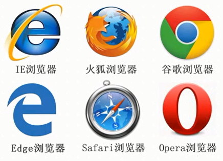
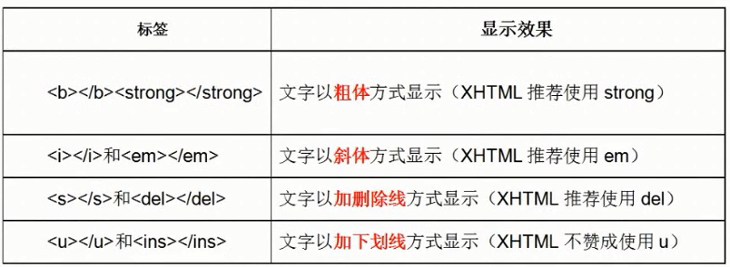
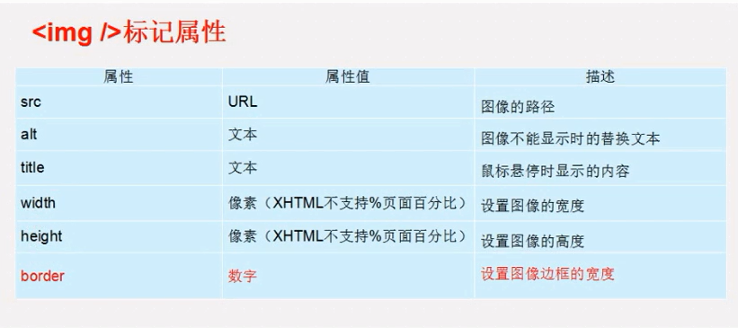
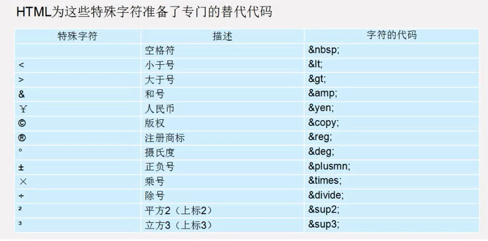

<h2>1.认识网页</h2>
<h6>网页组成元素：</h6>
网页由文字、图像和超链接、音频、视频以及Flash等元素构成。<br>
<h6>网页是如何构成的呢？</h6>
前端代码---》浏览器渲染---》再到完整页面，如：淘宝页面
<h2>2.常见浏览器</h2>
浏览器是网页运行的平台，常用的浏览器有IE、火狐(Firefox)、谷歌(Chrome)、Safari和Opera等。我们成为五大浏览器。

<h6>2.1查看浏览器在市场上的份额</h6>

查看网站：https://tongji.baidu.com/data/browser
<h2>2.2浏览器内核</h2>

```
浏览器内核可以分两部分：
      渲染引起(layout engineer 或者 Rendering Engine)和JS引擎。
      渲染引擎负责取得网页的内容(HTML、XML、图像等)、整理讯息(例如加入CSS等)，以及计算机网页的显示方式，然后输出至显示器或打印机。浏览的JS引擎则是解析JavaScript语言，执行JavaScript语言来实现网页的动态效果。
      最开始渲染引擎和JS引擎并没有区分的很明确，后来JS引擎越来越独立，内核就倾向于只渲染引擎。
```
面试用
<h6>(1)Trident(IE内核)</h6>
Window10发布后，IE将其内置浏览器命名为Edge，它最显著的特点就是新内核EdgeHTML.
<h6>(2)Gecko(firefox)</h6>
<h6>(3)webkit(Safari)</h6>
<h6>Chromium项目中研发/Blink(Chrome)</h6>
<h6>Persto/现Blink内核(Opera)</h6>

移动端的浏览器内核：

- 目前移动设备常用内核：Webkit、Blink、Trident、Gecko等。
- 其中iphone和iPad等苹果ios平台主要是Webkit。
- Android4.4之前是Webkit,Android4.4系统浏览器切换到了Chromium，内核是Webkit的分支Blink。
- Windows Phone8 系统浏览器内核是Trident。

<h2>3.Web标准</h2>
<h6>3.1Web标准的好处</h6>

- 1、让Web的发展前景更广阔
- 2、内容能内更广泛的设备访问
- 3、更容易被搜索引擎搜索
- 4、降低网站流量费用
- 5、使网站更易于维护
- 6、提高页面浏览速度

<h6>Web标准构成</h6>
由W3C和其他标准化组织制定的一系列的标准的集合。主要由三个方面：

- 结构(Structure)---XML、XHTML
- 表现(Presentation)----CSS
- 行为(Behavior)----DOM和CMAScript<br>
html、CSS、JavaScript

<h2>4.HTML初识</h2>
HTML(Hyper Text Markup Language)超文本标记语言，主要通过HTML标签对网页的文本、图片声音等内容进行描述。<br>

<h2>4.1HTML骨架格式</h2>

```
<!DOCTYPE html> 文档声明(html5.0)
<html lang="en"> 根标签
   <head> 头部标签
      <meta charset="UTF-8">解决编码规则UTF-8/gb2312
      <title></title> 标题标签
   </head>
   <body></body> 内容/主体标签
</html>
```
<h2>4.2HMTL标签分类</h2>
<h6>什么叫标签/HMTL元素？</h6>

- HTML标签是由"<>"包围的关键词，比如：< html>
- 标签中的第一个标签是开始标签，第二个标签是结束标签，它也称为开放标签和闭合标签
- 它分为双标签，如：<p>我是段落标签是双标签</p>
- 单标签：如：<br/>我是换行标签
<h2>4.3HTML标签关系</h2>
标签的相互关系分为：

`
1.嵌套关系,如：<head><title></title></head>
`

`
2.并列关系，如:<head></head><body></body>
`

建议：如果两个标签之间的关系是嵌套关系，子元素最好缩进一个tab键的身位。如果是并列关系,最好上下对齐。
<h2>5.开发工具</h2>
Visual Studio Code<br>
Sublime text 3<br>
HBuilder<br>
WebStorm <br>
Adobe Dreamweaver
<h2>6.!DOCTYPE html</h2>

```
 !DOCTYPE html 文档申明(html5.0)
 <!DOCTYPE HTML PUBLIC "-//W3C//DTD HTML 4.01 Transitional//EN"
"http://www.w3.org/TR/html4/loose.dtd">：声明是4.01版本
```

<h2>7.字符集</h2>

- utf-8目前最常用的字符集编码方式，常用的还有gbk和gb2312。
- gb2312简体中文 包括6763个汉子
- BIG5 繁体中文 港澳台等用
- GBK包含全部中文字符 是GB2312的扩展，加入对繁体字的支持，兼容GB2312。
UTF-8则包含全世界所有国家需要用到的字符。
<h2>8.标签的语义化及其标题标签</h2>
什么是语义化：就是指标签的含义。
<h6>为什么要有语义化标签？</h6>

- 1.方便代码的阅读和维护。
- 2.同时让浏览器或网络爬虫可以很好的解析，从而更好分析其中的内容。
- 3.使用语义化标签会更具好地搜索引擎优化。

核心
：合适的地方给一个最为合理的标签。<br>
语义是否良好：当我们去掉CSS之后，网页结构依然组织有序，并且有良好的可读性。

<h2>HTML标签</h2>
<h4>排版/布局标签</h4>
<h6>标题标签(熟记)</h6> 
单词缩写：head 头部.标题

`
< h1>、<h2>、<h3>、<h4>、<h5>和<h6>
`

注意:h1标签因为重要，尽量少用，一般h1都是给logo使用。
<h6>段落标签(熟记)</h6>
单词缩写：paragraph 段落

`
< p>段落标签</p>

<h6>水平线标签</h6>
单词缩写：horizontal 横线

```
<hr color="red" size="15" width="300"/>:水平线
```
< hr/>是单标签
`
<h6>换行标签(熟记)</h6>
单词缩写：break 打断，换行

`
<br/>
`
<h6>div span标签(重点)</h6>
<p>单词缩写：division 分割，分区</p>
<p>span 跨度，跨距；范围</p>
div span是没有语义的 是我们网页布局主要的2个盒子

`
< div>我是div盒子</> <span>今日价格</span>
`
<h6>文本格式化标签</h6>

http://www.w3school.com.cn/html/html_formatting.asp


```
<big>大字体</big>
<small>小字体</small>
<sub>下标</sub>
<sup>上标</sup>
```
<h2>标签的属性</h2>

属性就是特性，比如:手机的尺寸，总结就是手机的XXXX。

```
<标签名 属性1="属性值1" 属性2="属性值2" ...>内容</标签名>

<font color="#ff00ff" size="+3" face="黑体">标题标签</font>:字体标签
color="#ff00ff":字体颜色
size="+3":字体大小
face="黑体":字体类型
<p align="center"></p>:段落标签
align="left/center/right":段落文本的对齐方式

```
在上面的语法中：

- 1.标签可以拥有多个属性，必须写在开始标签中，位于标签名后面。
- 2.属性之间不分先后顺序，标签名与属性、属性与属性之间均可以以空格分开。
- 3.任何标签的属性都有默认值，省略该属性则取默认值。
- 采取 键值对 的格式 key="value"的格式

比如：

```
<hr width ="400"/>
属性 是宽度
值是400
```

建议：尽量不要使用样式属性
<h2>图像标签(重要)</h2>

该语法中src属性用于指定图像文件的路径和文件名，他是img标签的必要属性。

```


img：引入图片<单标签>
px:像素
src="image/timg.jpg":图片的url/路径
width="400":宽度
height="400":高度
title="这是风景图":鼠标悬浮上去的提示信息
alt="这是一张撕裂的风景图":当图片路径错误的提示信息
align="top/middle/bottom":上中下对齐
```


建议：一般情况下，宽度和高度文明只需更改一项即可，其余的那个会等比例缩放，这样不会失真。
<h2>链接标签</h2>

```
<a href="跳转目录" tarfet="目标窗口的弹出方式">文本或图像</a>

<a href="demo.html" target="_blank">淘宝</a>
href="demo.html"：链接的url
href='#':链接当前页面
target="_blank/_top/_self/_parent":新窗口，头部窗口，当前窗口，父窗口。其中_self为默认值。
```

href:用于指定链接目标的url地址，当为标签应为href属性时，它就具有了超链接的功能。<br>

target:用于指定链接页面的打开方式:<br>

注意：

- 1、链接必须有 href 这个属性。
- 2、外部链接 必须以，http://开头，如：http://www.baidu.com
- 3、内部链接 直接链接内部页面名称即可，如：<a href="index.html">首页</a>
- 4、如果当时没有确定链接目标时，通常链接标签的href属性值定义为"#"(即href="#)，表示该链接暂时为一个空链接。
- 5、不仅可以创建文本超链接，在网页中各种网页元素，如图像、表格、音频、视频等都可以添加超链接。

<h2>锚点链接(难点)</h2>
作用：描点定位适合于较长的页面，我们可以点击某个关键词，从而迅速到达页面中的这个位置。<br><br>
创建锚点链接分为两步：

```
 <a name="name">新人上路指南</a>;定义锚标记aligt
 <a href="#name">新人上路</a>:跳转锚标记
```

<h2>base标签</h2>
base可以设置整体链接的打开状态。不用在a标签里挨个target=_blank设置。

```
<!DOCTYPE html>
<html lang="en">
     <head>
          <meta charset="utf-8">
          <base tarset="_blank"/>
     </head>
     <body>
     <a href="http://www.baidu.com">百度</a>
     <a href="http://www.baidu.com">新浪</a>
     <a href="http://www.sohu.com">搜狐</a>
     <a href="http://www.163.com">网易</a>
     </body>
     </html>
```
<h2>特殊字符标签</h2>

<h2>注释标签</h2>

<! -- 注释--  >

- 1、暂时不需要的代码注释
- 2、对代码的结构写解释，
方便阅读代码

```
HMTL注释的快捷键 单行注释 ctrl+/
                多行注释 ctrl+shift+/
```
<h2>滚动标签</h2>

```
<marquee scrolldelay="150" direction="right">

</marquee>

scrolldelay="150":滚动的延迟时间
direction="right/left/up/down":滚动方向
```
<h2>居中标签</h2>

```
<center></center>:居中标签
```
<h2>路径</h2>
相对路径：指定从根目录到文件的完整路径 

- 1、图像文件HTML文件位于同一文件夹：只需输入图像文件的名称即可，如。
- 2、图像文件HTML文件位于下一级文件夹：输入文件夹名和文件名，之间"/"隔开，如 src="img/img01/logo.gif"/>。
- 3、图像文件HTML文件位于上一级文件夹：在文件名之前加入"../"，如果是上两级，则需要使用"../../"，以此类推，如。

绝对路径：完整路径<br>
"C:\Users\admin\Desktop\HTML\案例\image/timg.jpg"。<br>
或完整的网络地址，例如："http://www.XXX.cn/images/logo.gif"。

