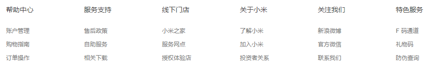
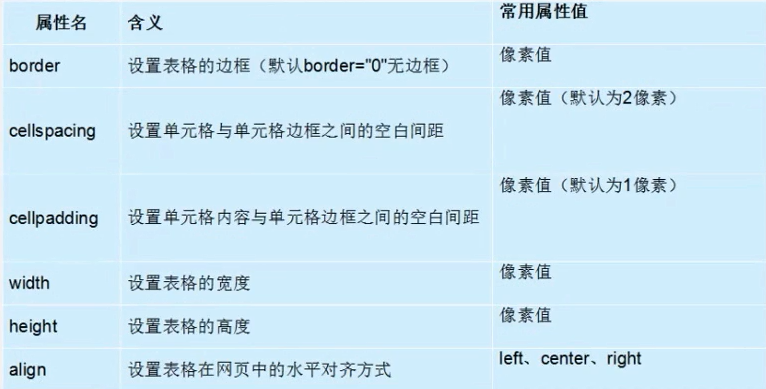
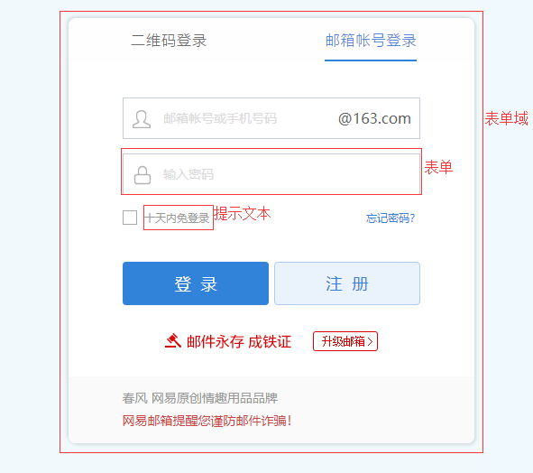
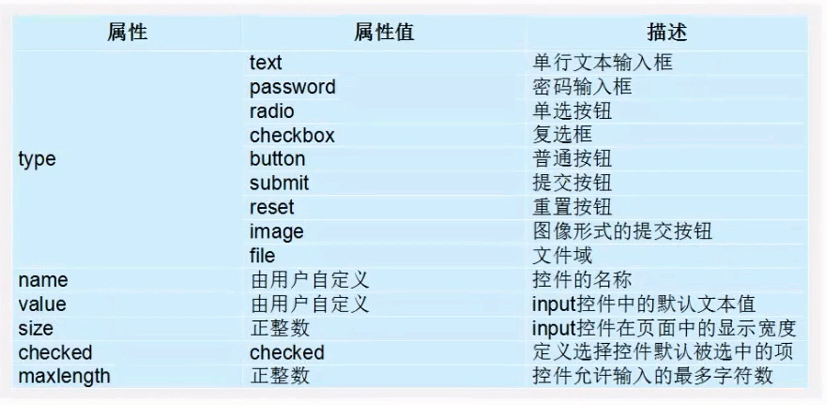

<h2>1.列表标签</h2>
什么是列表：就是容器里面装载着文字或图标的一种形式，叫列表。
<h5>无序列表ul(重点)</h5>

```
<ul type="square">
    <li>列表1</li>
    <li>列表2</li>
    <li>列表3</li>
    <li>列表4</li>
</ul>
type="disc/square/circle":实心，正方块，空心
```
注意：

```
1、<ul></ul>中只能嵌套<li></li>，直接在<ul></ul>标签中输入其他标签或者文字的做法是不被允许/不规范的。

2、<li>与</li>之间相当于一个容器，可以容纳所有元素。如：<li><h4>说过有</h4><p>苹果</p></li>

3、无序列表会带有自己样式属性，放下那个样式，让CSS来！
```

<h5>有序列表</h5>

```
<ol type="A">
    <li>列表1</li>
    <li>列表1</li>
    <li>列表1</li>
    <li>列表1</li>
</ol>
type="A/i"：i罗马数字
默认是数字1、2、3、、、
```
<h5>自定义列表(常用)</h5>

```
<dl>
   <dt>定义标题</dt>
   <dd>定义描述、解释</dd>
   ...
   <dt>北京</dt>
   <dd>朝阳</dd>
   <dd>昌平</dd>
   <dd>海淀</dd>
   ...
</dl>
```
常用在网页底部：如小米官网的底部


<h2>2.表格table</h2>
一般用在如：小米官网手机参数和新浪股票行情，数据比较多的情况下用它。

```
<table border="1" cellspacing="0" cellpadding="5" width="500" height="300" align="center"> 表格
    <tr> 行标签
        <td>姓名</td> 单元格标签
        <td>性别</td>
        <td>年龄</td>
    </tr>
    <tr>
        <td>姓名</td> 
        <td>性别</td>
        <td>年龄</td>
    </tr>
    <tr>
        <td>姓名</td> 
        <td>性别</td>
        <td>年龄</td>
    </tr>
</table>
```
注意：

```
 1.<tr></tr>中只能嵌套<td></td>
 2.<td></td>标签，它就像一个容器，一个类，可以容纳所有的元素。
```
<h5>表格属性</h5>

<h5>表头标签</h5>

```
<table border="1" cellspacing="0" cellpadding="5" width="500" height="300" align="center"> 表格
    <tr> 行标签
        <th>姓名</th> 表头标签
        <th>性别</th>
        <th>年龄</th>
    </tr>
    <tr>
        <td>张三</td> 
        <td>男</td>
        <td>20</td>
    </tr>
    <tr>
        <td>李四</td> 
        <td>男</td>
        <td>40</td>
    </tr>
</table>
```
<h5>表格结构</h5>

```
在使用表格进行布局时，可以将表格划分为头部、主体和页脚(页脚因为有兼容性问题、、、)具体如下：

<thead></thead>:用于定义表格的头部。

必须位于<table></table>标签中，一般包含网页的logo和导航等头部信息。

<tbody></tbody>:用于定义表格的主体。

位于<table></table>标签中，一般包含网页中除头部和底部之外的其他内容。
```


```
<table border="1" cellspacing="0" cellpadding="5" width="500" height="300" align="center"> 表格
    <thead> 表格头部
       <tr> 行标签
          <th>姓名</th> 表头标签
          <th>性别</th>
          <th>年龄</th>
       </tr>
    </thead>
    <tbody>表格的主体部分
    <tr>
        <td>张三</td> 
        <td>男</td>
        <td>20</td>
    </tr>
    <tr>
        <td>李四</td> 
        <td>男</td>
        <td>40</td>
    </tr>
    </tbody>
</table>
```
<h5>浏览器审查HTML标签元素</h5>

- control+shift+i/F12 检查元素
- Elements 元素 
- control+shift+c 指定元素的小箭头
<h5>表格标题caption</h5>

```
<table>
      <caption>表格标题</caption>
      <thead> 表格头部
       <tr> 行标签
          <th>姓名</th> 表头标签
          <th>性别</th>
          <th>年龄</th>
       </tr>
    </thead>
    <tbody>表格的主体部分
    <tr>
        <td>张三</td> 
        <td>男</td>
        <td>20</td>
    </tr>
    <tr>
        <td>李四</td> 
        <td>男</td>
        <td>40</td>
    </tr>
    </tbody>
</table>
```
<h5>合并单元格</h5>
跨行合并：rowspan 

跨列合并：colspan

```
<table>
      <caption>表格标题</caption>
      <thead> 表格头部
       <tr> 行标签
          <th>姓名</th> 表头标签
          <th>性别</th>
          <th>年龄</th>
       </tr>
    </thead>
    <tbody>表格的主体部分
    <tr>
        <td>张三</td> 
        <td>男</td>
        <td rowspan="2">20</td> 跨行合并单元格
    </tr>
    <tr>
        <td>王五</td> 
        <td>男</td>
    </tr>
    <tr>
        <td>李四</td> 
        <td colspan="2">合并之后</td> 跨列合并单元格
    </tr>
    </tbody>
</table>
```
<h2>3.表单标签(掌握)</h2>
目的：为了收集用户信息。<br><br>
在HMTL中，一个完整的白哦单通常由表单控件(也称为表单元素)、提示信息和表单域3个部分构成。<br><br>
表单控件：input控件、sleect控件、textarea、button


<h5>input控件(重点)</h5>
input 输入<br>
type 类型

```
<input/>标签为单标签，type为属性,其取值有多种，用于指定不同的控件类型。除了type属性之外，<input/>标签还可以定义很多其他的属性，常用的如下：
```


```
用户名：<input type="text" value="请输入用户名"/>   value默认值 text文本框

密码：<input type="password" maxlength="6"/>  password密码框 maxlength最大长度

性别：<input type="radio" name="sex" checked="checked"/>男   radio单选框 如果是一组通过相同的name值来实现 checked默认选中
     <input type="radio" name="sex"/>女  

爱好：<input type="checkbox" name="hobby"/>足球   checkbox复选框
     <input type="checkbox" name="hobby"/> 篮球
     <input type="checkbox" name="hobby"/> 乒乓球

搜索：<input type="button" value="搜索"/> button普通按钮
     <input type="submit" vaule="提交表单"/> submit提交按钮
     <input type="reset" value="重置表单"/> reset重置按钮
     <input type="image" src="./images/1.png" />  image图像按钮
     上传头像：<input type="file"/> file文件按钮

```
<h5>label标签</h5>
label标签为input元素定义标注(标签)<br><br>
作用：用于绑定一个表单元素，当点击label标签的时候，被绑定的表单元素就会获得输入焦点。<br><br>

如何绑定元素呢？

for属性规定label与哪个表单元素绑定。

```
<label> 输入账号：<input type="text"/></label>

如果label里面里面有多个表单，想定位到某个，可以通过for id的格式来进行

<label for="two"> 
输入账号：<input type="text"/> 
         <input type="text" id="two"/>
</label>
```
<h5>textarea控件（文本域）</h5>

```
留言板：
<textarea cols="每行中的字符数" rows="显示的行数">
    请输入留言
</textarea>
```
<h5>select下拉菜单</h5>

```
籍贯：
<select>
    <option>点击选择你的籍贯</option>
    <option>北京</option>
    <option>上海</option>
    <option>广州</option>
    <option selected="selected">深圳</option>
</select>
<select>
    <option>点击选择你的城市</option>
    <option>海淀</option>
    <option>昌平</option>
    <option>朝阳</option>
    <option>大兴</option>
</select>
```
注意：
```
 1.<select></select>中至少应包含一对<option></option>
 2.在option中定义selected="selected"时，当前项即为选中项。
```
<h5>表单域</h5>
三个域：

- 文本域 textarea 留言的
- 文件域 input type="file" 上传文件的
- 表单域 form 收集表单控件信息

```
<form action="url地址" method="提交方式" name="表单名称">
     各种表单控件
</form>
```
常用属性：

- 1.Action在表单收集到信息后，需要将信息传递给服务器进行处理，action属性用于指定接收并处理表单数据的服务器程序的url地址。
- 2.method用于设置表单数据的提交方式，其取值为get或post。
- 3.name用于指定表单的名称，以区分同一个页面中的多个表单。<br>
注意:每个表单都应该有自己表单域。

```
<form action="demo.php" method="post" name="login">
<p>用户名：<input type="text" name="username" id=""></p>
<p>密码：<input type="password" name="pwd" id=""></p>
<input type="submit" value="提交"/>
<input type="reset" value="重置"/>
</form>

<form action="demo.php" method="post" name="regiter">
<p>用户名：<input type="text" name="username" id=""></p>
<p>密码：<input type="password" name="pwd" id=""></p>
<input type="submit" value="提交"/>
<input type="reset" value="重置"/>
</form>
```

注意：


- get，速度快，但是会显示表单里面的内容，不安全，不能做密码提交的。

- post速度慢一些，但是不会显示表单内容，安全一些。
    
     