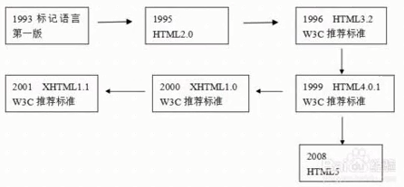
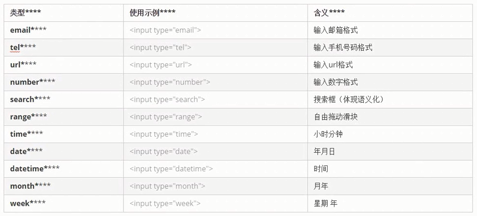
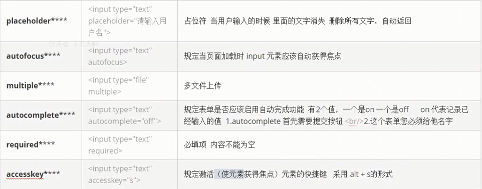
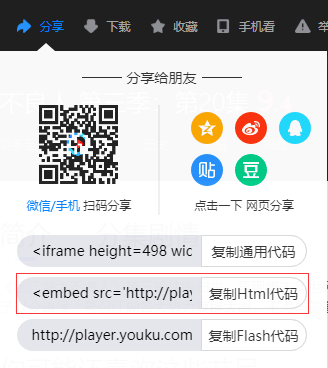
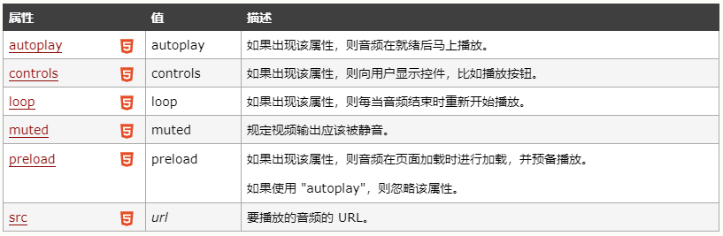
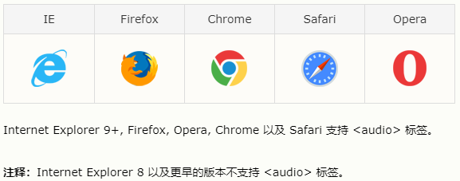
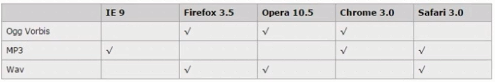
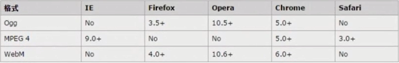
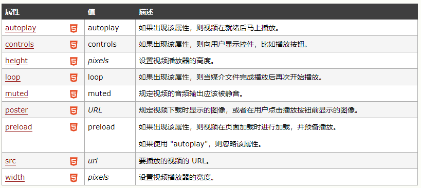

<h2>HTML的发展历程</h2>

<h2>文档类型设定</h2>
 
 - document
 - HTML   sublime输入 html:4s
 - XHTML  sublime 输入 html:xt
 - XHTML5 sublime输入 html:5 <! DOCTYPE html>
 <h2>字符设定</h2>

```
<meta http-equiv="charset" content="utf-8">:HTML与XHTML中建议这样去写
<meta charset="utf-8">:HTML5的标签中建议这样去写
 ```
 <h2>常用新标签</h2>
 W3C手册官网：

 http://www.w3chtml.com/cn

 - header：定义文档的页眉头部
 - nav :定义导航链接的部分
 - footer:定义文档或节的页脚
 - article:定义文字
 - section:定义文档中的节(section、区段)
 - aside:定义其所处内容之外的内容 侧边
 - datalist:标签定义选项列表，请与input元素配合使用该元素
 - fieldset：元素可将表单内的相关元素分组，打包  legend搭配使用
 ```
 <header>语义：定义页面的头部 页眉</header>
 <nav>语义：定义导航栏</nav>
 <footer>语义：定义 页面底部 页脚</footer>
 <article>语义：定义文章</article>
 <section>语义：定义区域/文章小节</section>
 <aside>语义：定义侧边栏的内容</aside>

 <input type="text" value="输入明星" list="star"/>  <!-- input里面用list -->
 <datalist id="star">  <!-- datalist里面用id来实现和input链接 -->
      <option>李嘉欣</option>
      <option>王艳</option>
      <option>李若彤</option>
      <option>郭碧婷</option>
 </datalist>

 <fieldset>
      <legend>用户登录</legend>标题
      用户名：<input type="text">
      密 码 ：<input type="password">
 </fieldset>
 ```
<h2>新增的input type属性值：</h2>


```
<fieldset>
      <legend>HTML5新增的input type类型</legend>
      <form action="">
          邮箱：<input type="email"/> <!--email格式-->

          手机：<input type="tel"> <!--手机-->

          数字：<input type="number"> <!--只能是数字-->

          url:<input type="url"> <!--网址格式的-->
          
          搜索：<input type="search"> <!--搜索-->

          区域：<input type="range"> <!--区域滑块-->

          时间：<input type="time"> <!--小时 分钟-->

          年月日：<input type="date"> <!--年月日-->

          年月：<input type="month"> <! --年月-->

          星期：<input type="month"> <!--周-->

          颜色：<input type="color"> <!--颜色-->

          <input type="submit">
      </form>
</fieldset>
```

http://www.w3school.com.cn/html5/html_5_form_input_types.asp

<h2>常用新属性</h2>


```
用户名：<input type="text" placeholder="请输入用户名" autofocus="autofocus"/>

上传头像：<input type="file" multiple/>

自动记录完成：
1.autocomplete 首先需要提交按钮
2.这个表单必须要给它名字/要有name值
    <form action="">
          姓名：<input type="text" autocomplete name="userName"/>
          <input type="submit"/>
    </form>

          昵称：<input type="text" require accesskey="s"/>
          alt+s获得光标焦点
```

```
案例：
<form action="">
<fieldest>
     <lengend>学生档案</lengend>
     <label>姓名：<input type="text" placeholder="请输入你的学生名字"></label><br>
     
     <label>手机号：<input type="tel"></label><br>

     <label>邮箱：<input type="email"></label><br>

     <label>所属学院：<input type="text" placeholder="请选择学院" list="college"></label>
     <datalist id="college"> 
            <option>前端学院</option>
            <option>Java学院</option>
            <option>php学院</option>
            <option>环艺学院</option>
     </datalist><br>

     <label>出生日期：<input type="tata"/></label><br>

     <label>成绩：<input type="number"/></label><br>

     <label>毕业时间：<input type="tata"/></label><br>

     <input type="submit"><input type="reset">
</fieldest>
</form>
```
<h2>H5新增补充</h2>

```
<span>我是</span><mark>标记</mark>
<label>下载中:</label>
<progress value="50" max="100"></progress>
<ul contenteditable="false" draggable="true" hidden>
    <li>曹操</li>
    <li>项羽</li>
    <li>曹操</li>
</ul>
<textarea spellcheck="true"> </textarea>
```
<h2>多媒体标签</h2>

- embed ：标签定义嵌入的内容
- audio ：播放音频
- video ：播放视频

embed可以用来插入各种多媒体，格式可以是Midi、Wav、AlFF、AU、MP3等。url为音频或视频文件及其路径，可以是相对路径或绝对路径。但要处理兼容方面的问题。

建议：因为内存的问题，我们可以把视频放在优酷、土豆、爱奇艺、腾讯、乐视等，然后调用传在上面的地址，这样它既不暂用我们网站的一个控件，且也可以显示视频。

优酷视频为例：



```
 <body>
 <embed src='http://player.youku.com/player.php/sid/XNDA3ODgzNDU4MA==/v.swf' allowFullScreen='true' quality='high' width='480' height='400' align='middle' allowScriptAccess='always' type='application/x-shockwave-flash'></embed>
 </body>
```

<h2>音频audio</h2>

```
<!-- 音频 -->
  <audio autoplay="autoplay" controls="controls" loop="-1" <!--数字写几次就循环几次，-1代表无限循环和loop=loop一样的-->
         onmouseover="this.play()" onmouseout="this.pause()">
         <source src="medias/Truth%20of%20the%20Legend.ogg">
  </audio>
```

http://www.w3school.com.cn/tags/tag_audio.asp
HTML5中的新属性：


兼容问题，浏览器支持：




为了浏览器兼容：ogg mp3 wav

```
  <audio controls autoplay>
      <source src="xxx.mp3">
      <source src="xxx.ogg">
      您的浏览器不支持播放声音。
  </audio>
```
<h5>想让html5的video和audio标签能在所有浏览器上工作，必须在页面的head内部加入以下一行代码：</h5>

```
<script src="//api.html5media.info/1.1.8/html5media.min.js"></script>
 然后你可以使用以下代码加入一段视频：

<video src="video.mp4" width="320" height="200" controls preload></video>
 你还可以使用以下代码加入一段音频：

<audio src="audio.mp3" controls preload></audio>
```
<h2>视频 video</h2>

http://www.w3school.com.cn/tags/tag_video.asp
```
 <!-- 视频 -->
  <video controls="controls"  loop onmouseover="this.play()"
         onmouseout="this.pause()" width="400" height="400">
        <source src="medias/volcano.mp4">
  </video>
```
当前video元素支持三种视频格式：


HTML5中的新属性：


```
   <!-- <video src="mp4.mp4" autoplay="autoplay" controls windth="500"></video> -->

   兼容性写法：我们视频支持 ogg mp4 webM三种视频格式
   <audio controls autoplay>
      <source src="xxx.mp4">
      <source src="xxx.ogg">
      您的浏览器不支持播放视频。
  </audio>
```