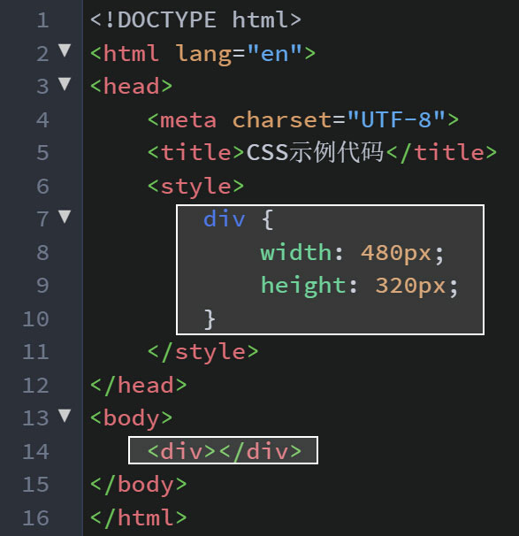
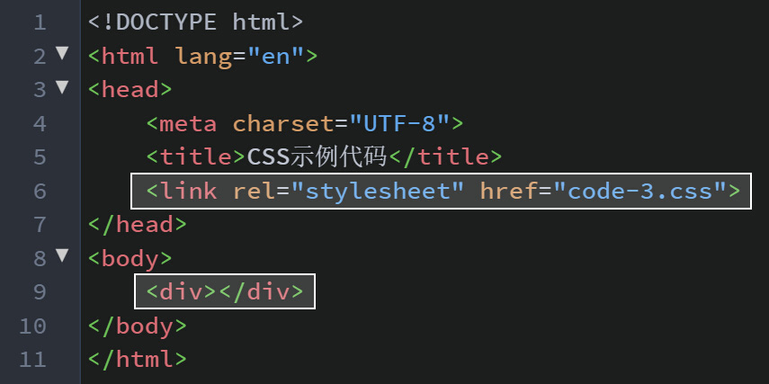
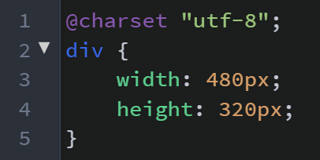
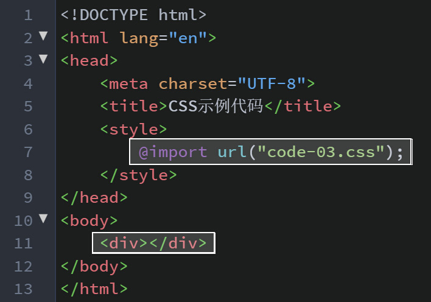

<h1>CSS概述</h1>
CSS全称"Cascading Style Sheets",用于设置HTML标签的样式，它的基本结构如下：

<h1>CSS引用样式</h1>
使用样式表主要由4种方式，即，"行内样式"、"内嵌样式"、"外链样式"、"导入式"。
<h4>行内样式</h4>
是将"style"作为一个标签的属性，然后通过它的值来设置样式。写法如下：

<h4>内嵌样式</h4>
将样式作为标签放置于< head>标签对以内，让浏览器在加载完成其它基本信息后，首先将样式给渲染出来。标签名为" < style> ",若项目采用的是HTML严格模式/标准模式(standard mode)开发，那需要为该标签加一个"type"属性，将值设为"text/css"。写法如下：

<h5>外链样式</h5>
同样是将< link>放置于< head>标签对以内，通过该标签的“href”属性的值去获取CSS文件的绝对/相对路径。该标签必须要具有“rel”属性，并且将值设为“stylesheet”,否则浏览器将不能正确的解析CSS文件进行样式渲染。
HTML文件写法如下：

所对应的CSS文件写法如下：

注意： 
&nbsp;&nbsp;&nbsp;&nbsp;CSS文件开头需要设置一个编码格式，通常我们都是将其设为统一编码格式“UTF-8”（不区分大小写）。虽说不设置该值对CSS代码本身执行影响不大，但是在我们通过浏览器“开发者工具”查看CSS代码的时候，里面的“中文注释”会显示成乱码。
<h4>导入式</h4>
该方法是在< style>标签的内容里通过“@import”方法来导入外部CSS文件，这点和通过< link>标签导入外部样式是一样的，但其它方面却有很大不同，后面会讲到。这种方式的写法是：

这里导入的样式和用<link>标签导入的样式是同一个CSS文件，这里就不再展示。  
通过< link rel="stylesheet">链接的CSS文件和用“@import”导入的CSS文件同是外部引用的方式，但他们却有以下区别:

- < link>除了加载CSS文件以外，它还能加载其它类型文件，如“icon”、“index”、“rss”等，它还能通过将“rel”的值设置为“prefetch”执行文件的预加载，而“@import”只能加载CSS文件
- < link>在现代的浏览器中是多线程加载的，也就是说在通过该标签加载一个文件的时候< body>标签内的DOM也在执行同步的加载。而“@import”是一种“线性”的加载，加载效率不如< link>的方式
- 无论在老版本的浏览器中，或者现在一些非主流的浏览器中，页面都是会首先加载< link>标签引用的样式并渲染，而“@import”在这些浏览器中会最后才去渲染CSS的样式，这样会让用户首先看到一个无样式的HTML界面，等CSS渲染完成之后才能最终看到完整样式的界面
- < link>作为一个标签，也就是一个DOM元素，是可以通过JavaScript进行操作的（如增加、删除< link>标签，修改< link>的属性值等）。而“@import”写在< style>标签内部或CSS文件内（写在< style>标签内和CSS文件内的写法一致），是无法通过JavaScript进行操作的。  
综上所述：< link>无论是性能上、显示顺序上还是可以操作性上来讲都是优于“@import”的。所以，如果我们要使用外部样式，那基本上都是通过< link>标签来引用的。
<h1>CSS引用优先级</h1>
“优先级”的高低，即当一个选择器同时关联了两个同样的CSS样式时，被执行的那个CSS样式我们视为“优先级高”，被忽略的那个CSS样式我们视为“优先级低”。以上四种样式的引用方式，按照优先级从高到低排列分别是： 
行内样式 > 内嵌样式 > 外链样式 > 导入样式  
补充：!important >行内样式 > 内嵌样式 > 外链样式 > 导入样式  
我们可以这样理解：越是离我们要设置样式标签元素近的CSS样式，那优先级越高，反之，优先级越低。当然在这里需要明白的是，CSS样式的引用优先级没有优先级越高越好或者优先级越低越好的说法，我们是要利用样式优先级这一特性，在是我们写更少的CSS代码同时，又使我们的Web页面表现力更加丰富。
<h1>通过< link>标签引用CSS文件</h1>
在实际的项目开发过程中，我们一般都是将CSS单独存放在一个文件夹中，然后在HTML页面中通过< link rel="stylesheet" href="样式表路径+名称.css">的方式进行引用。引用后CSS文件仍然是独立的，不会受到包括HTML和JavaScript任何方法和函数的影响，如果CSS文件中涉及到文件路径的相对位置，那么也是以CSS文件所在的文件路径位置为准，而非引用它的HTML文件的文件路径位置。  
相对于“行内样式”和“内嵌样式”而言，“外链样式”即通过< link>标签引用CSS样式有以下好处：  

- 简化了DOM结构，实现了内容和表现的分离，使HTML和CSS文件结构更加清晰，利于维护
- 大大减少了CSS代码的编写量。项目越大，这一点体验得越明显
- < link>可以和其它< link>、JS文件以及< body>内的内容进行多线程加载，使得加载速度更快
- 利于项目整体风格的调整，维护起来也更加便捷。单文件修改，全网站（应用）生效
- 浏览器会将CSS文件进行缓存，进一步地减少了加载所需时间
- 可以根据需要利用JavaScript或Media动态的组合所需的CSS文件
- 对搜索引擎友好，有利于SEO