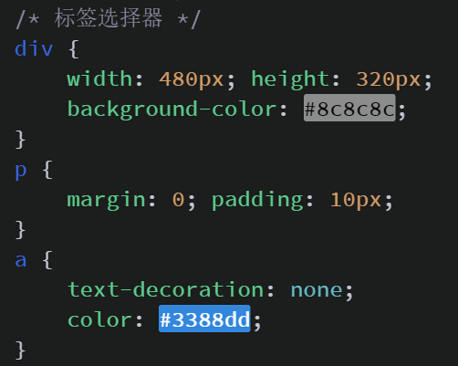
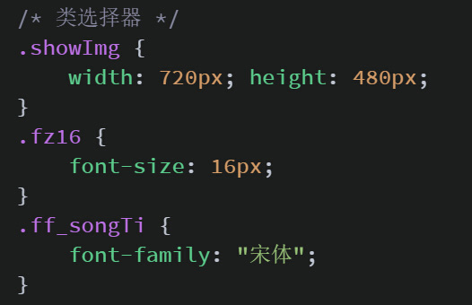
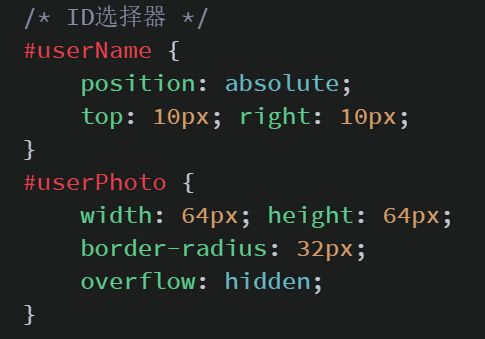
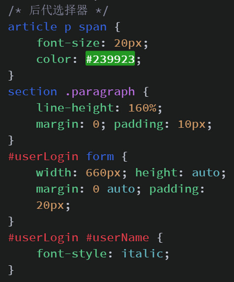
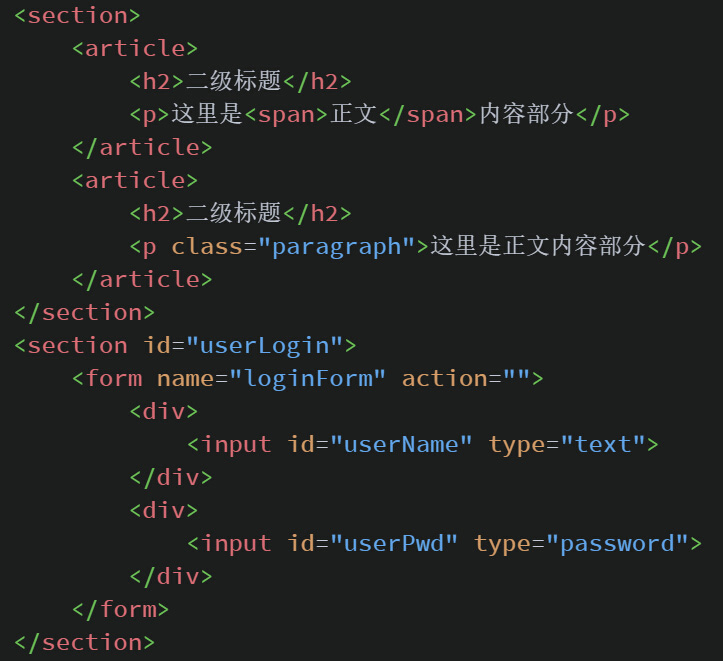
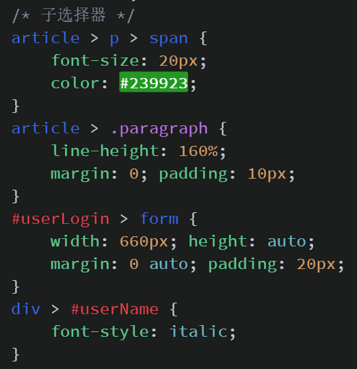
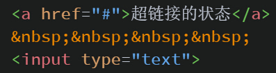
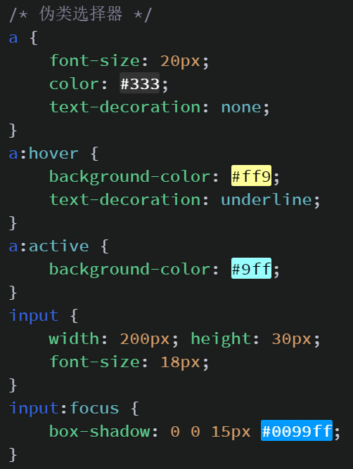

<h1>CSS选择器概述</h1>
所谓CSS选择器(selector)就是，对HTML页面中的元素实现一对一，一对多或者多对一的控制,从而实现布局调整，元素类型重定义，元素美化，文本、图像美化，完善交互，播放动画等一系列的功能。
<h1>CSS基础选择器</h1>
CSS的基础选择器主要有三个：“标签选择器”、“类选择器”和“ID选择器”。
<h4>标签选择器（weighting：1）</h4>
一个完整的HTML页面是有很多不同的标签组成，而标签选择器，则是决定哪些标签采用相应的CSS样式。写法如下：

<h4>类选择器（weighting：10）</h4>
类选择器（Class选择器）根据类名来选择,而这个类名是自定义的，但我们在定义这个类名的时候也应该尽量能反应被设置元素的实际功能。比如说，我们是用于显示一张图片的，我们可以取名“showImg”；如果是将一个字体字号设置为16像素的，应该取名为“f16”或“fz16”。同一个类名的选择器理论上可以被任意多的标签元素使用。在CSS中，定义类名选择器应该以“.”作为开头，否则，浏览器将视为你自定义的标签名。写法如下：

<h4>ID选择器（weighting：100）</h4>
和类选择器一样，名称也是自定义的，命名原则也应该尽量能反应该元素的实际功能，或者一些唯一的特质。但它和Class的不同，它应该是页面里唯一的，即同一个页面内只能出现一个ID，否则，不仅违反了ID命名的基本规则，也会在JS（其它JS框架皆是如此）进行操作时，始终都只能获取到第一个ID，之后的相同ID的元素则不会生效。定义一个ID选择器应该以“#”开头。写法如下：

除此以外，还有一个选择器“*”叫做“通用选择器”，它的作用是选择页面中所有的标签元素，它的权重是0（weighting：0），但业内很多Web前端优化师都认为该选择符存在性能问题，而且它一旦使用后父选择器与后代选择器的搭配容易出现浏览器不能解析的情况，所以一般在高质量的Web页面中基本是看不到该选择符的，就算是平时也不推荐大家使用。
<h1>后代选择器</h1>
后代选择器是对某元素所嵌套的指定元素进行选择，每个选择符之间用空格进行分割，多个嵌套层次应该以多个空格进行分割（多层嵌套难免会增加选择器带来高权重，这样在处理一些元素的特殊样式的时候会带来些困难，所以在实际开发中我们还是应该避免出现多层嵌套的后代选择器的存在），HTML代码如下：

CSS代码如下：

<h1>子选择器</h1>
子选择器区别与后代选择器的地方就是，后代选择器可以选择嵌套在标签内部任意层级的标签元素，而子选择器只能选择当前标签往内一层的元素。每个选择符之间用“>”进行分割，HTML代码如上例：

CSS代码如下：

<h1>伪类选择器</h1>
伪类选择器和其它选择器有所不同，它是通过触发一定的“事件”来实现效果，也就是说如果不进行任何操作是看不到该选择器的CSS样式设置的。以Google Chrome浏览器开发者工具为例，要想看到所设置的伪类选择器样式需通过点击“ Element”标签栏下“Style”标签栏中的“:hov”按钮，然后勾选需要查看的操作事件进行样式查看。目前支持的操作事件有，“hover”,“active”，“visited”和“focus”:
<h4>:hover</h4>
鼠标悬浮于该元素上设置的样式
<h4>:active</h4>
鼠标悬点击时该元素上设置的样式
<h4>:visited（不建议使用）</h4>
鼠标悬点击后该元素上设置的样式
<h4>:focus</h4>
表单元素获得焦点后设置的样式
HTML代码如下：

CSS代码如下：
