<h1>CSS文本样式概述</h1>
文本在HTML页面中是最基本的表现形式，通过文本能最有效而详细的说明网页中的内容。但若不对页面中的文本做任何处理，那会给用户浏览带来一些不好的体验。如果通过CSS对文本进行设置后，不仅让用户浏览体验更佳的好，也会让页面的美观程度提升一个高度。
<h1>文字的的基本属性“font”</h1>
该属性用于设置网页中文本的基本显示样式，如字体类型、字体粗细、字体大小、字体系列，甚至还可以直接通过对“font”属性多值的设置实现对文本行高的设置。  
“font”属性有以下分支属性：
<h3 style="font-sze:16px;color:#2a90d1;">font-style</h3>
用于设置字体类型，可设置以下值：

- normal:普通字体
- italic:斜体
- oblique:倾斜字体
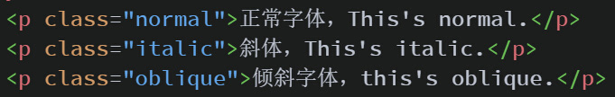
CSS代码如下：
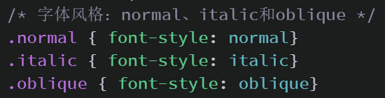
运行效果：

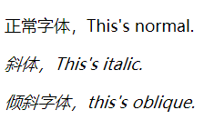
<h3 style="font-sze:16px;color:#2a90d1;">font-weight</h3>
用于设置字体粗细，可设置以下值：

- normal:正常粗细
- bold:粗体
- border:更粗的字体
- lighter:更细的字体
- 100-900：步长为100,400等同于normal,而700等同于bold
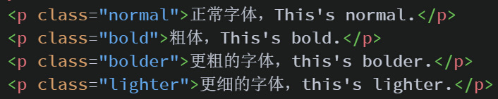
CSS代码如下：
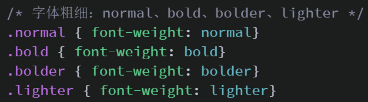
运行效果：

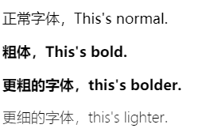
<h3 style="font-sze:16px;color:#2a90d1;">font-size</h3>
用于设置字体大小的，可设置的值可以是任意正整数和浮点数，但考虑到Chrome等主流浏览器不支持12像素以下的字体，若字号以像素为单位，或通过设置其它单位转换为的像素值不应该小于12像素。常用的字号单位有：

- px（像素）
- em（当前父元素内的默认字体大小）
- %（相对于浏览器默认字体大小的百分比）
- pt（点）
- ex（相当对于字母“x”的高度）
- pc（派卡）
- mm（毫米）
- cm（厘米）
- in（英寸）

常识:除非人为的对浏览器的设置进行了更改，否则目前浏览器的主流的字号都是采用16像素（px）的字体。
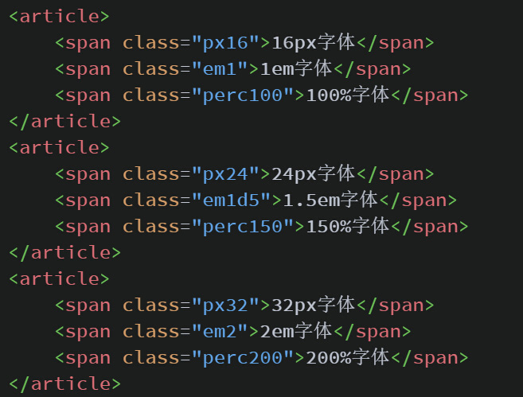
CSS代码如下：

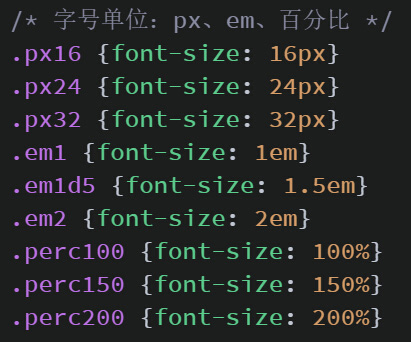
运行效果：
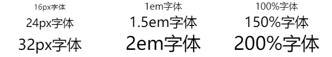
<h3 style="font-sze:16px;color:#2a90d1;">font-family</h3>
用于设置字体系列，就是我们通常说的“所用字体”。设置字体有以下规则，使用中文字体，或带空格的英文字体名，需要用“引号”将该字体名扩起来，单个单词的字体名称则无需加上引号。“font-family”可以有多个值，多个值设置的作用是，当浏览用户本地计算机没有找到设置的第一个值所表示的字体时，会去找第二个，以此类推，若找到最后一个值都没有找到匹配的字体，浏览器则会用自己的默认字体。考虑到网页最终显示效果在不同设备上的一致性，我们通常使用的中文字体只有：“宋体”、“微软雅黑”、“黑体”、“楷体”、“幼圆”等，而目前以“微软雅黑”为最常用设计字体。常用的英文字体有：“Arial”、“Helvetica”、“Tahoma”、“Verdana”、“Lucida Grande”、“Times New Roman”、“Georgia”等。
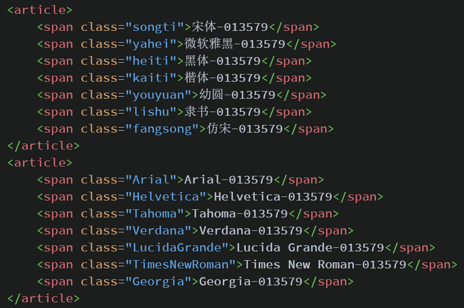
CSS代码如下：
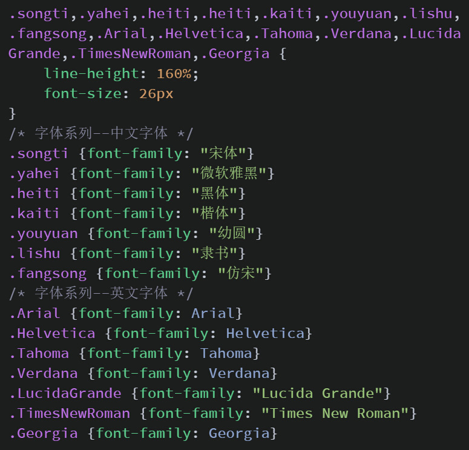
运行效果：
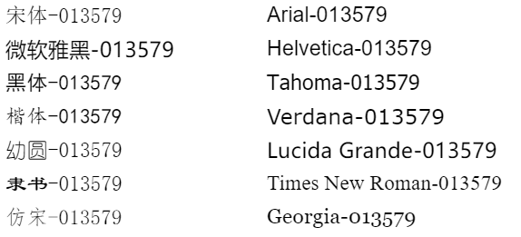
<h3 style="font-sze:16px;color:#2a90d1;">font的组合写法</h3>
除了为“font”的具体分支属性设置样式，我们还能将“font”的多个值组合起来写，如我们要设置一个风格为正常的粗体，字号为20像素的“微软雅黑”和一个风格为斜体的正常粗细，字号为22像素的“宋体”，我们可以这样写：
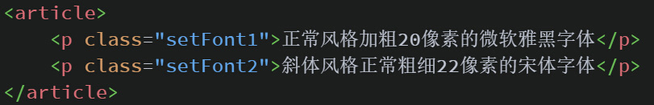
CSS代码如下：
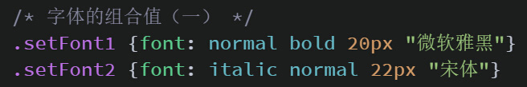
运行效果：
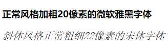

由于字体风格和字体粗细，具有一定的相似性，如他们都有一个“normal”值，所以在写“font”属性组合值的时候可以省略二者之一，以辨识到的值进行设置，另外一个自动为“normal”，甚至还能省略掉第前两个值，只保留“font-size”和“font-family”如：
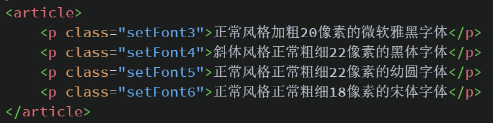
CSS代码如下：

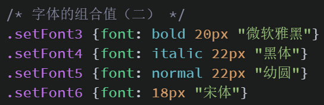
运行效果：
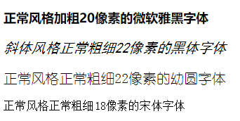

注意：在“font”组合值的写法中，只有“font-size”和“font-family”这两个的值是不能省略的，而且是缺一不可，否则浏览器会不认识该值，对该组合值进行报错。  
“font”属性组合值的写法，除了以上所提到的，它还有一种比较不常见，却还比较实用的写法，即可直接在“font”属性内设置文本的行高“line-height”，如下：
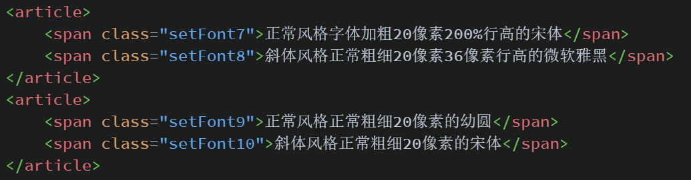
CSS代码如下：

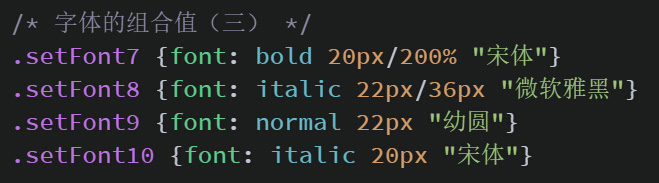
运行结果：
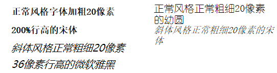  
<!-- <section style="background-color: #2a1907;color: #f2ebe7;">
<章节练习（一）>

用“font”多值组合的写法制作任意四个段落的文本，具体要求如下：

- 1、第一段文本为正常风格，正常粗细，16像素的“宋体”
- 2、第二段文本为斜体风格，正常粗细，20像素的“微软雅黑”
- 3、第三段文本为正常风格，加粗，22像素的“幼圆”
- 4、第四段文本为斜体风格，加粗，22像素的“楷体”
- 5、所有段落的行高是文字的1.6倍，并且不能使用“line-height”属性
- 6、每个段落之间的间距是30像素

<扩展功能>

- 1、具有一个在页面中居中的，字体为普通风格、普通粗细、颜色为“#0349fc”的一级标题，字体为“微软雅黑”
- 2、每个段落有2个字符的缩进
</section> -->
<h1>字体颜色--color</h1>
在目前的浏览器标准中，要想改变浏览器默认字体的颜色（#000000）唯一的途径就是通过CSS的"color"属性进行设置。颜色属性可以设置4种类型的值，有以下类型：
<h3 style="font-sze:16px;color:#2a90d1;">颜色英文单词</h3>
可以通过颜色的英文单词直接设置文本的颜色 
如"red"、"orange"、"yellow"、"green"、"cyan"、"blue"、"purple"、"pink"、"gray"、"black"和"while"等等。
<h3 style="font-sze:16px;color:#2a90d1;">HEX（16进制颜色）</h3>
通过"#"+16进制表示颜色，有"#"+"三位"和"#"+"六位"的形式。若是"三位"的形式，第一位表示"红",第二位表示"绿",第三位表示"蓝",通过取值区间"0-9"
