<h1>CSS文本概述</h1>
字体CSS设置主要是围绕文字本身进行，如文字风格、字体粗细、字体大小、字体系列、字体颜色等，就是说无论进行什么样的设置都是围绕单个文字本身的样式进行设置的，并不会影响到文本的整体布局（“font”组合值写法中的“行高”除外），这一节中CSS文本设置是对文本布局方面的知识进行。
<h1>文本的居中方式"text-align"</h1>
该属性用于控制"行内块元素"或"块元素"内"行内元素"（文本元素）的居中方式，包含三个值：

- <h3 style="font-sze:16px;color:#2a90d1;">left（默认）</h3>
    文本左对齐
- <h3 style="font-sze:16px;color:#2a90d1;">center</h3>
    文本居中对齐
- <h3 style="font-sze:16px;color:#2a90d1;">right</h3>
    文本右对齐<br><br>
HTML代码示例：

```
<article>
   <p class="left">文本左对齐</p>
   <P class="center">文本居中对齐</P>
   <P class="right">文本右对齐</P>
</article>
<article>
   <p class="left">
       <span>文本标签左对齐</span>
   </p>
   <p class="center">
       <label>字段标签居中对齐</label>
   </p>
   <p class="right">
       <a href="javascript:;">超链接标签右对齐</a>
   </p>
</article>
```
CSS代码如下：

```
<!-- 文本对齐方式：left、center、right -->

.left{
    text-align:left;
    }
.center{
    text-align:center;
    }
.right{
    text-align:right;
    }
```
运行效果：

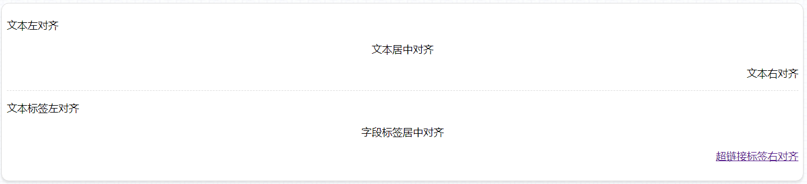
<h1>段落首行缩进"text-indent"</h1>
该属性是用于“行内元素”设置每个段落首行缩进数量值的属性，CSS字体大小（font-size）可以设置的数值和单位在该属性的值中都可以使用（除了百分比）。如果是使用与中文布局，一般会使用“2em”的数值和单位来为每个段落的首行缩进“两个字符”。<br><br>
HTML代码示例：

```
<article>
   <p class="em2">CSS目前最新版本为CSS3，是能够真正做到网页表现和内容分离的一种样式设计语言。相对于传统HTML的表现而言，CSS能够对网页的对象的位置排版进行像素级的精确控制，支持几乎所有的字体字号样式，拥有对网页对象和模型样式编辑的能力，并能够进行初步交互设计，是目前基于文本展示最优秀的表现设计语言。CSS能够根据不同使用者的理解能力，简化或者优化写法，针对各类人群，有较强的易读性。</p>
   <p class="PX40">CSS目前最新版本为CSS3，是能够真正做到网页表现和内容分离的一种样式设计语言。相对于传统HTML的表现而言，CSS能够对网页的对象的位置排版进行像素级的精确控制，支持几乎所有的字体字号样式，拥有对网页对象和模型样式编辑的能力，并能够进行初步交互设计，是目前基于文本展示最优秀的表现设计语言。CSS能够根据不同使用者的理解能力，简化或者优化写法，针对各类人群，有较强的易读性。</p>
   <p class="pt30">CSS目前最新版本为CSS3，是能够真正做到网页表现和内容分离的一种样式设计语言。相对于传统HTML的表现而言，CSS能够对网页的对象的位置排版进行像素级的精确控制，支持几乎所有的字体字号样式，拥有对网页对象和模型样式编辑的能力，并能够进行初步交互设计，是目前基于文本展示最优秀的表现设计语言。CSS能够根据不同使用者的理解能力，简化或者优化写法，针对各类人群，有较强的易读性。</p>
</article>
```
对应的CSS代码如下：

```
<!-- 段落首行缩进 -->
.em2{
    text-indent:2em;
}
.px40{
    text-indent:40px;
}
.pt30{
    text-indent:30px;
}
```
运行效果：

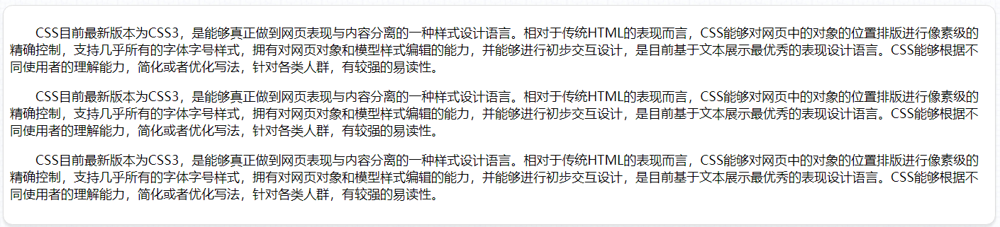
<h1>文本装饰线"text-decoration"</h1>
该属性是为文本上添加一根装饰线，带"href"属性的< a>标签默认会带有一根下划线，就是有该属性的值"underline"设置的。"text-decoration"属性有以下值：<br><br>

- <h3 style="font-sze:16px;color:#2a90d1;">none（默认）</h3>
    不显示任何装饰线
- <h3 style="font-sze:16px;color:#2a90d1;">underline</h3>
   在文本下方显示装饰线
- <h3 style="font-sze:16px;color:#2a90d1;">overline</h3>
   在文本上方显示装饰线
- <h3 style="font-sze:16px;color:#2a90d1;">line-through</h3>
   在文本中间显示装饰线，相当于删除线<br><br>
HTML代码示例：

```
<article> 
    <p class="noneLine">
       <a href="">没有任何装饰线</a>
    </p>
    <p class="underLine">
       <span>文本下方显示装饰线</span>
    </p>
    <p class="overLine">
       <span>文本上方显示装饰线</span>
    </p>
    <p class="lineThrough">
       <span>文本中间穿过装饰线</span>
    </p>
</article>
```
CSS代码如下：

```
<!-- 装饰线 -->
.noneLine a{
    text-decoration:none;
}
.underLine{
    text-decoration:underLine;
}
.overLine{
    text-decoration:overLine;
}
.lineThrough{
    text-decoration:line-through;
}
```
运行效果：

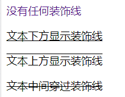
<h1>英文字母大小写转换“text-transform”</h1>
该属性能将“行内元素”中的英文文本进行大小写转换，以满足网站对规范性的要求。特别在一些对项目产品细节要求至严的跨国企业或合资企业，他们对网站或应用中的文本格式也有相当高的要求，当网站中的绝大部分英文文本都是由其它整理黏贴而来的时候，如果要逐一去修改这些文本，不仅时间成本大大地增加，也容易出现一些难以一时发现的疏漏，这个时候“text-transform”属性就能很好的帮我们解决。该属性有以下属性值：<br><br>

- <h3 style="font-sze:16px;color:#2a90d1;">none（默认）</h3>
   保持文本中英文单词的默认大小写
- <h3 style="font-sze:16px;color:#2a90d1;">capitalize</h3>
   每个英文单词首字母为大写字母，其它为小写字母
- <h3 style="font-sze:16px;color:#2a90d1;">uppercase</h3>
   将所有英文单词转换为大写字母
- <h3 style="font-sze:16px;color:#2a90d1;">lowercase</h3>
   将所有英文单词转换为小写字母<br><br>
HTML代码示例：

```
<article>
    <p class="transnone">There are plenty more fish in the sea than ever came out of it.</p>
    <p class="capitalize">There are plenty more fish in the sea than ever came out of it.</p>
    <p class="uppercase">There are plenty more fish in the sea than ever came out of it.</p>
    <p class="lowercase">There are plenty more fish in the sea than ever came out of it.</p>
</article>
```
CSS代码如下：

```
<!-- 英文大小写转换 -->
.transnone{
    text-transform:none;
}
.capitalize{
    text-transform:capitalize;
}
.uppercase{
    text-decoration:uppercase;
}
.lowercase{
    text-decoratio:lowercase;
}
```
运行效果：

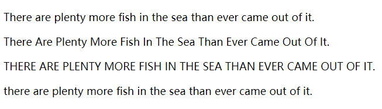
<h1>文本的阴影“text-shadow”</h1>
该属性的作用是给文本添加阴影效果。该属性最初在CSS2.0中被定义的，但在CSS2.1被删除了，不知处于睡眠考虑，在CSS3.0中又重新被写进了规范。目前除了<span style="font-size: 18px;color: #0b933b;">IE9及之前版本不支持</span>该属性外，其它主流浏览器均支持该属性。<br><br>
该属性有4个值，具体如下：

- <h3 style="font-sze:16px;color:#2a90d1;">水平方向阴影偏移（h-shadow）</h3>
   “0”表示维持原位，正数为向右偏移，负数为向左偏移。单位为像素“px”。
- <h3 style="font-sze:16px;color:#2a90d1;">垂直方向阴影偏移（v-shadow)</h3>
   “0”表示维持原位，正数为向上偏移，负数为向下偏移。单位为像素“px”。
- <h3 style="font-sze:16px;color:#2a90d1;">阴影模糊距离（blur）</h3>
   用正数表示阴影模糊的单位距离，距离越大模糊程度越高，单位为像素“px”。
- <h3 style="font-sze:16px;color:#2a90d1;">阴影的颜色（color）</h3>
   支持Web技术中的常用颜色模式：“颜色英文单词”、“HEX”、“RGBa”、“HSLa”。<br><br>
   注意：
   
   和“行内块元素”和“块元素”所用的“box-shadow”有所不同，文本阴影的属性值里没有“inset”（设置为内阴影）和“spread”（阴影的扩展，单位像素“px”），以后在使用中需要加以区分。<br><br>
HTML代码示例：
```
<article>
    <p class="textShadow-1">
       <span>用英文单词表示文本阴影的颜色</span>
    </p>
    <p class="textShadow-2">
       <span>用HEX表示文本阴影的颜色</span>
    </p>
    <p class="textShadow-3">
       <span>用RGBa表示文本阴影的颜色</span>
    </p>
    <p class="textShadow-4">
       <span>用HSLa表示文本阴影的颜色</span>
    </p>
</article>
```
CSS代码如下：
```
<!-- 文本阴影 -->
.textShadow-1,textShadow-3{
    color:#fff;
}
.textShadow-1{
    text-shadow:-1px 2px 2px purple;
}
.textShadow-2{
    text-shadow:0 0 2px #0b31d4;
}
.textShadow-3{
    text-shadow:0 -1px 2px rgba(162,13,65,0.9);
}
.textShadow-4{
    text-shadow:0 0 4px hsla(122,85%,36%,0.8);
}
```
运行结果：

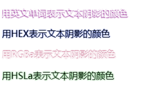
<h1>段落文本行高“line-height”</h1>
该属性是用于设置“行内元素”中文本元素在一行中所占据的高度，可以使用的值也和字体大小设置一样，而且同样能够使用百分比，或不带单位的浮点数（“1”表示“100%”，“1.5”表示“150%”，以此类推）。该属性除字面上的意思外，很多时候还有一个小妙用，就是当文本元素只有一行时，可以将该行的文本行高设为和父容器元素高度一致，以此到达文本垂直居中的效果。使用场景如：表格、导航按钮、自定义样式按钮、标题栏等。<br><br>
HTML代码示例：

```
<article>
   <p class="lineHeight">CSS目前最新版本为CSS3，是能够真正做到网页表现和内容分离的一种样式设计语言。相对于传统HTML的表现而言，CSS能够对网页的对象的位置排版进行像素级的精确控制，支持几乎所有的字体字号样式，拥有对网页对象和模型样式编辑的能力，并能够进行初步交互设计，是目前基于文本展示最优秀的表现设计语言。CSS能够根据不同使用者的理解能力，简化或者优化写法，针对各类人群，有较强的易读性。</p>
   <button type="button" class="customBtn">自定义样式按钮</button>
   <nav class="mainNav">
        <a href="javascript:;">网站首页</a>
        <a href="javascript:;">产品介绍</a>
        <a href="javascript:;" class="checked">特色功能</a>
        <a href="javascript:;">帮助与支持</a>
        <a href="javascript:;">关于我们</a>
   </nav>
</article>
```
CSS代码如下：
```
<!-- 行高 -->
.lineHeight{
    line-height:1.6;
}
.customBtn{
    width:200px;
    line-height:50px;
}
.mainNav a{
    width:108px;
    background-color:#9A9A9A;
    line-height:42px;
    text-align:center;
    text-decoration:none;
    color:#fff;
    display:inline-block;
    margin-top:15px;
}
.mainNav a.checked{
    background-color:#131313;
}
```
运行效果：

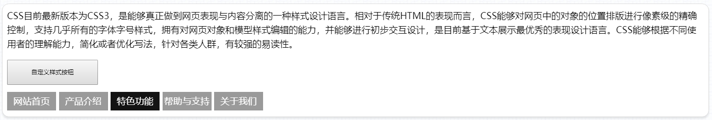

<!-- <章节练习（一）>
制作任意四个文本段落，具体要求如下：

1、第一个文本段落首行缩进两个中文字符

2、第二个文本段落中应该包含一个名为“百度”的超链接，点击后以浏览器新选项卡（或新窗口）的方式跳转到“https://www.baidu.com”,该超链接标签文本不应包含下划线

3、第三个段落为字体颜色为“#fff”带阴影的文本，阴影水平偏移量“0”,垂直偏移量“2px”,模糊距离“1px”，颜色为“rgba(253,76,233,.96)”

4、第四个段落文本对齐方式为右对齐，字数控制在2~16字内

5、以上段落，除了第四个段落以外，至少要求具有两行任意文本，行高应为文本的140%

<扩展功能>
1、四个段落应该包含在一个<article>标签内，且该标签实际宽度为“960像素”，水平居中

2、页面背景色为“#e3e3e3”,<article>背景色为“纯白色”，边框为“#acacac”的1像素实线

3、<article>标签内的段落应该和边框上下保持12像素左右20像素的内间距

4、<article>标签具备一个漂亮但不突兀的阴影 -->

<h1>单词的间距“word-spacing”</h1>
该属性用于设置英文单词之间的间距，中文则是设置文本中空格的距离，单位为Web技术的常用度量单位，如“像素（px）”，“字符（em）”，“点（pt）”等，可以为负数。<br><br>
HTML代码示例：

```
<article>
   <p class="wordSpacing-1">
       <span>There are plenty more fish in the sea than ever came out of it.</span>
   </p>
   <p class="wordSpacing-2">
      <span>天涯 何处 无芳草</span>
   </p>
   <p class="wordSpacing-3">
       <span>There are plenty more fish in the sea than ever came out of it.</span>
   </p>
   <p class="wordSpacing-4">
      <span>天涯 何处 无芳草</span>
   </p>
</article>
```
CSS代码如下：
```
<!-- 单词间距 -->
.wordSpacing-1{
    word-spacing:10px;
}
.wordSpacing-2{
    word-spacing:2em;
}
.wordSpacing-3{
    word-spacing:-15px;
}
.wordSpacing-4{
    word-spacing:-1em;
}
```
运行效果：

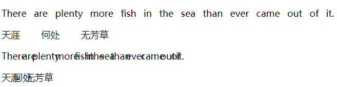

<h1>字符的间距“letter-spacing”</h1>
和“word-spacing”有所不同，该属性是用于控制字符间的间距，即无论单词或词语中含有空格（该属性对空格字符无效），该属性都会生效，单位同样为Web技术的常用度量单位，同样为可以为负数。<br><br>
HTML代码示例：

```
<article>
   <p class="letterSpacing-1">
       <span>There are plenty more fish in the sea than ever came out of it.</span>
   </p>
   <p class="letterSpacing-2">
      <span>天涯 何处 无芳草</span>
   </p>
   <p class="letterSpacing-3">
       <span>There are plenty more fish in the sea than ever came out of it.</span>
   </p>
   <p class="letterSpacing-4">
      <span>天涯 何处 无芳草</span>
   </p>
</article>
```

CSS代码如下：
```
<!-- 字符间距 -->
.letterSpacing-1{
    letter-spacing:2px;
}
.letterSpacing-2{
    letter-spacing:0.6em;
}
.letterSpacing-3{
    letter-spacing:-3px;
}
.letterSpacing-4{
    letter-spacing:-4px;
}
```
运行效果：

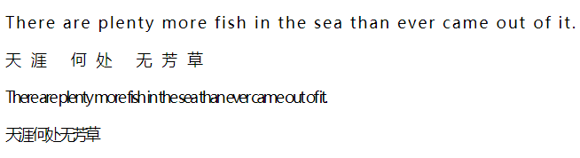
<h1>空格行处理“white-space”</h1>
该属性设置如何处理元素内的空格符和换行符，它主要有以下值：

- <h3 style="font-sze:16px;color:#2a90d1;">normal（默认）</h3>
    由浏览器处理空格和换行
- <h3 style="font-sze:16px;color:#2a90d1;">pre</h3>
  段落里所有的空格符和换行符都会被保留（类似于< pre>标签）
- <h3 style="font-sze:16px;color:#2a90d1;">nowrap</h3>  
   段落内的文本不会换行（类似于没有设置过换行的“notepad”）
- <h3 style="font-sze:16px;color:#2a90d1;">pre-wrap</h3>
   段落里所有的空格符序列和换行符序列都会被保留（除了在某些编码格式下和“pre”有所差距，大多数时候可以说它和“pre”这个值是等价的）
- <h3 style="font-sze:16px;color:#2a90d1;">pre-line</h3>
   多空格会合并成一个，但换行符会保留<br><br>
   HTML代码示例：
   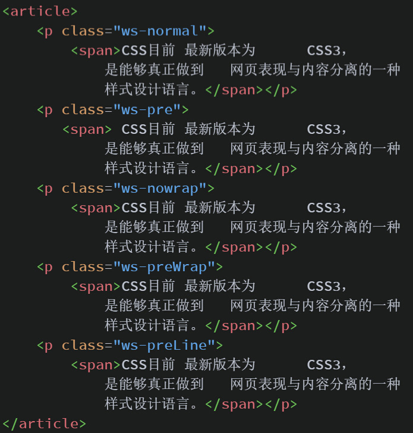
   CSS代码如下：

   ```
   <!-- 空格与换行处理 -->
   .ws-normal span{
       white-space:normal;
   }
   .ws-pre span{
       white-space:pre;
   }
   .ws-pre span{
       white-space:nowrap;
   }
   .ws-pre span{
       white-space:pre-wrap;
   }
   .ws-pre span{
       white-space:pre-line;
   }
   ```
   运行效果：

   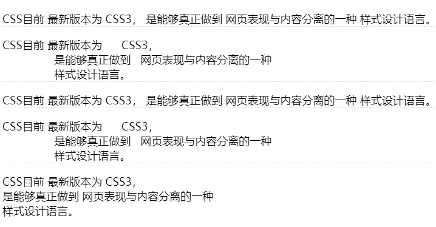
   <h1>设置文本方向“direction”</h1>
该属性是由于控制文本显示方向的，即从左往右，或从右向左。<br><br>
在有些国家，如：“阿拉伯”、“伊朗”、“以色列”，还有古典的“中日韩”文等等，他们的文字显示方向都是从右向左的，为了适应这些文字方向的需求，如果用手工去设置，耗费的时间成本会过高，也非常容易出错，这个时候“direction”属性会帮你克服这个问题。该属性有两个值：
- <h3 style="font-sze:16px;color:#2a90d1;">ltr</h3>
   默认值,文本方向从左到右
- <h3 style="font-sze:16px;color:#2a90d1;">rtl</h3>
   文本方向从右向左<br><br>
HTML代码示例：

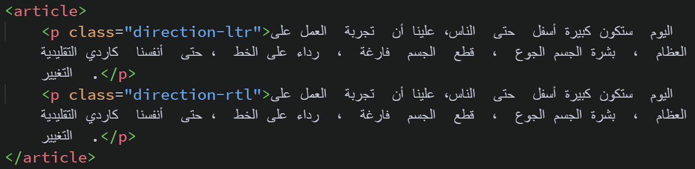
CSS代码如下：

```
<!-- 文本显示方向 -->
.direction-ltr{
    direction:ltr;
}
.direction-rtl{
    direction:rtl;
}
```
运行效果：

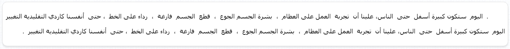
<h1>文本的裁切“text-overflow”</h1>
该属性规定当文本溢出包含元素时进行的处理。该属性主要包含两个值：

- <h3 style="font-sze:16px;color:#2a90d1;">clip</h3>
     裁切文本
- <h3 style="font-sze:16px;color:#2a90d1;">ellipsis</h3>
显示省略符号来代表被裁剪的文本<br><br>
不过该属性不能单独使用，必须要配合文本换行处理属性“white-space”和内容溢出处理属性“overflow”来使用，否则会达不到所期望的效果。<br><br>
HTML代码示例：

```
<article>
   <P class="text-inherit">天将降大任于是人也，必先苦其心志，劳其筋骨，饿其体肤，空伐其身行，行弗乱其所为，所以动心忍性，曾益其所不能。</P>
   <p class="text-clip">天将降大任于是人也，必先苦其心志，劳其筋骨，饿其体肤，空伐其身行，行弗乱其所为，所以动心忍性，曾益其所不能。</p>
   <p class="ellipsis">天将降大任于是人也，必先苦其心志，劳其筋骨，饿其体肤，空伐其身行，行弗乱其所为，所以动心忍性，曾益其所不能。</p>
</article>
```
CSS代码如下：

```
<!-- 文本裁切 -->
.text-inhrit,.text-clip,.text-ellipsis{
    width:720px;
}
.text-inherit{
    text-overflow:inherit;
    overflow:hidden;
    white-space:nowrap;
}
.text-clip{
    text-overflow:clip;
    overflow:hidden;
    white-space:nowrap;
}
.text-ellipsis{
    text-overflow:ellipsis;
    overflow:hidden;
    white-space:nowrap;
}
```
运行效果：

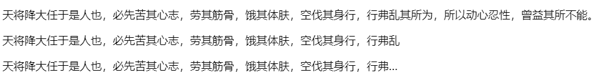