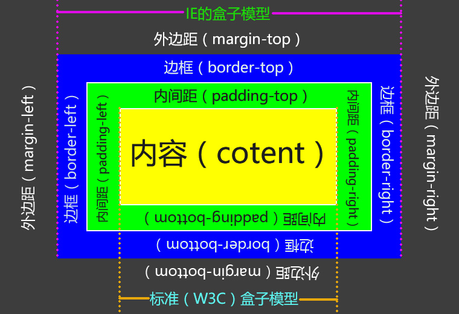
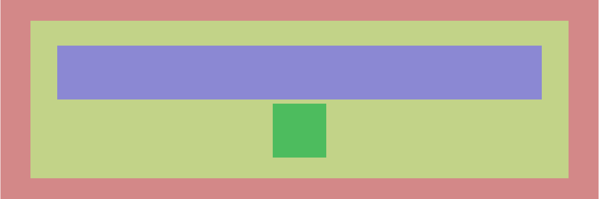
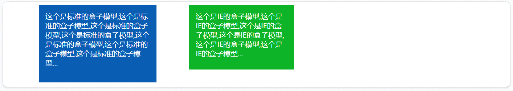
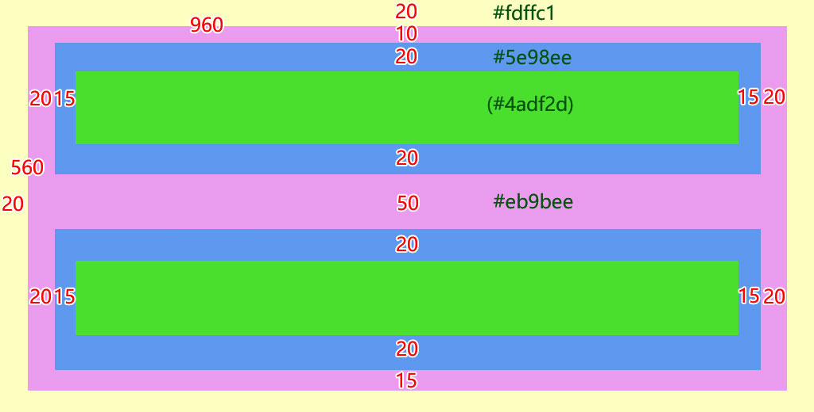

<h1>CSS盒子模型概述</h1>
所谓盒子模型，即是将网页布局中的元素（能设置宽高的元素）进行拟物化的比喻，一个盒子是由“内容--<span style="font-size:24px;color:#0b933b;">content</span>”（盒子内的物件）、“内间距--<span style="font-size:24px;color:#0b933b;">padding</span>”（物件和盒子的距离）、“边框--<span style="font-size:24px;color:#0b933b;">border</span>”（盒子壁）、“外间距--<span style="font-size:24px;color:#0b933b;">margin</span>”（盒子和其它物体的距离）组成，如下示例图：

由于一些“客观”的原因，IE浏览器和标准（W3C，其它主流浏览器）的盒子模型有一定的差异，即IE浏览器的尺寸（“width”和“height”）包含了conent、padding和border；标准的盒子模型只包含content。一方面为为了兼容IE浏览器，另一方面是IE的盒子模型在实际的布局中的确更容易控制。所以我们在实际的开发工作中，都是将标准的盒子模型转换为IE的盒子模型。转换方式是将CSS的样式属性<span style="font-size:24px;color:#0b933b;">“box-sizing”</span>的值设为<span style="font-size:24px;color:#0b933b;">“border-box”</span>。当然，如果我们要将IE的盒子模型转化为标准的盒子模型也是可行的，即将“box-sizing”的值设置为“cotent-box”，不过业界并不推崇这样做。我们可以自己动手制作一个简单的页面实例进行对比。
<h1>元素宽度“width”</h1>
该属性用于设置元素的宽度，但通过该属性设置的宽度有的时候未必就是元素真实的宽度。通过设置“width”的宽度，在<span style="font-size:24px;color:#0b933b;">IE标准的盒子模型</span>中，宽度是由“<span style="font-size:24px;color:#0b933b;">content+padding+border</span>”组成的，也就是说在IE标准的盒子模型中，设置“width”的时候是无需考虑“padding”和“border”的（这需在这两个属性的值都不大的时候）。而在标准的盒子模型中，宽度只包含“conent”，元素自带的，和人为设置的“padding”和“border”都会额外的增加元素的宽度。<br><br>
在HTML中具有盒子模型属性的显示类型有“块元素（block）”和“行内块(inline-block)”。<br><br>
“width”属性最常用的两种设置方式为“<span style="font-size:24px;color:#0b933b;">像素（px）</span>"设置和"<span style="font-size:24px;color:#0b933b;">百分比（%）</span>"设置。他们的特点如下：<br><br>

- <h3 style="font-sze:16px;color:#2a90d1;">像素设置</h3>
  优点：该方式去设置宽度更为的稳定，也就是说当一个元素是通过像素去设置元素宽度的时候，该元素的内容，特别是用像素去设置的文本内容也相对稳定，不会因为设备分辨率的不同而在排版显示上有所不同。<br><br>
  缺点：在不同设备上，需要对元素宽度进行修改才能得到最佳的布局效果。如一个在PC端宽度为“960像素”的元素，在手机端就会出现右半部分，甚至右大半部分的显示都会被裁切的情况（如“iphone 4”的浏览器显示分辨率为“320*480”）。
- <h3 style="font-sze:16px;color:#2a90d1;">百分比设置</h3>
  优点：能对不同显示分辨率做出更好的适应。最外层的标签元素（<body>的子节点）若宽度设为“100%”，那无论是在具有“<span style="font-size:24px;color:#0b933b;">4K</span>”显示分辨率的高清投影大屏幕上，还是在分辨率在几百像素的移动设备上，都能横向占满整个屏幕。现在有人将“百分比布局”称作“流式布局”，是一种应对“移动浪潮”布局的新趋势。<br><br>
  缺点：若采用百分比布局的方式，很多因素难以控制，如采用默认大小的表单元素，HTML5的功能标签，都会给这种布局方式带来麻烦,若是采用多列布局的页面，这种布局方式在移动端上的效果绝对是“灾难性”的。特别是对于缺乏前端开发经验的开发人员而言，这种布局方式经常会出现一些布局效果在意料之外的情况。<br><br>
  百分比设置的布局有一个“相对性”的特点，也就是它的百分比是对于父级元素而言的，“width”利用百分比宽度来布局的原理，如下例：<br><br>
HTML代码如下：

  ```
  <section>
        <div>
            <p></p>
            <p></p>
        </div>
  </section>
  ```
CSS代码如下：

```
    section, div, p {
            box-sizing: border-box;
        }
        section {
            width: 90%; height: 480px;
            background-color: #d38888;
            margin: 0 auto;
            padding-top: 50px;
        }
        div {
            width: 90%; height: 380px;
            background-color: #c2d388;
            margin: 0 auto;
            padding-top: 50px;
        }
        p:first-child {
            width: 90%; height: 130px;
            background-color: #8b88d3;
            margin: 10px auto;
        }
        p:last-child {
            width: 10%; height: 130px;
            background-color: #4dbc5e;
            margin: 10px auto;
        }
```
运行效果：


<h1>元素高度“height”</h1>
该属性的作用是用于设置“块级元素”和“行内块元素”的<span style="font-size:24px;color:#0b933b;">高度</span>，它绝大部分特征、度量单位和盒子模型的计算方式基本上和“width”属性一样。但在CSS的领域里，垂直方向的一些属性总是会出现一些让人“费解”的问题，如垂直居中的属性"<a href="javascript:;">vertical-align</a>","<a href="javascript:;" >margin-top和margin-bottom</a>"的重叠，<a href="javascript:;">页面内“块级元素”的首个子元素</a>（如：div > p:first-child）在执行“margin-top”时会让父元素去执行该属性，而对于它的最后一个子元素则不会产生这种情况，等等一系列的问题。<br><br>
“width”属性的表现和“height”属性的差异在于，在同样不设置<html>或<body>宽高的条件下，任意“块级元素”和“行内块级元素”在不考虑盒子模型的前提下使用“widht”属性设置百分比（%）单位都能达到预期的效果，而<a href="javascript:;">“height”则不然</a>除非对设置了“height”属性的父级元素设置“height”属性，否则无论用多少的百分比去设置元素的高度，该元素的高度都始终为“0”。
<h1>外间距“margin”</h1>
“margin”我们称他为外间距，是一个<span style="font-size:24px;color:#0b933b;">具有宽高</span>样式属性的元素（即通常的“行内块元素”和“块元素”）相对于<span style="font-size:24px;color:#0b933b;">同级元素</span>和<span style="font-size:24px;color:#0b933b;">父级元素</span>的一个距离值，常用单位像素“px”。该属性对文本类元素（即“行内元素”）标签是无效的。<br><br>
“margin”属性有四个分支属性，如下：

- <h3 style="font-sze:16px;color:#2a90d1;">margin-top</h3>
   距离上方同级元素在垂直方向的距离，若上方元素含有“margin-bottom”，则会<span style="font-size:24px;color:#0b933b;">重叠该值</span>，并且<span style="font-size:24px;color:#0b933b;">取较大值</span>作为间距值。<br><br>
   若该元素为父元素内的首个子元素，则是设置父元素距离上方元素的距离，若上方元素含有“margin-bottom”，则同样会重叠该值，取较大值作为间距值。
- <h3 style="font-sze:16px;color:#2a90d1;">margin-right</h3>
    距离父级元素右边框的距离，若父元素有内间距“padding-right”,则还需要加上该值。<br><br>
    距离右方同级元素在水平方向的距离，若右方元素含有“margin-left”，则会和该值相加，取两个元素之间间距值的<span style="font-size:24px;color:#0b933b;">和</span>作为间距值。
- <h3 style="font-sze:16px;color:#2a90d1;">margin-bottom</h3>
  距离下方同级元素在垂直方向的距离，若下方元素含有“margin-top”，则会<span style="font-size:24px;color:#0b933b;">重叠该值</span>，并且<span style="font-size:24px;color:#0b933b;">取较大值</span>作为间距值。若该元素是DOM内最后一个元素，则相当于是给父元素设置了一个下间距（padding-bottom），若父元素已经设置了“padding-bottom”，则与父元素的该值相加取<span style="font-size:24px;color:#0b933b;">和</span>作为与页面底部的间距。
- <h3 style="font-sze:16px;color:#2a90d1;">margin-left</h3>
   距离父级元素左边框的距离，若父元素有内间距“padding-left”,则还需要加上该值。<br><br>
   距离左方同级元素在水平方向的距离，若左方元素含有“margin-right”，则会和该值相加，取两个元素之间间距值的<span style="font-size:24px;color:#0b933b;">和</span>作为间距值。<br><br>
   如果我们在一个元素需要在多个方向进行设置外间距的时候，如果将“margin”多个方向的属性都设置一遍，难免会让代码看起来比较繁杂，增加了不少代码量，也增加了维护的难度。这个时候我们可以将“margin”四个方向的值“合四为一”，写法如下：

- <h3 style="font-sze:16px;color:#2a90d1;">margin：10px;</h3>
  即将“margin”四个方向的值“margin-top”、“margin-right”、“margin-bottom”和“margin-left”都设置为10像素。
- <h3 style="font-sze:16px;color:#2a90d1;">margin: 10px 15px;</h3>
  即将“margin”垂直方向的值“margin-top”和“margin-bottom”设置为10像素，水平方向的值“margin-left”和“margin-right”都设置为15像素。
 - <h3 style="font-sze:16px;color:#2a90d1;">margin: 10px 15px 20px;</h3> 
   即将“margin”距离上方“margin-top”的值设为10像素，水平方向的值“margin-left”和“margin-right”都设置为15像素，距离下方的“margin-bottom”的值设为20像素
 - <h3 style="font-sze:16px;color:#2a90d1;">margin: 10px 15px 20px 25px;</h3> 
   即将“margin”分别对应的“margin-top”，“margin-right”，“margin-bottom”，“margin-left”的值设为10像素，15像素，20像素和25像素。<br><br>
   通过对上面“margin”值的设置我们可以发现，在该属性设置三个值的时候是没有同时设置垂直方向，又分别设置左右方向的写法的，这点在以后使用中要注意。<br><br>
   利用“margin”多值设置的方法，我们还产生了一种<span style="font-size:24px;color:#0b933b;">设计模式</span>，即将“margin”的值设为“<span style="font-size:24px;color:#0b933b;">0 auto</span>”，可以让一个“块元素”在页面中水平居中。这里也需要注意的是，虽然“margin”四个方向的属性对“行内块元素”是有效的，但这水平居中的设计模式对于它来说是无效的。要让“行内块元素”执行水平居中就要涉及到我们另外一种设计模式了，即“绝对定位+负外边距”的用法。在CSS显示与定位中会讲到。
   <h1>内间距"padding"</h1>
   “padding”我们称他为内间距，是一个具有宽高样式属性的元素相对于<span style="font-size:24px;color:#0b933b;">自身元素的内容</span>的一个距离值，常用单位像素“px”。该属性对文本类元素（即"行内元素"）标签是无效的。在“标准（W3C）的盒子模型”中，“padding”的值会占据除“width”和“height”所设置值的额外宽高空间，而在“IE盒子模型”中，“padding”所设置的值不会增加元素的宽和高，但会<span style="font-size:24px;color:#0b933b;">向内</span>占据空间。<br><br>
   HTML代码示例：

   ```
   <div>这个是标准的盒子模型，这个是标准的盒子模型，这个是标准的盒子模型，这个是标准的格子模型，这个是标准的盒子模型，这个是标准的盒子模型，这个是标准的盒子模型，这个是标准的盒子模型...</div>
   <div>这个是IE的盒子模型，这个是IE的盒子模型，这个是IE的盒子模型，这个是IE的盒子模型，这个是IE的盒子模型，这个是IE的盒子模型...</div>
   ```
   对应的CSS代码如下：
   ```
   div{
       width:320px;
       height:200px;
       font:22px "微软雅黑";
       color:#fff;
       margin-left:100px;
       float:left;
   }
   div:first-child{
       background-color:#095eb4;
       padding:20px;
       box-sizing:contnet-box;
   }
   div:last-of-type{
       background-color:#0db427;
       padding:20px;
       box-sizing:border-box;
   }
   ```
   运行效果：

   
   “padding”属性的值设置相对于“margin”来说需要考虑的额外因素更少（除了对设置了“background-origin”属性为“conent-box”的元素来说，后面会讲到），它的设置的值在垂直方向也不会出现任何“预料外”的情况，它有四种分支属性，如下：

 - <h3 style="font-sze:16px;color:#2a90d1;">padding-top</h3>
   设置该元素的边界与<span style="font-size:24px;color:#0b933b;">自身的内容在上方的间距</span>。
- <h3 style="font-sze:16px;color:#2a90d1;">padding-right</h3>
  设置该元素的边界与<span style="font-size:24px;color:#0b933b;">自身的内容在右方的间距</span>。
- <h3 style="font-sze:16px;color:#2a90d1;">padding-bottom</h3>
  设置该元素的边界与<span style="font-size:24px;color:#0b933b;">自身的内容在下方的间距</span>。
- <h3 style="font-sze:16px;color:#2a90d1;">padding-left</h3>
  设置该元素的边界与<span style="font-size:24px;color:#0b933b;">自身的内容在左方的间距</span>。<br>
和"margin"一样"padding"属性的值也有组合起来写的用法，如下：
- <h3 style="font-sze:16px;color:#2a90d1;">padding：10px;</h3>
  即将元素边界与内容四个方向“padding-top”、“padding-right”、“padding-bottom”和“padding-left”的间距都设置为10像素。
- <h3 style="font-sze:16px;color:#2a90d1;">padding：10px 12px;</h3>
  将元素边界与内容上下两个方向“padding-top”、“padding-bottom”的间距都设置为10像素,与内容左右两个方向“padding-left”和“padding-right”的间距都设置为12像素。
- <h3 style="font-sze:16px;color:#2a90d1;">padding：10px 12px 15px;</h3>
  即将元素边界与内容上方“padding-top”的间距设置为10像素，与内容左右两个方向“padding-left”和“padding-right”的间距都设置为12像素，与内容下方“padding-top”的间距设置为15像素。<br><br>
  与“margin”一样，“padding”属性在设置三个值的时候是没有同时设置垂直方向，又分别设置左右方向的写法的。若要进行这样的设置，请使用四个值的设置方式去进行设置，即将垂直方向（第一个和第三个）的值设为一样，再分别去设置水平方向（第二个和第四个）的值。<br><br>
  在“IE盒子模型”下运用“padding”需要特别注意的是，“padding”的值会占据内容的空间。如在一个高度为“50像素”，“padding-top”和“padding-bottom”均为“10像素”的“行内块”或“块级”元素内，给文本内容设置行高“line-height:50px”并不会达到垂直居中的效果，而要将文本元素的行高设置为“height-(padding-top+padding-bottom)=<span style="font-size:24px;color:#0b933b;">innerHeight</span>在JavaScript中“innerHeight”表示内容的高度，“outerHeight”表示元素实际占据的高度）”，即“50-(10+10)=30”才能达到文本在该元素内垂直居中的效果。

<!-- <章节练习（一）将以下带标注的图形在代码编辑器内进行编写，并在浏览器呈现：

1、“#fdffc1”色的部分为<body>的背景色，“#eb9bee”色部分为一个<section>标签，宽为“960像素”，高为“560像素”，内部<p>标签的宽高根据已提供数值进行计算得出；

2、“#5e98ee”色是两个<p>标签的“内间距”（该标签的背景色），里面的“#4adf2d”色不用表示出来，它表示该标签的“内容”，第一个<p>标签的内容用任意一段大于一行的文本填充即可（方便查看“内间距”值是否生效），第二个<p>标签的文本内容和第一个<p>标签内的一致，但不换行，超出的部分用“省略号”代替（必须要使用“text-overflow”进行裁切），并在该元素内垂直居中。 -->
<h1>元素边框“border”</h1>