<h1>CSS背景概述</h1>
在当今HTML页面中，页面的背景色默认为“白色”，除了少许的表单元素及HTML5规范后才出现的一些新的“功能性”元素标签，其它元素是不具有背景色的（也可以理解为透明的）。要为页面内的元素添加漂亮的“装饰”，让页面表现得更加丰富，区别于人，除了“border”、“outline”、“box-shadow”外，“background”在里面也扮演着相当重要的角色，本章围绕“background”这个属性进行的。
<h1>背景色“background-color”</h1>
该属性可以称得上是该属性使用率最高的属性，是用于设置<span style="font-size:24px;color:#0b933b;">任何显示类型</span>（display）元素的背景颜色，可以使用的颜色为Web技术中的常用颜色模式：“颜色英文单词”、“HEX”、“RGBa”、“HSLa”。<br><br>
HTML代码部分为4个<section>标签，对应的CSS代码如下:

```
section{
    width:220px;height:140px;
    margin-right:30px;
    float:left;
    box-sizing:border-box;
}
section:nth-child(1){
    background-color:#f2e005;
    border:10px solid #5f9ade;
}
section:nth-child(3){
    background-color:#05f245;
    border:10px dotted #5f9ade;
}
section:nth-child(4){
    background-color:#0e05f2;
    border:10px double #5f9ade;
}
```
运行效果:


通过上例我们可以发现，“background-color”默认的颜色范围会覆盖到“border”的边界，但是这个覆盖是可以通过后面会讲到的“background-clip”分支属性进行设置的。
<h1>背景图像“background-image”</h1>
在CSS3版本发布之前“background-image”这一属性在页面的美化中可以说有着非常核心的地位，但在CSS3版本发布之后，该属性在页面美化中的比重开始下降，页面的加载速度也得到了不少的提升。但要使用CSS3或者HTML的“canvas”技术去实现复杂的图像终究比较困难，所以在很多Web应用场景中“background-image”仍然扮演着非常重要的角色。<br><br>

在实际运用的过程中需要注意的是背景图片“background-image”是可以和背景色“background-color”共存的，也就是采用一张“非矩形”的“Png图片”作为背景图片时要小心背景色带来的以外影响。<br><br>

HTML代码部分为4个< section>标签,对应的CSS代码如下：

```
section{
    width:240px;height:160px;
    margin-rigth:30px;
    float:left;
    box-sizing:border-box;
}
section:nth-child(1){
    background-iamge:url("./images/bgi-01.jpg");
    background-size:72px 72px;
}
section:nth-child(2){
    background-image:url("./images/bgi-01.jpg");
    background-size:cover;
    background-position:center center;
}
section:nth-child(3){
    background-image:url("./images/bgi-01.jpg");
    background-size:contain;
}
section:nth-child(4){
    background:url("./images/bgi-01.jpg")0 0 no-repeat,
               url("./images/bgi-02.jpg")120px 0 no-repeat,
               url("./images/bgi-03.jpg")0 80px no-repeat,
               url("./images/bgi-04.jpg")120px 80px no-repeat,
    background-szie:50% 50%;
}
```
运行效果：


<h1>背景图像重复“background-repeat”</h1>
当一张背景图像宽或高小于其元素容器，或用“background-size”（后面会讲到）设置宽高大小元素容器的宽高时，背景图片默认会以“平铺”的方式排满整个元素的背景，而该属性正是用于控制图像重复排列方式的，它有以下值：

- <h3 style="font-sze:16px;color:#2a90d1;">repeat</h3>
  默认。以“平铺”的方式排列图片
- <h3 style="font-sze:16px;color:#2a90d1;">repeat-x</h3>
  只在水平方向（X轴方向）进行重复
- <h3 style="font-sze:16px;color:#2a90d1;">repeat-y</h3>  
  只在垂直方向（Y轴方向）进行重复
- <h3 style="font-sze:16px;color:#2a90d1;">no-repeat</h3>   
  使背景图片不重复<br><br>
  HTML代码部分为4个< section>标签,对应的CSS代码如下：
```
section{
    width:240px;heigth:160px;
    background-image:url("./images/bgi-01.jpg");
    background-size:20% 25%;
    border:1px solid #999;
    margin-right:30px;
    float:left;
    box-sizing:border-box;
}
section:nth-child(1){
    background-repeat:repeat;
}
section:nth-child(2){
    background-repeat:repeat-x;
}
section:nth-child(3){
    background-repeat:repeat-y;
}
section:nth-child(4){
    background-repeat:no-repeat;
}
```
运行效果：

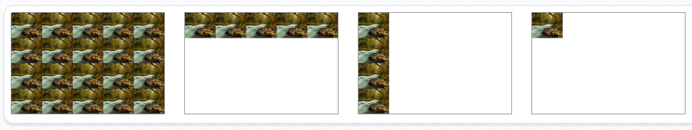 
<h1>背景图定位“background-position”</h1>
该属性用于设置背景图片在元素内出现的位置。使用这个属性主要分为两类实际情况：第一类情况就是元素的宽高大于背景图片时，这个时候是通过“0”或“<span style="font-size:24px;color:#0b933b;">正数值</span>”去进行定位；第二类情况就是元素的宽高小于背景图片的宽高时，这个时候是通过“0”或“<span style="font-size:24px;color:#0b933b;">负数值</span>”去进行定位（这是采用 “CSS图片精灵（CSS Sprites）”技术来开发项目的时候比用的属性）。<br><br>
该属性的值有三种形式：

- <h3 style="font-sze:16px;color:#2a90d1;">方位英文单词</h3> 
   可以有“left”、“right”、“top”、“bottom”和“center”。用法如：“left top”（默认），设置背景图在元素内的“左上方”；“right bottom”，设置背景图在元素内的“右下方”；“center center”，设置背景图在元素的“中心”。  
- <h3 style="font-sze:16px;color:#2a90d1;">百分比单位</h3> 
  用法如：“0% 50%”，设置背景图在元素内“水平方向”的“左方”，垂直方向的“中心”；“50% 50%”,，设置背景图在元素内的“中心”；“100% 100%”，设置背景图在元素内的“右下方”。
- <h3 style="font-sze:16px;color:#2a90d1;">像素单位</h3> 
  背景图的“左上角”相对于元素“左上角”偏移的距离，如“10px 20px”,设置背景图“水平向右”偏移10像素，“垂直向下”偏移20像素。<br><br>
  这三种形式去设置背景图片的位置是可以“<span style="font-size:24px;color:#0b933b;">混搭</span>”的，如：“left 100%”、“50% 70px”、“top 30px”等。不过从代码规范性的角度出发，并不推荐这种“混搭”的方式。<br><br>
  这是一个定位图片位置的例子，HTML代码部分为4个< section>标签,对应的CSS代码如下：

  ```
  section{
      width:220px;height:140px;
      background-iamge:url("./images/bgi-01.jpg");
      background-repeat:no-repeat;
      background-size:50% 50%;
      border:1px solid #aaa;
      margin-right:30px;
      float:left;
  }
  section:nth-child(1){
      background-position:center bottom;
  }
  section:nth-child(2){
      background-position:100% 50%;
  }
  section:nth-child(3){
      background-position:30px 45px;
  }
  section:nth-child(4){
      background-position:50% center;
  }
  ```
  运行效果：

  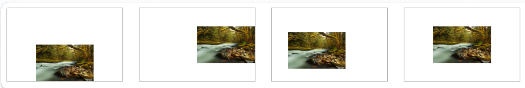<br><br>
  这是用“CSS Sprites”进行定位的例子，HTML代码部分为:

  ```
  <form name="background-position">
       <button type="button">全部</button>
       <button type="button">普通</button>
       <button type="button">悬浮</button>
       <button type="button">点击</button>
       <button type="button" disabled>禁用</button>
       <button type="button">全效</button>
  </form>
 CSS代码如下：
 ```
 button{
     width:72px;height:32px;
     background-color:transparent;
     background-image:url("./images/bgi-05.png");
     background-repeat:no-repeat;
     border:none;outline:none;
     font:18px "微软雅黑";color:#fff;
     padding:0;
     box-sizing:content-box;
     cursor:pointer;
 }
 button:nth-child(1){
     width:144px;height:64px;
     background-posiiton:0 0;
 }
 button:nth-child(2){
     background-posiiton:0 0;
 }
 button:nth-child(3):hover{
     background-posiiton:-72px 0;
 }
 button:nth-child(4):active{
     background-posiiton:0 -32px;
 }
 button:nth-child(5):disabled{
     background-posiiton:-72px -32px;
     color:#ddd;
     cursor:not-allowed;
 }
 button:nth-child(6):hover{
     background-posiiton:-72px 0;
 }
 button:nth-child(6):active{
     background-posiiton:0 -32px;
 }
 ```
 运行结果：

 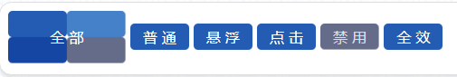
 <h1>背景图固定“background-attachment”</h1>
 通过将该属性的值设置为“<span style="font-size:24px;color:#0b933b;">fixed</span>”后，页面出现滚动条后就算页面滚动，背景图也会固定在原来的位置不会跟随页面滚动。它的默认值是“<span style="font-size:24px;color:#0b933b;">scroll</span>”，是当页面滚动的时候，背景图也跟随页面同步滚动。<br><br>
 CSS主要代码如下:

 ```
 body{
     background-image:url("./images/bgi-06.jpg");
     background-repeat:no-repeat;
     background-size:cover;
     background-position:center center;
     background-attachment:fixed;
     padding:60px 0 120px;
 }
 article{
     width:960px;height:auto;
     background-color:rgba(144,129,114,0.6);
     border-radius:15px;
     margin:0 auto;
     paddint:20px;
     text-shadow:0 1px 2px rgba(83,72,62,0.9);
     color:#fff;
 }
 article p{
     text-indent:2em;
     font:24px "楷体";
 }
 ```
 <a href="https://www.aulence.com/html-pages/css/codeEffect/code-78.html">查看本例演示效果</a>
 <h1>背景裁切范围“background-clip</h1>
 该属性是规定背景显示的范围，是从“border”开始，是从“padding”开始，还是从“content”开始，它有以下值：
 
 - <h3 style="font-sze:16px;color:#2a90d1;">border-box</h3> 
   默认，背景的覆盖范围从“border”开始
- <h3 style="font-sze:16px;color:#2a90d1;">padding-box</h3> 
   背景的覆盖范围从“padding”开始
- <h3 style="font-sze:16px;color:#2a90d1;">content-box</h3> 
   背景的覆盖范围从“content”开始<br><br>
HTML代码部分为3个< section>标签,对应的CSS代码如下：

```
section{
    width:240px;height:160px;
    background-image：url("./images/bgi-01.jpg");
    background-repeat:no-repeat;
    border:15px dotted #f830ca;
    padding:15px;
    margin-right:30px;
    float:left;
    box-sizing:content-box;
}
section:nth-child(1){
    background-clip:border-box;
}
section:nth-child(2){
    background-clip:padding-box;
}
section:nth-child(3){
    background-clip:content-box;
}
```
运行效果：

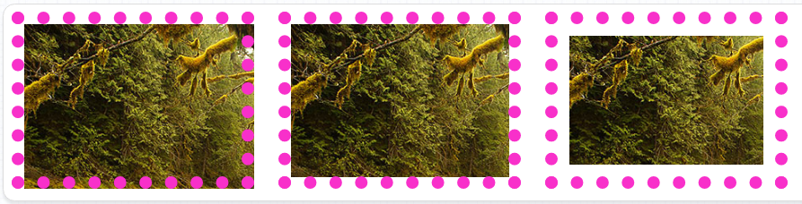
示例中使用了背景图片“background-image”作为演示，当背景为背景色“background-color”时该属性进行的范围裁切效果也是一样的，可以自行进行效果实践。
<h1>背景图大小“background-size</h1>
该属性用于设置背景图片的大小，主要可以通过四种类型的单位设置：

- <h3 style="font-sze:16px;color:#2a90d1;">像素值</h3>
  可以通过像素“px”精确地设置背景图片的大小。需要设置为两个值，第一个值表示背景图的<span style="font-size:24px;color:#0b933b;">宽度</span>，第二个值表示背景图的<span style="font-size:24px;color:#0b933b;">高度</span>，还可以通过设置宽度或高度的其中一个，将另外一个值设置成“<span style="font-size:24px;color:#0b933b;">auto</span>"达到保持背景图原始图像比例的效果。如：“240px 120px”、“180px auto”或“auto（相当于还原默认的大小）”。
- <h3 style="font-sze:16px;color:#2a90d1;">百分比值</h3>
  用“百分比”作为值，结构和用“像素值”一致，也是两个值，第一个值是相对于元素宽度的百分比值，第二个值是相对于元素高度的百分比。如：“100% 80%”、“100% auto”或“auto 50%”。
- <h3 style="font-sze:16px;color:#2a90d1;">contain</h3>
  自动将背景图像填满元素的其中一边，图像的比例保持不变。
- <h3 style="font-sze:16px;color:#2a90d1;">cover</h3>
  在保持图像原始比例的情况下，将元素的背景区域完全覆盖，超出元素宽高的部分会自动被裁剪，是一种比较“智能”的背景图片大小设置方式，通过配合“background-position”属性使用可以将开发者认为背景图像中“更重要”的部分通过定位显示出来。<br><br>
  HTML代码部分为4个< section>标签,对应的CSS代码如下：

  ```
  section{
      width:220px;height:140px;
      background-image:url("./images/bgi-02.jpg");
      background-repeat:no-repeat;
      border:1px solid #aaa;
      margin-right:30px;
      float:left;
  }
  section:nth-child(1){
      background-size:180px 50%;
  }
  section:nth-child(2){
      background-size:180px auto;
      background-position:50% 0;
  }
  section:nth-child(3){
      background-size:contain;
  }
  section:nth-child(4){
      background-size:cover;
      background-position:center center;
  }
  ```
运行效果：

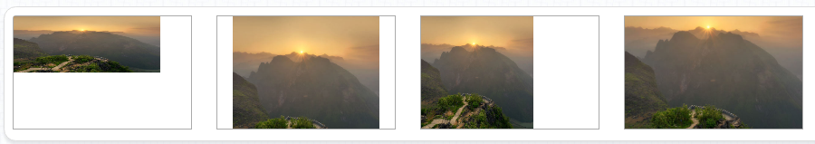
<h1>背景开始位置background-origin</h1>
它和"background-clip"的使用方式十分相似，可以通过一段实例对比两者之间的差别。<br><br>
HTML代码部分为6个< section>标签，第1排的3个为"background-clip"属性设置，第2排的3个为"background-origin"属性设置，对应的CSS代码如下：

```
section{
    width:260px;height:180px;
    background-image:url("./images/bgi-02.jpg");
    border:15px dotted #00d8ff;
    padding:15px;
    margin-right:20px;margin-bottom:20px;
    float:left;
}
section:nth-child(1){
    background-clip:border-box;
}
section:nth-child(2){
    background-clip:padding-box;
}
section:nth-child(3){
    background-clip:content-box;
}
section:nth-child(4){
    background-origin:border-box;
    clear:both;
}
section:nth-child(5){
    background-origin:padding-box;
}
section:nth-child(6){
    background-origin:content-box;
}
```
运行效果：

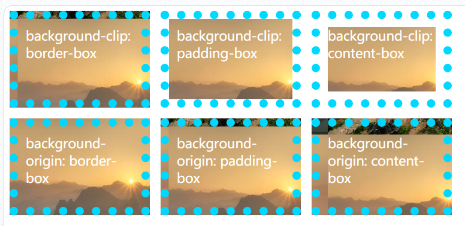
<h1>背景组合值“background”</h1>
在实际的开发过程中为了节省代码量，减小维护难度，我们通常会采用组合值的写法去设置背景，通常是下面这种模式：

```
section{
    width:260px;height:180px;
    marign-right:20px;
    float:left;
}
section:nth-child(1){
    background:url("./images/bgi-01.jpg") repeat fixed center center;
}
section:nth-child(2){
    background:url("./images/bgi-01.jpg") no-repeat fixed;
}
section:nth-child(3){
    background:url("./images/bgi-01.jpg") no-repeat;
    background-size:cover;
    background-position:center center;
}
```
运行效果：

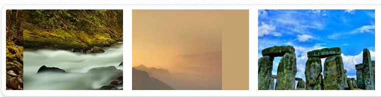
<h1>背景色渐变"background"</h1>
“background”背景色渐变是利用色彩在元素内以一定的方向进行颜色的过度变化。IE浏览器早期的版本里有一套滤镜标准，也包含了渐变的功能，不过当时除了IE内核（Trident）的浏览器具有该功能，其它浏览器如果要实现渐变都是通过将一张图片进行水平（repeat-x）和垂直（repeat-y）方向的重复进行实现的，直到CSS3标准的版本发布之后，主流的浏览器才开始普遍的支持滤镜这一特效。<br><br>
在CSS3中渐变主要有两种类型：

- <h3 style="font-sze:16px;color:#2a90d1;">线性渐变</h3>
 颜色的变化过度方式是沿着一条<span style="font-size:24px;color:#0b933b;">直线</span>进行的。<br><br>
 执行线性渐变的先决条件是必须要具有<span style="font-size:24px;color:#0b933b;">两种或以上的颜色</span>。<br><br>
 我们首先来执行一次最<span style="font-size:24px;color:#0b933b;">基本的渐变</span>和一个<span style="font-size:24px;color:#0b933b;">有方向的渐变</span>。HTML部分为2个< section>标签，CSS代码如下：

 ```
 section{
     width:460px;height:280px;
     margin-right:20px;
     float:left;
 }
 section:nth-child(1){
     background:linear-gradient(#d80000,#2c2cff);
 }
 section:nth-child(2){
     background:-webkit-linear-gradient(left,#bec510,#e66055);
     background:-moz-linear-gradient(left,#bce510,#e66055);
     background:-ms-linear-gradient(left,#bce510,#e66055);
     background:linear-gradient(to right,#bce510,#e66055);
 }
 ```
 运行效果：

 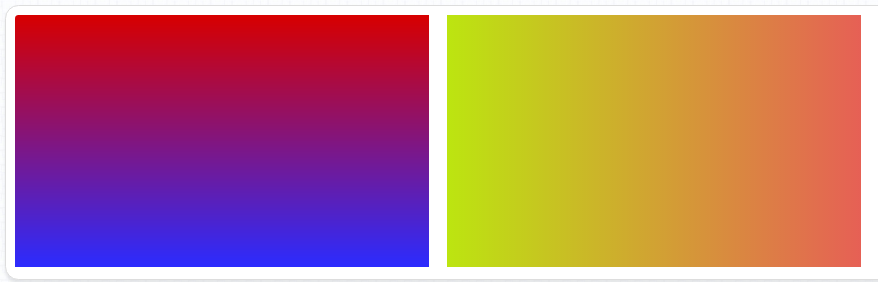
 再来看一个从<span style="font-size:24px;color:#0b933b;">边角方向开始的渐变</span>示例。HTML部分为2个< section>标签，CSS代码如下：

 ```
 section:nth-child(1){
     background:-webkit-linear-gradient(left top,#d80000,#2c2cff);
     background:-moz-linear-gradient(left top,#d80000,#2c2cff);
     background:-ms-linear-gradient(left top,#d80000,#2c2cff);
     background:linear-gradient(to bottom right,#d80000,#2c2cff);
 }
  section:nth-child(2){
     background:-webkit-linear-gradient(left bottom,#d8b700,#0bcc6c);
     background:-moz-linear-gradient(left bottom,#d8b700,#0bcc6c);
     background:-ms-linear-gradient(left bottom,#d8b700,#0bcc6c);
     background:linear-gradient(to top right,#d8b700,#0bcc6c);
 }
 ```
 运行效果：

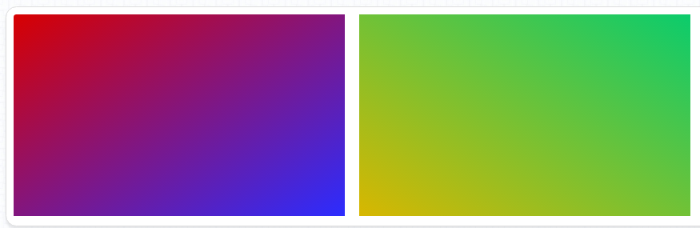
有时我们在写网页不想和千篇一律都是水平、垂直、对角线方向的渐变，这个时候我们需要制作一些有<span style="font-size:24px;color:#0b933b;">角度的渐变</span>HTML部分为2个< section>标签，CSS代码如下：

```
 section:nth-child(1){
     background:-webkit-linear-gradient(15deg #d8b700,#0bcc6c);
     background:-moz-linear-gradient(15deg #d8b700,#0bcc6c);
     background:-ms-linear-gradient(15deg #d8b700,#0bcc6c);
     background:linear-gradient(15deg #d8b700,#0bcc6c);
 }
  section:nth-child(2){
     background:-webkit-linear-gradient(45deg #bf0303,#fc7d20);
     background:-moz-linear-gradient(45deg #bf0303,#fc7d20);
     background:-ms-linear-gradient(45deg #bf0303,#fc7d20);
     background:linear-gradient(45deg #bf0303,#fc7d20);
 }
  section:nth-child(3){
     background:-webkit-linear-gradient(100deg #7e03bf,#f243de);
     background:-moz-linear-gradient(100deg #7e03bf,#f243de);
     background:-ms-linear-gradient(100deg #7e03bf,#f243de);
     background:linear-gradient(100deg #7e03bf,#f243de);
 }
```
运行效果：

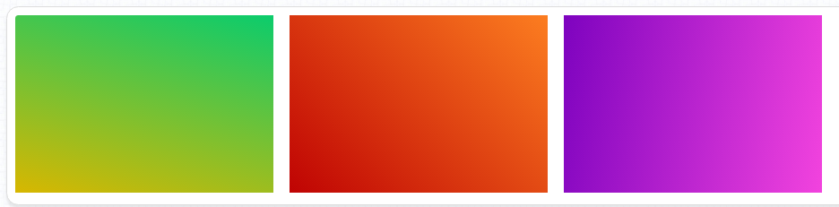
需注意的是在支持CSS3最开始的版本，也就是现在来说叫老版本的主流浏览器（Chrome,Safari,fiefox），对角度的“理解”是不一样的，它们的开始角度0度是从水平的右方，也就是“三点钟方向”开始的。所以在遇到老版本的主流浏览器时要能正确的区分。<br><br>
CSS3的渐变需要两种或以上的颜色组成，也就是说除了我们上面演示的<span style="font-size:24px;color:#0b933b;">双色渐变</span>,当然还有<span style="font-size:24px;color:#0b933b;">多色渐变</span>。下例我们看看多色渐变的设置。HTML部分为3个< section>标签，CSS代码如下：

```
section:nth-child(1){
     background:-webkit-linear-gradient(#d8b700,#0bcc6c,#0b89cc,#eba45c);
     background:-moz-linear-gradient(#d8b700,#0bcc6c,#0b89cc,#eba45c);
     background:-ms-linear-gradient(#d8b700,#0bcc6c,#0b89cc,#eba45c);
     background:linear-gradient(#d8b700,#0bcc6c,#0b89cc,#eba45c);
 }
  section:nth-child(2){
     background:-webkit-linear-gradient(left,#f23c3c,#204afc,#f4fc20);
     background:-moz-linear-gradient(left,#f23c3c,#204afc,#f4fc20);
     background:-ms-linear-gradient(left,#f23c3c,#204afc,#f4fc20);
     background:linear-gradient(to right,#f23c3c,#204afc,#f4fc20);
 }
  section:nth-child(3){
     background:-webkit-linear-gradient(45deg #7e03bf,#6098f4,#f243de);
     background:-moz-linear-gradient(45deg #7e03bf,#6098f4,#f243de);
     background:-ms-linear-gradient(45deg #7e03bf,#6098f4,#f243de);
     background:linear-gradient(45deg #7e03bf,#6098f4,#f243de);
 }
```
运行效果：

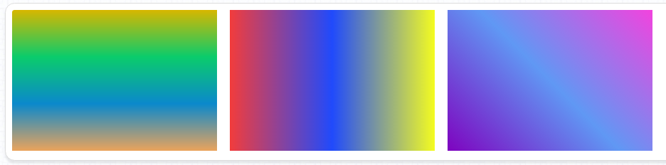
在之前示例中，我们只用到了“HEX”的颜色模式来制作渐变效果，其实在CSS3的渐变中，仍然是支持“颜色英文单词”、“RGBa”和“HSLa”的颜色模式的。接下来我们以一个“RGBa”颜色模式为例，来看看渐变中的透明。HTML部分为3个< section>标签，CSS代码如下：

```
 html,body {
            margin: 0; padding: 0;
            height: 100%
        }
        section {
            width: 320px; height: 220px;
            margin-right: 20px;
            float: left;
        }
body {
    background: url("./images/bgi-07.jpg") no-repeat;
    background-size: cover;
    background-position: 50% 50%;
}
section:nth-child(1) {
     background: -webkit-linear-gradient(0deg,rgba(126, 3, 191, 0.3),#bf0377);
     background: -moz-linear-gradient(0deg,rgba(126, 3, 191, 0.3),#bf0377);
     background: -ms-linear-gradient(0deg,rgba(126, 3, 191, 0.3),#bf0377);
     background: linear-gradient(0deg,rgba(126, 3, 191, 0.3),#bf0377);
}
section:nth-child(2) {
     background: -webkit-linear-gradient(45deg,#0279d0,transparent,#a021ef);
     background: -moz-linear-gradient(45deg,#0279d0,transparent,#a021ef);
     background: -ms-linear-gradient(45deg,#0279d0,transparent,#a021ef);
     background: linear-gradient(45deg,#0279d0,transparent,#a021ef);
}
section:nth-child(3) {
    background: -webkit-linear-gradient(0deg,rgba(126, 3, 191, 0.1),rgba(126, 3, 191, 0.8)),
                -webkit-linear-gradient(90deg,black,hsla(0, 100%, 50%, 0.3));
    background: -moz-linear-gradient(0deg,rgba(126, 3, 191, 0.1),rgba(126, 3, 191, 0.8)),
                -moz-linear-gradient(90deg,black,hsla(0, 100%, 50%, 0.3));
    background: -ms-linear-gradient(0deg,rgba(126, 3, 191, 0.3),rgb(126, 3, 191)),
                -ms-linear-gradient(90deg,black,hsla(0, 100%, 50%, 0.3));
    background: linear-gradient(0deg,rgba(126, 3, 191, 0.3),rgb(126, 3, 191)),
                linear-gradient(90deg,black,hsla(0, 100%, 50%, 0.3));
}
```
运行效果：

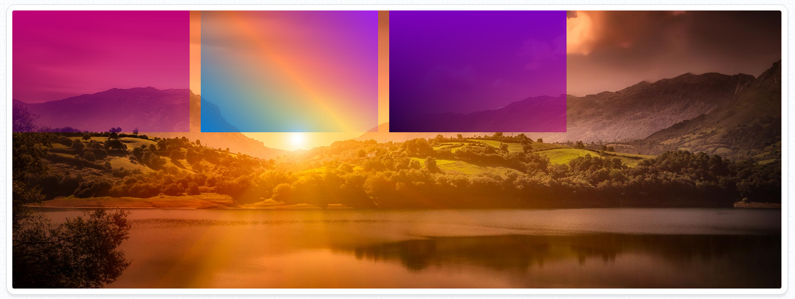
上例中的第三个元素，采用的是<span style="font-size:24px;color:#0b933b;">多重多色</span>的渐变方式，这也是现在很多高质量设计的国外网站、App页面所使用的方式，虽说代码更佳的复杂，但会让表现效果更佳的出众。<br><br>
以上的线性渐变效果都是用渐变的值“linear-gradient()”加“方向/角度”和“颜色”参数实现的，在CSS3中还有一种特殊的线性渐变方式，叫做“<span style="font-size:24px;color:#0b933b;">重复线性渐变</span>，如下例。
HTML部分为4个< section>标签，CSS代码如下：

```
html,body {
            margin: 0; padding: 0;
        }
        section {
            width: 240px; height: 220px;
            margin-right: 20px;
            float: left;
        }
        section:nth-child(1) {
            background: -webkit-repeating-linear-gradient(#452ff2 5%, #ff00ce 10%, #a700ff 25%);
            background: -moz-repeating-linear-gradient(#452ff2 5%, #ff00ce 10%, #a700ff 25%);
            background: -ms-repeating-linear-gradient(#452ff2 5%, #ff00ce 10%, #a700ff 25%);
            background: repeating-linear-gradient(#452ff2 5%, #ff00ce 10%, #a700ff 25%);
        }
        section:nth-child(2) {
            background: -webkit-repeating-linear-gradient(60deg,#f22f46 10%, #dfe626 20%, #9f24e0 30%);
            background: -moz-repeating-linear-gradient(60deg,#f22f46 10%, #dfe626 20%, #9f24e0 30%);
            background: -ms-repeating-linear-gradient(60deg,#f22f46 10%, #dfe626 20%, #9f24e0 30%);
            background: repeating-linear-gradient(60deg,#f22f46 10%, #dfe626 20%, #9f24e0 30%);
        }
        section:nth-child(3) {
            background: -webkit-repeating-linear-gradient(15deg,#f2ea2f 20px, #64f22f 40px);
            background: -moz-repeating-linear-gradient(15deg,#f2ea2f 20px, #64f22f 40px);
            background: -ms-repeating-linear-gradient(15deg,#f2ea2f 20px, #64f22f 40px);
            background: repeating-linear-gradient(15deg,#f2ea2f 20px, #64f22f 40px);
        }
        section:nth-child(4) {
            background: -webkit-repeating-linear-gradient(45deg, #0092b7 0, #000 1px, #000 .25em, #0092b7 calc(.25em + 1px), #0092b7 .75em);
            background: -moz-repeating-linear-gradient(45deg, #0092b7 0, #000 1px, #000 .25em, #0092b7 calc(.25em + 1px), #0092b7 .75em);
            background: -ms-repeating-linear-gradient(45deg, #0092b7 0, #000 1px, #000 .25em, #0092b7 calc(.25em + 1px), #0092b7 .75em);
            background: repeating-linear-gradient(45deg, #0092b7 0, #000 1px, #000 .25em, #0092b7 calc(.25em + 1px), #0092b7 .75em);
        }
```
运行效果：

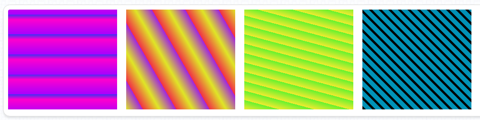
通过上面“repeating-linear-gradient()”的用发大家会发现还是比较复杂的，但是如果对它的理解够透彻，还是能够用它来做出很多“高质感”的东西的，比如说进度条、标尺等，再配合我们后续会学到的径向渐变能做出更多有创意的图形元素。

- <h3 style="font-sze:16px;color:#2a90d1;">径向渐变</h3>
颜色的变化过度方式是以一个圆的圆心为参照进行的。<br><br>
“径向渐变”的属性值参数设置和“线性渐变”一致，属性值的写法为“radial-gradient（[参数设置]）”。如下例。<br><br>
HTML部分为4个< section>标签，CSS代码如下：

```
html,body {
            margin: 0; padding: 0;
        }
        section {
            width: 220px; height: 220px;
            margin-right: 20px;
            float: left;
        }
        section:nth-child(1) {
            background: -webkit-radial-gradient(#d8b700,#0bcc6c,#0b89cc,#eba45c);
            background: -moz-radial-gradient(#d8b700,#0bcc6c,#0b89cc,#eba45c);
            background: -ms-radial-gradient(#d8b700,#0bcc6c,#0b89cc,#eba45c);
            background: radial-gradient(#d8b700,#0bcc6c,#0b89cc,#eba45c);
        }
        section:nth-child(2) {
            background: -webkit-radial-gradient(left,#f23c3c,#204afc,#f4fc20);
            background: -moz-radial-gradient(left,#f23c3c,#204afc,#f4fc20);
            background: -ms-radial-gradient(left,#f23c3c,#204afc,#f4fc20);
            background: radial-gradient(left,#f23c3c,#204afc,#f4fc20);
        }
        section:nth-child(3) {
            background: -webkit-radial-gradient(80%,#3cbaf2,#204afc,#20fc53);
            background: -moz-radial-gradient(80%,#3cbaf2,#204afc,#20fc53);
            background: -ms-radial-gradient(80%,#3cbaf2,#204afc,#20fc53);
            background: radial-gradient(80%,#3cbaf2,#204afc,#20fc53);
        }
        section:nth-child(4) {
            background: -webkit-radial-gradient(20% 45%,#7e03bf,#6098f4,#f243de);
            background: -moz-radial-gradient(20% 45%,#7e03bf,#6098f4,#f243de);
            background: -ms-radial-gradient(20% 45%,#7e03bf,#6098f4,#f243de);
            background: radial-gradient(20% 45%,#7e03bf,#6098f4,#f243de);
        }
```
运行效果：

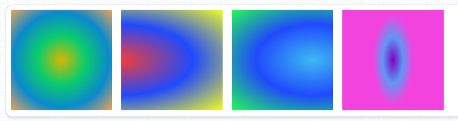