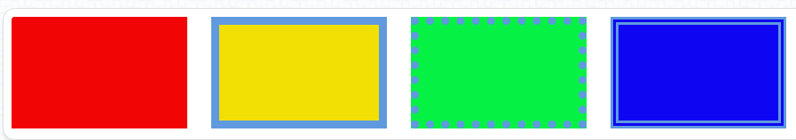
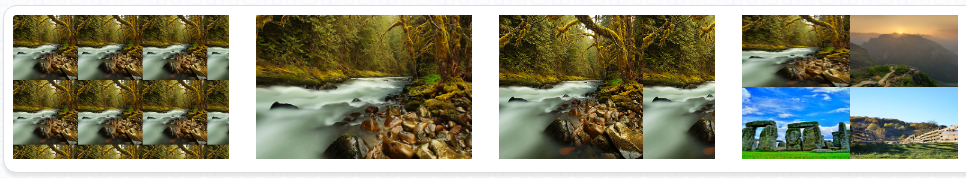

<h1>CSS背景概述</h1>
在当今HTML页面中，页面的背景色默认为“白色”，除了少许的表单元素及HTML5规范后才出现的一些新的“功能性”元素标签，其它元素是不具有背景色的（也可以理解为透明的）。要为页面内的元素添加漂亮的“装饰”，让页面表现得更加丰富，区别于人，除了“border”、“outline”、“box-shadow”外，“background”在里面也扮演着相当重要的角色，本章围绕“background”这个属性进行的。
<h1>背景色“background-color”</h1>
该属性可以称得上是该属性使用率最高的属性，是用于设置<span style="font-size:24px;color:#0b933b;">任何显示类型</span>（display）元素的背景颜色，可以使用的颜色为Web技术中的常用颜色模式：“颜色英文单词”、“HEX”、“RGBa”、“HSLa”。<br><br>
HTML代码部分为4个<section>标签，对应的CSS代码如下:

```
section{
    width:220px;height:140px;
    margin-right:30px;
    float:left;
    box-sizing:border-box;
}
section:nth-child(1){
    background-color:#f2e005;
    border:10px solid #5f9ade;
}
section:nth-child(3){
    background-color:#05f245;
    border:10px dotted #5f9ade;
}
section:nth-child(4){
    background-color:#0e05f2;
    border:10px double #5f9ade;
}
```
运行效果:


通过上例我们可以发现，“background-color”默认的颜色范围会覆盖到“border”的边界，但是这个覆盖是可以通过后面会讲到的“background-clip”分支属性进行设置的。
<h1>背景图像“background-image”</h1>
在CSS3版本发布之前“background-image”这一属性在页面的美化中可以说有着非常核心的地位，但在CSS3版本发布之后，该属性在页面美化中的比重开始下降，页面的加载速度也得到了不少的提升。但要使用CSS3或者HTML的“canvas”技术去实现复杂的图像终究比较困难，所以在很多Web应用场景中“background-image”仍然扮演着非常重要的角色。<br><br>

在实际运用的过程中需要注意的是背景图片“background-image”是可以和背景色“background-color”共存的，也就是采用一张“非矩形”的“Png图片”作为背景图片时要小心背景色带来的以外影响。<br><br>

HTML代码部分为4个< section>标签,对应的CSS代码如下：

```
section{
    width:240px;height:160px;
    margin-rigth:30px;
    float:left;
    box-sizing:border-box;
}
section:nth-child(1){
    background-iamge:url("./images/bgi-01.jpg");
    background-size:72px 72px;
}
section:nth-child(2){
    background-image:url("./images/bgi-01.jpg");
    background-size:cover;
    background-position:center center;
}
section:nth-child(3){
    background-image:url("./images/bgi-01.jpg");
    background-size:contain;
}
section:nth-child(4){
    background:url("./images/bgi-01.jpg")0 0 no-repeat,
               url("./images/bgi-02.jpg")120px 0 no-repeat,
               url("./images/bgi-03.jpg")0 80px no-repeat,
               url("./images/bgi-04.jpg")120px 80px no-repeat,
    background-szie:50% 50%;
}
```
运行效果：


<h1>背景图像重复“background-repeat”</h1>
当一张背景图像宽或高小于其元素容器，或用“background-size”（后面会讲到）设置宽高大小元素容器的宽高时，背景图片默认会以“平铺”的方式排满整个元素的背景，而该属性正是用于控制图像重复排列方式的，它有以下值：

- <h3 style="font-sze:16px;color:#2a90d1;">repeat</h3>
  默认。以“平铺”的方式排列图片
- <h3 style="font-sze:16px;color:#2a90d1;">repeat-x</h3>
  只在水平方向（X轴方向）进行重复
- <h3 style="font-sze:16px;color:#2a90d1;">repeat-y</h3>  
  只在垂直方向（Y轴方向）进行重复
- <h3 style="font-sze:16px;color:#2a90d1;">no-repeat</h3>   
  使背景图片不重复<br><br>
  HTML代码部分为4个< section>标签,对应的CSS代码如下：

  