<h1>CSS显示与定位概述</h1>
在HTML中，元素会按照标准的“文档流”布局方式进行布局，即“从左到右，从上到下”的方式进行布局，而通过CSS里面的部分定位和显示方式的设置可以使元素脱离“文档流”，采用特殊的布局方式进行布局，或者在页面中进行“隐藏”，而“隐藏”在CSS中又有两种定义方式，一种可以脱离“文档流”，一种仍然存在于“文档流”的布局中。
<h1>元素的显示方式“display”</h1>
规定元素的“<span style="font-size:24px;color:#0b933b;">显示类型</span>”，以目前的HTML标准来讲，HTML文档中自带的标签元素的“显示类型”已经被定义，如（只列出了部分“显示类型”的分类）：

- block：< div>、< p>、< header>、< main>、< footer>、< nav>、< section>、< article>、< ul>、< ol>等。
- inline-block：< input>、< textarea>、< button>、< meter>、< progress>”等。
- inline：< span>、< a>、< label>、< em>、< mark>、< img>、< audio>、< video>等。
- table：< table>。
- table-row：< tr>。
- table-cell：< th>和< td>。
- list-item：< li>。
如果考虑到布局需要，有的时候我们会强制的将“显示类型”进行转换，在进行转换后，该元素的功能和特性（如将< div>标签转换为“inline-block”之后，也不能嵌套在< p>里和转换为“block”的< span>里）也不会产生变化。<br><br>
显示类型“display”属性主要有以下类型的值：

- <h3 style="font-sze:16px;color:#2a90d1;">none（主要）</h3> 
  将元素设定为不显示，使元素完全地脱离“文档流”。
- <h3 style="font-sze:16px;color:#2a90d1;">inline（主要）</h3> 
  将元素设定为“行内元素”。
- <h3 style="font-sze:16px;color:#2a90d1;">inline-block（主要）</h3> 
  将元素设定为“行内块元素”。
- <h3 style="font-sze:16px;color:#2a90d1;">block（主要）</h3> 
  将元素设定为“块元素”。
- <h3 style="font-sze:16px;color:#2a90d1;">  list-item</h3>
  将元素设置为列表项。
- <h3 style="font-sze:16px;color:#2a90d1;">run-in</h3>
  根据上下文作为“行内块元素”或“块元素”显示。
- <h3 style="font-sze:16px;color:#2a90d1;">table</h3>
  将元素作为table显示。
- <h3 style="font-sze:16px;color:#2a90d1;">inline-table</h3>
  将元素作为行内的table显示。
- <h3 style="font-sze:16px;color:#2a90d1;">table-row-group</h3>
  将元素作为一个tbody元素来显示。
- <h3 style="font-sze:16px;color:#2a90d1;">table-header-group</h3>
  将元素作为一个thead元素来显示。
- <h3 style="font-sze:16px;color:#2a90d1; ">table-footer-group</h3>
  将元素作为一个tfoot元素来显示。
- <h3 style="font-sze:16px;color:#2a90d1;">table-row</h3>
  将元素作为一个tr元素来显示。
- <h3 style="font-sze:16px;color:#2a90d1;">table-column-group</h3>
  将元素作为一个colgroup元素来显示。
- <h3 style="font-sze:16px;color:#2a90d1;">table-column</h3>
  将元素作为一个col元素来显示。
- <h3 style="font-sze:16px;color:#2a90d1;">table-cell</h3>
  将元素作为一个table单元格元素来显示。
- <h3 style="font-sze:16px;color:#2a90d1;">table-caption</h3>
  将元素作为一个table标题显示。
  <h1>元素可见性“Visibility”</h1>
  该属性用于设置元素“是否可见”，也就是即使元素是不可见的，那它所占据的空间也不会消失。“visibility”属性有以下值：
- <h3 style="font-sze:16px;color:#2a90d1;">Visible（默认）</h3>
  设置元素为可见的
- <h3 style="font-sze:16px;color:#2a90d1;">hidden</h3>
  设置元素为不可见的
- <h3 style="font-sze:16px;color:#2a90d1;">collapse</h3>
在表格元素中使用时，此值可删除一行或一列，但是它不会影响表格的布局。被行或列占据的空间会留给其他内容使用。如果此值被用在其他的元素上，会呈现为“hidden”<br><br>
我们通过一段代码的运行效果来对比“display”属性和“visibility”在元素显示、隐藏后的布局对比。<br><br>
HTML代码示例：

```
 <form>
        <section>
            <h3>“visibility”属性：</h3>
            <input name="visibility" type="checkbox" checked>
            <input name="visibility" type="text" value="visibility">
            <input name="visibility" type="checkbox">
            <input name="visibility" type="text" value="显示与否">
            <input name="visibility" type="checkbox" checked>
            <input name="visibility" type="text" value="都会占据">
            <input name="visibility" type="checkbox">
            <input name="visibility" type="text" value="本来的空间">
        </section>
        <section>
            <h3>“display”属性：</h3>
            <input name="display" type="checkbox" checked>
            <input name="display" type="text" value="display">
            <input name="display" type="checkbox">
            <input name="display" type="text" value="隐藏后">
            <input name="display" type="checkbox" checked>
            <input name="display" type="text" value="不会在">
            <input name="display" type="checkbox">
            <input name="display" type="text" value="占据空间">
        </section>
    </form>
```
CSS代码如下：

```
       body {
            margin: 0; padding: 0;
        }
        section:first-child, section:first-child h3:first-child {
            margin-top: 0;
        }
        section{ margin: 20px 0;}
        <!-- CSS主要代码 -->
        input { vertical-align: middle;}//属性设置元素的垂直对齐方式
        input[type="text"][name="visibility"],
        input[type="text"][name="display"] {
            width: 120px;
            margin-right: 30px;
        }
        input[type="checkbox"] {
            width: 20px; height: 20px;
        }
        /* “visibility”属性 */
        input[type="text"][name="visibility"] { visibility: hidden }
        input:checked + input[name="visibility"] {
            visibility: visible;
        }
        /* “display”属性 */
        input[type="text"][name="display"] { display: none }
        input:checked + input[name="display"] {
            display: inline-block;
        }
```
运行效果：

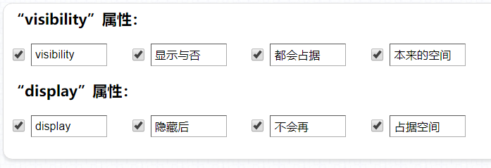
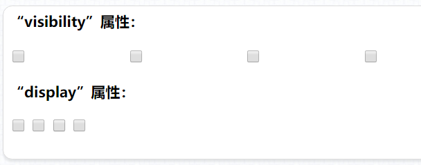
上述案例可以发现，通过将“visibility”的属性值设置为“hidden”，元素虽然不可见了，但仍未脱离“文档流”，在页面显示中占据着原本的位置。而通过将“display”的属性值设置为“none”，元素不可见了，而且在页面中占据的位置也让与“文档流”内布局的其它元素了。
<h1>元素的不透明度“opacity”</h1>
该元素用户设置元素的不透明度，取值范围是“0”到“1”之间的浮点数，可以保留两位小数，如“0.3”、“0.55”，可以支持省略掉前面的“0”也就是“.3”、“.55”的写法。“0”（相当于“visibility:hidden”）表示完全透明，“1”（默认）表示完全不透明。<br><br>
HTML部分为6个< section>标签，CSS代码如下：

```
       html,body {
            margin: 0; padding: 0;
            height: 100%;
        }
        body {
            background: url("./images/bgi-07.jpg") no-repeat;
            background-size: 100% 100%;
            background-position: 50% 50%;
        }
        section {
            width: 160px; height: 160px;
            background: url("./images/bgi-01.jpg") no-repeat;
            background-size: 100% 100%;
            background-position: 50% 50%;
            margin-right: 20px; margin-top: 20px; margin-bottom: 20px;
            float: left;
        }
        section:nth-child(1) { opacity: 0 }
        section:nth-child(2) { opacity: 0.2 }
        section:nth-child(3) { opacity: 0.4 }
        section:nth-child(4) { opacity: 0.6 }
        section:nth-child(5) { opacity: 0.8 }
        section:nth-child(6) { opacity: 1 }
```
运行效果：


将“opacity”的值设置为“0”，和将“visibility”的值设置为“hidden”在布局表现上几乎一致，但在对待用户<span style="font-size:24px;color:#0b933b;">行为</span>上却有着很大的差别。因为，通过将“opacity”的值设置为“0”的方式，只是让元素透明了，但仍然是可以让如鼠标悬浮等事件生效的，而将“visibility”的值设置为“hidden”的方式，是不能触发鼠标悬浮这一类的事件的，这点要注意区分。
<h1>元素的浮动“float”</h1>
该属性可以使元素脱离文档流，在父容器中进行浮动，停靠到父元素的“<span style="font-size:24px;color:#0b933b;">内容边界</span>”或其它浮动元素的“<span style="font-size:24px;color:#0b933b;">边框</span>”，浮动的元素会忽略元素间的“空格”，让同样具有该属性的元素“紧密”地排列在一起。该属性通常用于处理一些需要紧密排列在一起的“块级元素”，如“导航条”、“相册”，或用于处理“图文混排”等。<br><br>
该属性有三个允许的值：

- <h3 style="font-sze:16px;color:#2a90d1;">none</h3>
   默认，元素不进行浮动。
- <h3 style="font-sze:16px;color:#2a90d1;">left</h3>
   元素从左到右进行浮动。
- <h3 style="font-sze:16px;color:#2a90d1;">right</h3>
  元素从右到左进行浮动。<br><br>
“无序列表”的浮动示例，HTML代码如下：

```
<section>
        <ul class="fl">
            <li>列表项1</li>
            <li>列表项2</li>
            <li>列表项3</li>
            <li>列表项4</li>
            <li>列表项5</li>
        </ul>
    </section>
    <section>
        <ul class="fr">
            <li>列表项1</li>
            <li>列表项2</li>
            <li>列表项3</li>
            <li>列表项4</li>
            <li>列表项5</li>
        </ul>
    </section>
```
CSS代码如下:

```
        ul {
            list-style: none;
            margin: 0; padding: 0;
        }
        ul.fl li,ul.fr li {
            width: 100px;
            line-height: 30px;
            text-align: center;
            color: #fff;
        }
        ul.fl li {
            background-color: #ac0a0a;
            float: left;
        }
        ul.fr li {
            background-color: #0a36ac;
            float: right;
        }
        ul.fl:after, ul.fr:after {
            content: ".";
            height: 0;
            display: block;
            visibility: hidden;
            clear: both;
        }
```
运行效果：


再来看一个“图文混排”的示例（做了部分其它样式美化），HTML代码如下：

```
        <section class="flImg">
            
            <p>壬戌之秋，七月既望，苏子与客泛舟游于赤壁之下。清风徐来，水波不兴。举酒属客，诵明月之诗，歌窈窕之章。少焉，月出于东山之上，徘徊于斗牛之间。白露横江，水光接天。纵一苇之所如，凌万顷之茫然。浩浩乎如冯虚御风，而不知其所止；飘飘乎如遗世独立,羽化而登仙。</p>
            <p>于是饮酒乐甚，扣舷而歌之。歌曰：“桂棹兮兰桨，击空明兮溯流光。渺渺兮予怀，望美人兮天一方。”客有吹洞箫者，倚歌而和之。其声呜呜然，如怨如慕，如泣如诉；余音袅袅，不绝如缕。舞幽壑之潜蛟，泣孤舟之嫠妇。</p>
        </section>
        <section class="frImg">
            
            <p>壬戌之秋，七月既望，苏子与客泛舟游于赤壁之下。清风徐来，水波不兴。举酒属客，诵明月之诗，歌窈窕之章。少焉，月出于东山之上，徘徊于斗牛之间。白露横江，水光接天。纵一苇之所如，凌万顷之茫然。浩浩乎如冯虚御风，而不知其所止；飘飘乎如遗世独立,羽化而登仙。</p>
            <p>于是饮酒乐甚，扣舷而歌之。歌曰：“桂棹兮兰桨，击空明兮溯流光。渺渺兮予怀，望美人兮天一方。”客有吹洞箫者，倚歌而和之。其声呜呜然，如怨如慕，如泣如诉；余音袅袅，不绝如缕。舞幽壑之潜蛟，泣孤舟之嫠妇。</p>
        </section>
```
CSS代码如下:

```
          section {
                width: 1024px;
                background-color: #edebe4;
                padding: 20px;
                box-sizing: border-box;
                border: 2px solid #2e2a1b;
                border-radius: 15px;
            }
            section > p {
                text-indent: 2em;
                font: 26px "华文行楷";
                color: #5f5a47;
                margin: 0;
            }
            section:after {
                content: ".";
                height: 0;
                visibility: hidden;
                display: block;
                clear: both;
            }
            <!-- CSS主要代码 -->
            section:not(:first-child) {
                margin-top: 20px;
            }
            section > img {
                width: 160px; height: 160px;
                margin-bottom: 6px;
            }
            section.flImg > img {
                margin-right: 8px;
                float: left;
            }
            section.frImg > img {
                margin-left: 8px;
                float: right;
            }
```
运行效果：

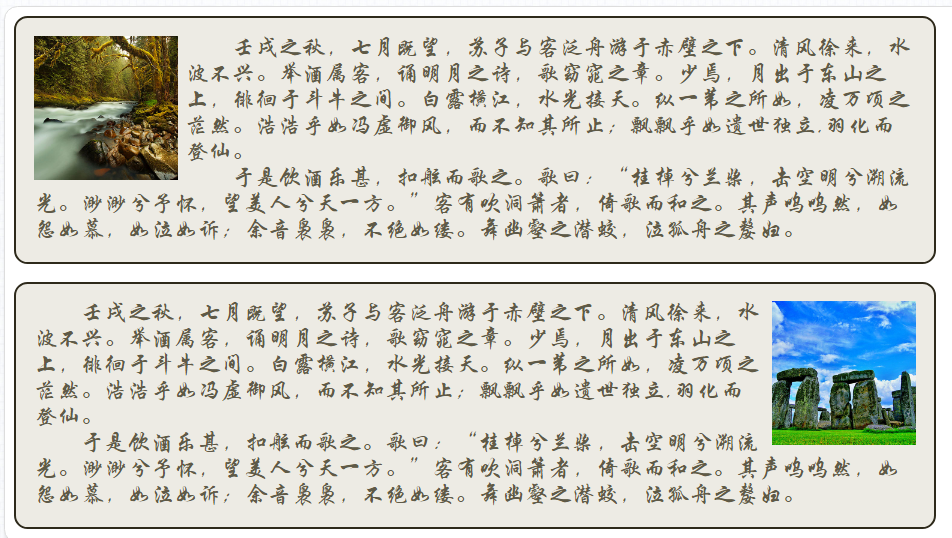
在使用浮动“float”属性的时候有一个需要特别注意的地方，就是若一个<span style="font-size:24px;color:#0b933b;">普通</span>的“块级元素”内的子元素全部都具有浮动属性（值必须为“left”或“right”），那它自身的<span style="font-size:24px;color:#0b933b;">高度会为“0”像素</span>，这是因为它的子元素已经全部脱离了“文档流”，再加上HTML中的普通“块级元素”若不设定“height”为大于“0”的像素值，那它在页面中将不能显示，所以这个元素在页面中的高度固然为“0”。<br><br>
若其子元素全部浮动的元素是独立存在于一个已经参与“定位（本章接下来的内容会讲到）”的元素内的话似乎也没有什么影响，但若它已经参与了“文档流”内的布局了的话，因为其高度为“0”的原因会给后续的元素布局带来些麻烦，我们看看这样一个例子：<br><br>
HTML代码如下:

```
<main>
        <section>
            
            <p>壬戌之秋，七月既望，苏子与客泛舟游于赤壁之下。清风徐来，水波不兴。举酒属客，诵明月之诗，歌窈窕之章。少焉，月出于东山之上，徘徊于斗牛之间。白露横江，水光接天。纵一苇之所如，凌万顷之茫然。浩浩乎如冯虚御风，而不知其所止；飘飘乎如遗世独立,羽化而登仙...</p>
        </section>
        <section>
            
            <p>壬戌之秋，七月既望，苏子与客泛舟游于赤壁之下。清风徐来，水波不兴。举酒属客，诵明月之诗，歌窈窕之章。少焉，月出于东山之上，徘徊于斗牛之间。白露横江，水光接天。纵一苇之所如，凌万顷之茫然。浩浩乎如冯虚御风，而不知其所止；飘飘乎如遗世独立,羽化而登仙...</p>
        </section>
    </main>
```
CSS代码如下：

```
       main {
            width: 960px;
        }
        section {
            background-color: #edebe4;
            border: 2px solid #2e2a1b;
            border-radius: 15px;
            padding: 20px;
        }
        section > img{
            width: 240px; height: auto;
            border: 2px solid #af219f;
        }
        section:first-child > img {
            float: left;
        }
        section:last-child {
            margin-top: 20px;
        }
        section:last-child > img {
            float: right;
        }
```
运行效果：

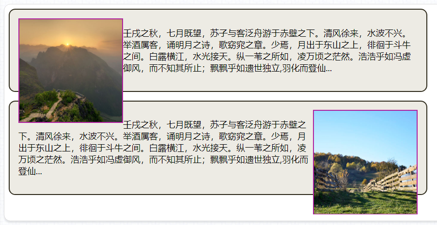
通过上面的示例，我们可以清楚地看到，每个区块元素< section>都没有设置“height”属性，而是想通过该元素内部的子元素自动地“撑起”它的高度，内部的文本的确是撑起了这个< section>元素的高度，但是意外的是，里面的< img>元素的却超出了其父元素< section>的下边界。这是因为代码中的两个< img>元素都设置了“float”属性，第一个值的为“left”，第二个的值为“right”，都脱离了“文档流”，也就是不再占据页面内的高度了，所以出现了以上示例中的情况。要防止元素设置“float”产生的副作用，请学习下一节的内容“清除浮动副作用”。
<h1>清除浮动副作用</h1>
通过上一节的学习明白了设置了“float”属性元素的父元素高度会为“0”，这会对页面后续的布局带来些麻烦。要解决这一“麻烦”比较常用的有以下方式：

- <h3 style="font-sze:16px;color:#2a90d1;">使用清除浮动影响的专用属性“clear”</h3>
   该属性用于清除浮动带来父元素高度为“0”的影响，它有以下值：
- none：默认值，不清除浮动影响
- left：清除左浮动元素带来的影响
- right：清除右浮动元素带来的影响
- both：清除左右两侧浮动元素带来的影响

该属性使用的方式，通常是给一个高度“height”设置为“0”的“块级元素”使用，要保证该“块级元素”内没有内容（有内容会为页面添加无用的信息），或者“visibility”属性的值为“hidden”（不能将“display”属性设置为“none”，这样元素会脱离“文档流”，也就起不到清楚浮动影响的效果了）。<br><br>
HTML代码如下:

```
<section>
        <ul>
            <li>列表项1</li>
            <li>列表项2</li>
            <li>列表项3</li>
            <li>列表项4</li>
            <li>列表项5</li>
            <div class="clear_left"></div>
        </ul>
    </section>
    <section>
        <ul>
            <li>列表项1</li>
            <li>列表项2</li>
            <li>列表项3</li>
            <li>列表项4</li>
            <li>列表项5</li>
            <div class="clear_right"></div>
        </ul>
    </section>
    <section>
        <ul>
            <li>列表项1</li>
            <li>列表项2</li>
            <li>列表项3</li>
            <li>列表项4</li>
            <li>列表项5</li>
            <div class="clear_both"></div>
        </ul>
    </section>
```
CSS代码如下:

```
       ul {
            list-style: none;
            margin: 0; padding: 0;
        }
        ul li {
            width: 100px; height: 30px;
            line-height: 30px;
            color: #fff;
            text-align: center;
        }
        section {
            width: 960px;
            border: 1px solid #ffff00;
        }
        section:nth-child(1) li {
            background-color: #b20202;
            float: left;
        }
        section:nth-child(2) li {
            background-color: #0275b2;
            float: right;
        }
        section:nth-child(3) li {
            background-color: #17a712;
            float: left;
        }
        .clear_left, .clear_right, .clear_both { height: 0 }
        .clear_left { clear: left }
        .clear_right { clear: right }
        .clear_both { clear: both }
```
运行效果：

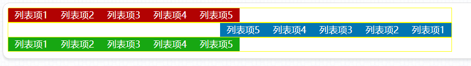
通过上面的示例我们可以发现，通过这种方式可以成功地消除子元素浮动对父元素高度的影响，但是这样会给页面添加一些无意义的空标签，并不是很理想。
<h3 style="font-sze:16px;color:#2a90d1;">使用绝对定位“position:absolute”</h3>
HTML代码大致和上例相似，不过去处了添加了“clear”属性的空标签，如下：

```
<section>
        <ul>
            <li>列表项1</li>
            <li>列表项2</li>
            <li>列表项3</li>
            <li>列表项4</li>
            <li>列表项5</li>
        </ul>
    </section>
    <section>
        <ul>
            <li>列表项1</li>
            <li>列表项2</li>
            <li>列表项3</li>
            <li>列表项4</li>
            <li>列表项5</li>
        </ul>
    </section>
    <section>
        <ul>
            <li>列表项1</li>
            <li>列表项2</li>
            <li>列表项3</li>
            <li>列表项4</li>
            <li>列表项5</li>
        </ul>
    </section>
```
CSS代码如下：

```
        body {
            height: 38px;
        }
        ul {
            list-style: none;
            margin: 0; padding: 0;
        }
        ul li {
            width: 100px; height: 30px;
            line-height: 30px;
            color: #fff;
            text-align: center;
        }
        <!-- CSS代码如下 -->
        section {
            width: 960px;
            border: 1px solid #ffff00;
        }
        section ul {
            position: absolute;
            border: 1px solid #ff00ff;
        }
        section:nth-child(1) li {
            background-color: #b20202;
            float: left;
        }
        section:nth-child(2) li {
            background-color: #0275b2;
            float: right;
        }
        section:nth-child(3) li {
            background-color: #17a712;
            float: left;
        }
```
运行效果：

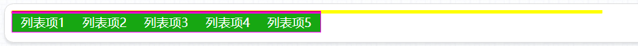
为了便于观察效果，这次我们给< ul>标签添加了一个紫色的边框，可以发现，< li>的父级元素< ul>也有了适应子元素内容的高度，但是一个很严重的情况出现了，首先< ul>的父级元素< section>仍然没有高度，并且3个< ul>列表由于绝对定位的原因，全部重叠在一起了，显然这种做法的缺点也比较明显，就是当页面内存在多个浮动元素组的时候，此方法对布局的帮助也不大。
<h3 style="font-sze:16px;color:#2a90d1;">裁切显示属性“overflow”</h3>
  该属性本是用于是否裁切设定该属性的元素对未能完全显示内容，未能完全显示的内容是否在元素内生成滚动条以便于完全查看。但后来很多开发者在实际工作中发现，该属性还有一个“好处”，就是可以消除浮动元素对父级元素高度的影响，就是将该属性的值设为除了“visible”外允许的值（auto、hidden和scroll），通常是“hidden”即可使父元素适应子元素的高度。<br><br>
HTML代码和上例完全一样，CSS代码只是将“position:absolue”改为了“overflow:hidden”，如下：

```
        ul {
            list-style: none;
            margin: 0; padding: 0;
        }
        ul li {
            width: 100px; height: 30px;
            line-height: 30px;
            color: #fff;
            text-align: center;
        }
        <!-- CSS主要代码 -->
        section {
            width: 960px;
            border: 1px solid #ffff00;
        }
        section ul {
            overflow: hidden;
            border: 1px solid #ff00ff;
        }
        section:nth-child(1) li {
            background-color: #b20202;
            float: left;
        }
        section:nth-child(2) li {
            background-color: #0275b2;
            float: right;
        }
        section:nth-child(3) li {
            background-color: #17a712;
            float: left;
        }
```
运行效果：

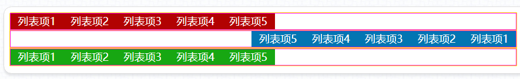
现在，不仅< li>的父元素< ul>自适应了子元素的高度，连最外层的< section>也自适应了其后代元素的高度，到目前为止也算是效果最理想的一种做法了。<br><br>
但并不是说该方法就没有缺点了，就是当用“float”来制作具有“二级导航菜单”的导航条的时候，用“overflow”去消除浮动就会出现问题了，就是如果用它的值“hidden”的时候，“二级导航菜单”由于被“裁切”了根本不会显示；如果用“auto”或者“scroll”的时候呢，又会在导航栏下生成一个内容都显示不全的，还带难看滚动条的“不明物体”；而用“visible”这个值的时候呢，又没有达到清除浮动影响的效果。
<h3 style="font-sze:16px;color:#2a90d1;">使用伪类元素选择器“:after”</h3>
使用这种方法的原理和在浮动元素“同级”的末尾加上一个带有“clear”属性的“块级元素”一样，不过设置方式看上去稍微复杂一点。我们先来看一下采用这种方式的实际效果，HTML部分与之前的示例也是一致的，对应的CSS代码如下：

```
       ul {
            list-style: none;
            margin: 0; padding: 0;
        }
        ul li {
            width: 100px; height: 30px;
            line-height: 30px;
            color: #fff;
            text-align: center;
        }
        section {
            width: 960px;
            border: 1px solid #ffff00;
        }
        <!-- CSS主要代码 -->
        section ul {
            border: 1px solid #ff00ff;
        }
        section ul:after {
            content: "";
            height: 0;
            visibility: hidden;
            display: block;
            clear: both;
        }
        section:nth-child(1) li {
            background-color: #b20202;
            float: left;
        }
        section:nth-child(2) li {
            background-color: #0275b2;
            float: right;
        }
        section:nth-child(3) li {
            background-color: #17a712;
            float: left;
        }
```
运行效果：

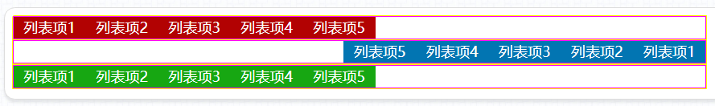
通过“CSS高级选择器”,“:after”是向设置了该选择器的子元素的末尾插入“显示类型”为“inline”的内容，而且通过这种方式插入的内容是个实实在在的HTML元素，也就它具有普通HTML元素的几乎一切CSS属性，“可操作性”非常的高。<br><br>
本例中，我们首先用该选择器必要的属性“content”插入一个任意字符（某些“高级”浏览器里也可以为“空”，但为了兼容性考虑，加上一个任意字符更加安全），然后将元素高度设置为“0”，使它不占据页面的空间，为了保证插入的那个“任意字符”不显示出来，我们还需要设置“visibility”属性的值为“hidden”。由于通过该选择器插入的内容的“显示类型”为“inline”，我们还需要将它转换为“block”。最后，也是最重要的一步，就是设置“clear”属性了。<br><br>
该方式看似复杂，但却是目前为止清除浮动影响的最佳方式，即：在HTML不用添加无意义的空标签，不会让布局重叠，不会裁切显示元素。它唯一的缺点就是不支持老版本的浏览器（IE7及以下版本），但是随着互联网技术的发展，这些问题都不再成为问题，都交给时间去解决吧。
<h1>定位属性“position”概述</h1>
在HTML中，元素的布局可以通过CSS的浮动属性“float”和外间距属性“margin”，甚至是内间距属性“padding”去实现（通过将边框属性“border”的分支属性“border-color”设置为“transparent”去做布局也不是不可以），但是这些布局方式都存在着各种各样的局限性，这个时候定位属性“position”的出现绝对是对元素布局的一个非常好的补充。而且该属性对<span style="font-size:24px;color:#0b933b;">所有显示类型</span>的元素使用。<br><br>
该属性有以下值：

- <h3 style="font-sze:16px;color:#2a90d1;">static</h3>
  默认值，采用元素默认的定位方式。
- <h3 style="font-sze:16px;color:#2a90d1;">relative</h3>
  使元素对其原始位置进行“相对定位”。
- <h3 style="font-sze:16px;color:#2a90d1;">absolute</h3>
  使元素根据父（祖先）父元素的定位情况进行“绝对定位”。
- <h3 style="font-sze:16px;color:#2a90d1;">fixed</h3>
   使元素相对于浏览器窗口进行“固定定位”。<br><br>
该属性除了值为“static”的情况，通常要配合“top”、“right”、“bottom”和“left”四个属性去使用，这四个属性允许的值为Web技术中常用的长度单位，如：“像素”、“百分数”、“字符大小”、“点”等。<br><br>
设置过定位属性的元素，有的时候会根据布局的需要出现重叠，重叠的规则是：在HTML文档中后出现的元素会出现在先出现元素的上方。若要调整元素的层级可以通过“<span style="font-size:24px;color:#0b933b;">z-index</span>”属性进行设置，该属性接受<span style="font-size:24px;color:#0b933b;">整型数值</span>作为值，值越大的，层级越高，越接近用户视觉，值越小则反之。（像一本反着翻开的书，页码越大越靠上，越容易被读者看到，页码越小则反之。）<br><br>
z-index”属性的取值范围在“-32767”至“32767”之间，“0”为默认值。当然，我们通常不会去使用到该属性的最小或最大值，为了便于管理页面内元素的“层级关系”，通常我们都是将该属性的值设置在一个比较便于管理的区间内，如“0到10”之间。
<h1>相对定位“position:relative”</h1>
当一个元素的“position”属性的值为“relative”时，元素对其原始位置进行“相对定位”，但元素在“文档流”中所占据的位置仍然保留。

HTML代码如下：
```
<section>
        <div class="posr_l100">
            <label>用户名：</label>
            <input type="text">
        </div>
        <div class="posr_r100">
            <label>密码：</label>
            <input type="password">
        </div>
    </section>
    <section class="posr_t-50">
        <div>
            <label>用户名：</label>
            <input type="text">
        </div>
        <div>
            <label class="posr_b20">密码：</label>
            <input type="password">
        </div>
    </section>
    <span class="aac">测试内容</span>
```
CSS代码如下：

```
        body {
            height: 80px;
            padding-top: 62px;
        }
        section {
            float: left;
            margin-right: 50px;
            border: 2px solid #aaa;
            border-radius: 15px;
            padding: 12px 20px;
        }
        section div > label {
            width: 80px;
            display: inline-block;
        }
        .posr_l100,.posr_r100,.posr_t-50,.posr_b20 {
            position: relative;
        }
        .posr_l100 { left: 100px; }
        .posr_r100 { rirght: 100px; }
        .posr_t-50 { top: -50px; }
        .posr_b20 { bottom: 20px; }
        .aac {
            position: relative;
            top: 50px; left: 50px;
        }
```
运行效果：

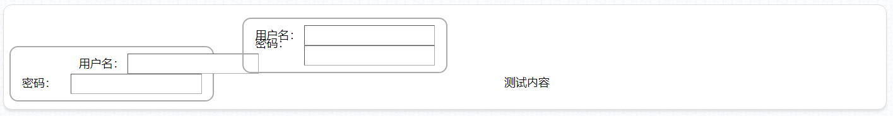
上例显示效果稍显错乱，但只是为了说明一个问题，就是参与“相对定位”的元素并不会影响到其它元素在“文档流”中的位置，而自身的“文档流”位置也正常保留了的。“相对定位”通常是用于布局相对复杂、浏览器布局差异比较大的表单元素。就是将所有< label>元素与右侧的表单元素进行垂直上对齐（vertical-align:top，该属性的值“middle”在各浏览器上也存在差异，不推荐在表单布局中使用）,然后通过设置“相对定位”的“top”属性的值来达到“视觉上”的垂直居中效果。
<h1>绝对定位“position:absolute”</h1>
当一个元素的“position”属性的值为“absolute”时，该属性会相对<span style="font-size:24px;color:#0b933b;">最近</span>的具有定位属性“position”（值不能够为“static”）的“祖先”级元素进行“相对定位”，没错，这里就是“相对定位”。如果当元素<span style="font-size:24px;color:#0b933b;">遍历</span>完所有的“祖先”元素都没有找到有“postion”的，那它将对当前的浏览器窗口进行“绝对定位”。<br><br>
若同级元素都具有“绝对定位”的属性，那这些元素会重叠在一起，除非通过“z-index”属性进行层级调整。若某个元素内存在一个<span style="font-size:24px;color:#0b933b;">唯一</span>的绝对定位的元素，如果没有给它设置“left”、“top”等这一系列的属性，那它将会保持原位，但是一旦设置了“left”或“right”值，那元素将会在<span style="font-size:24px;color:#0b933b;">水平轴</span>方向去执行绝对定位的规则，但垂直轴方向并不会发生位置变动。若设置了“top”或“bottom”（“left”和“right”值没有设置的情况），那元素将会在<span style="font-size:24px;color:#0b933b;">垂直轴</span>方向去执行绝对定位的规则。现在很多网站内的“二级导航菜单”就是利用绝对定位这一特性制作的。<br><br>
需要指出的是，将一个元素设置为“绝对定位”后，它对元素的性质有以下几种改变：<br><br>

- 元素会从“文档流”中脱离，不再占据页面内“文档流”的显示位置
- “非块级”的元素会被转化成“块级元素”。
- 元素的宽和高将对内容自适应（不再是“块级元素”默认100%的宽度了）。
- 若一个具有宽和高的元素是其父级元素中唯一的子元素，并且其父元素没有设置高度属性，那父元素内容的高度将会变为“0”。<br><br>
根据“绝对定位”对元素的改变，记得在页面布局的时候对设置了该属性值的元素做一些针对性的调整，如：不用再给元素显示地设置“display”属性，用于节约代码量，给没有内容的元素及其父级元素设置宽和高等。<br><br>
我们首先来看一个< body>元素下的子元素直接进行“绝对定位”的示例，HTML代码如下：

```
    <section>壬戌之秋，七月既望，苏子与客泛舟游于赤壁之下。清风徐来，水波不兴。举酒属客，诵明月之诗，歌窈窕之章。少焉，月出于东山之上，徘徊于斗牛之间。白露横江，水光接天。纵一苇之所如，凌万顷之茫然。</section>
    <section>壬戌之秋，七月既望，苏子与客泛舟游于赤壁之下。清风徐来，水波不兴。举酒属客，诵明月之诗，歌窈窕之章。少焉，月出于东山之上，徘徊于斗牛之间。白露横江，水光接天。纵一苇之所如，凌万顷之茫然。</section>
    <section>壬戌之秋，七月既望，苏子与客泛舟游于赤壁之下。清风徐来，水波不兴。举酒属客，诵明月之诗，歌窈窕之章。少焉，月出于东山之上，徘徊于斗牛之间。白露横江，水光接天。纵一苇之所如，凌万顷之茫然。</section>
```
CSS代码如下：

```
        body {
            height: 500px;
            font-family: "微软雅黑";
        }
        <!-- CSS主要代码 -->
        section {
            width: 240px; height: 240px;
            padding: 8px;
            position: absolute;
            color: #ffffff;
        }
        section:nth-child(1) {
            background-color: #b90909;
            top: 50px; left: 50px;
        }
        section:nth-child(2) {
            background-color: #09b932;
            top: 50px; right: 50px;
        }
        section:nth-child(3) {
            background-color: #0946b9;
            left: 50%; bottom: 50px;
            margin-left: -125px;
        }
```
运行效果：

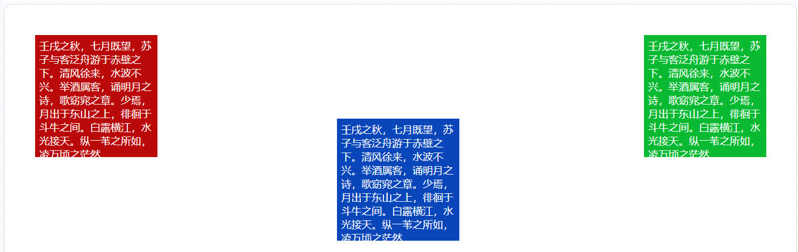
这样的定位方式相对简单，所有元素的定位都是相对于浏览器边缘进行的位置设置，只有最后一个< section>元素稍微特殊一点，是利用“position:absolute”加上“margin-left”的方式进行水平居中定位，这也是一定条件下（常用于元素宽度大于浏览宽度的情况，比如说大幅的Banner元素）比较实用的居中定位方式。<br><br>
我们再来看一个有嵌套关系，并且涉及多层元素定位的例子，HTML部分的代码如下：

```
    <section>壬戌之秋，七月既望，苏子与客泛舟游于赤壁之下。清风徐来，水波不兴。举酒属客，诵明月之诗，歌窈窕之章。少焉，月出于东山之上，徘徊于斗牛之间。白露横江，水光接天。纵一苇之所如，凌万顷之茫然。
    </section>
    <section>
        <article>于是饮酒乐甚，扣舷而歌之。歌曰：“桂棹兮兰桨，击空明兮溯流光。渺渺兮予怀，望美人兮天一方。”</article>
    </section>
    <section>
        <article>客有吹洞箫者，倚歌而和之。其声呜呜然，如怨如慕，如泣如诉；余音袅袅，不绝如缕。舞幽壑之潜蛟，泣孤舟之嫠妇。</article>
    </section>
```
CSS代码如下：

```
        body {
            height: 326px;
            font-family: "微软雅黑";
        }
        section {
            width: 240px; height: 240px;
            padding: 8px;
            color: #ffffff;
            opacity: 0.8;
        }
        <!-- CSS主要代码 -->
        section:nth-child(1) {
            width: 960px; height: auto;
            background-color: #f2afaf;
            margin: 0 auto;
        }
        section:nth-child(2) {
            background-color: #bef5cb;
            position: relative;
            left: 20%; top: 0;
        }
        section:nth-child(2) > article {
            width: 180px; height: 180px;
            padding: 8px;
            background-color: #129d33;
            position: absolute;
            left: 10px; top: 10px;
        }
        section:nth-child(3) {
            background-color: #c4bef5;
            position: absolute;
            right: 20%; top: 0px;
        }
        section:nth-child(3) > article {
            width: 180px; height: 180px;
            padding: 8px;
            background-color: #170898;
            position: absolute;
            right: 10px; bottom: 10px;
        }
```
运行效果：

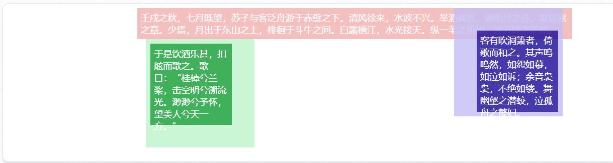
这个示例的CSS代码比较多，但关键代码就8行，就是第2、3个< section>及子元素< article>执行定位相关的属性。首先可以发现之前谈到的一个问题，也就是第2、3个< section>的“top”属性都是“0”，但是由于第2个< section>执行的是“相对定位”，将该属性值设置为“0”等于是没有做垂直方向的偏移，也能说明它仍居“文档流”内，而第3个< section>执行的是“绝对定位”，它会忽略“文档流”内所有元素的位置，去相对于当前浏览器边界做定位。<br><br>
本例中的2个< section>内的< article>元素都执行的是“绝对定位”，可以发现，他们并没有去“寻找”浏览器边界做定位，而是相对父元素< section>去做了定位，而且这与父元素< section>执行的是“相对定位”还是“绝对定位”并没有关系，当然，若父元素< section>执行的是“固定定位”（position:fixed，后续会讲到）也会达到同样的效果。<br><br>
绝对定位”初看是一个比较简单的属性，但深究起来还是有很多复杂的地方，如：一个元素没有设置宽和高，将它“上右下左”四个方向的属性值都设置为“0”，那它的宽和高将占满整个浏览器窗口等等。
<h1>固定定位“position:fixed”</h1>
当一个元素的“position”属性的值为“fixed”时，那它会相对于浏览器边界进行定位，并且当页面存在滚动条的时候，页面的滚动也不会对其和浏览器边界之间的相对位置产生影响，就像是“漂浮”在一个固定的地方一样，所以将其称作“固定定位”。除此之外，“固定定位”和“绝对定位”的其它特性都比较相似，而且该定位方式也会脱离“文档流”，它和文档内的元素都不会有任何布局上的互相干扰。针对“固定定位”的这些特性，它通常用于以下情景：

- <h3 style="font-sze:16px;color:#2a90d1;">弹出框底部的“遮罩层”</h3>
现在的网页设计基本不会再去采用浏览器引擎内自带的那种弹出提示框，而一般是开发者根据美工的要求自定义的弹出框，但自行设计的弹出框并不具备<span style="font-size:24px;color:#0b933b;">页面事件阻塞</span>功能，为了防止用户“绕过”弹出框去继续对页面元素进行操作，绝大部分时候都会在弹出框下方（通过“z-index”设置层级关系）添加一层“遮罩”（这层遮罩可以是透明的，也可以是色彩半透明的），这样用户就不能再通过鼠标点击的方式去操作弹出框“下方”的内容了。
- <h3 style="font-sze:16px;color:#2a90d1;">页面浮动二维码</h3>
微信公众号是现在各类商家推广自身品牌，自媒体发布的一个非常主流的手段，所以在自己的官方网站的空白处都会“悬浮”着一个二维码，若用户不需要关注这个商家（企业、机构、学院等）点击该二维码旁的关闭按钮即可关闭二维码。
- <h3 style="font-sze:16px;color:#2a90d1;">“回到顶部”按钮</h3>
现在内容稍多的网站，为了顾及到用户体验，几乎都会在页面空白的适当位置加上一个“回到顶部”按钮，需要该按钮的位置不受页面滚动的影响，最高效的办法（也可以利用JavaScript去做，再配以CSS的过渡特效，可以实现一定的动态效果，但相对低效）也就是通过“固定定位”去实现了。
- <h3 style="font-sze:16px;color:#2a90d1;">网站/应用操作指引</h3>
现在做得较好的互联网网站为了迎合大众的赏美和做功能上的一些调整，时常会涉及到网站风格及内容的改版，这样网站上的功能内容、位置结构都会涉及到改动，会让新老用户都“无从下手”，这个时候利用CSS中“固定定位”元素设计的“指引步骤”，再配以JavaScript的控制，会让用户有一种“这个网站做得很人性化”的感觉。但这种设计也不要滥用，凡事都有个度，用户体验设计亦是如此，若太多地采用这种方式反而会影响一些熟悉该网站的用户的操作流畅度。
- <h3 style="font-sze:16px;color:#2a90d1;">固定的顶部导航栏</h3>
有些网站希望用户尽可能多地浏览本站的内容，但由于设计风格开阔或者信息内容太多等原因，导致每页的内容都比较多，通过“回到顶部”按钮又增加了操作步骤（在用户体验设计中重要的一环就是要求用户操作数更少，但能实现的交互功能更多），这个时候通过“固定定位”将网站导航栏“浮动固定”在页面的顶部，这样用户无论在页面内容的什么地方，都能更方便地进行页面的跳转了。以上这些情景用例只是对“固定定位”比较常用的地方进行说明、、、。<br><br>
案例HTML部分的代码如下：

```
<header>前赤壁赋</header>
    <section>
        <article>
            <p>壬戌之秋，七月既望，苏子与客泛舟游于赤壁之下。清风徐来，水波不兴。举酒属客，诵明月之诗，歌窈窕之章。少焉，月出于东山之上，徘徊于斗牛之间。白露横江，水光接天。纵一苇之所如，凌万顷之茫然。浩浩乎如冯虚御风，而不知其所止；飘飘乎如遗世独立,羽化而登仙。</p>
            <p>于是饮酒乐甚，扣舷而歌之。歌曰：“桂棹兮兰桨，击空明兮溯流光。渺渺兮予怀，望美人兮天一方。”客有吹洞箫者，倚歌而和之。其声呜呜然，如怨如慕，如泣如诉；余音袅袅，不绝如缕。舞幽壑之潜蛟，泣孤舟之嫠妇。</p>
            <p>苏子愀然，正襟危坐，而问客曰：“何为其然也？”客曰：“‘月明星稀，乌鹊南飞。’此非曹孟德之诗乎？西望夏口，东望武昌，山川相缪，郁乎苍苍，此非孟德之困于周郎者乎？方其破荆州，下江陵，顺流而东也，舳舻千里，旌旗蔽空，酾酒临江，横槊赋诗，固一世之雄也，而今安在哉？况吾与子渔樵于江渚之上，侣鱼虾而友麋鹿，驾一叶之扁舟，举匏樽以相属。寄蜉蝣于天地，渺沧海之一粟。哀吾生之须臾，羡长 江之无穷。挟飞仙以遨游，抱明月而长终。知不可乎骤得，托遗响于悲风。”</p>
            <p>苏子曰：“客亦知夫水与月乎？逝者如斯，而未尝往也；盈虚者如彼，而卒莫消长也。盖将自其变者而观之，则天地曾不能以一瞬；自其不变者而观之，则物与我皆无尽也，而又何羡乎！且夫天地之间，物各有主，苟非吾之所有，虽一毫而莫取。惟江上之清风，与山间之明月，耳得之而为声，目遇之而成色，取之无禁，用之不竭。是造物者之无尽藏也，而吾与子之所共适。”</p>
            <p>客喜而笑，洗盏更酌。肴核既尽，杯盘狼籍。相与枕藉乎舟中，不知东方之既白。</p>
        </article>
    </section>
    <footer>苏轼</footer>
```
CSS代码如下：

```
        body {
            height: 420px;
            overflow-y: auto;
        }
        header,footer {
            width: 100%; height: 50px;
            background-color: #d40f0f;
            position: fixed;
            text-align: center;
            font: 32px/50px "全新硬笔行书简","楷体";
            color: #fff;
        }
        header { top: 0; }
        footer { bottom: 0; }
        section {
            width: 660px;
            margin: 0 auto;
            padding: 60px 0;
        }
        article {
            text-indent: 2em;
            font: 26px "全新硬笔行书简","楷体";
            color: #620808;
        }
```
运行效果：

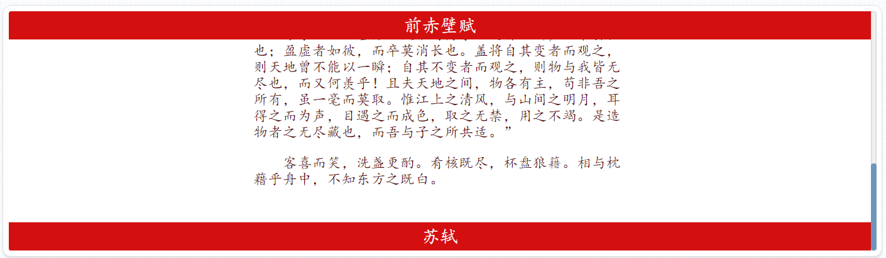