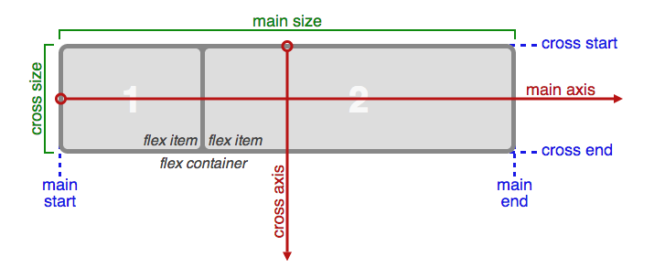
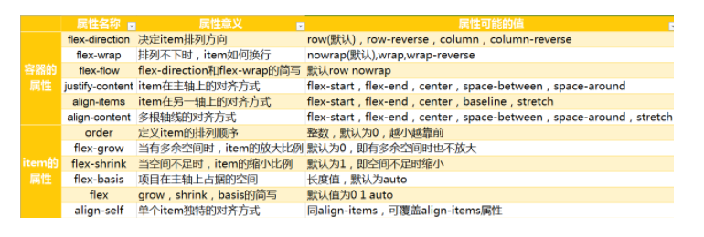

<h1>什么是Flex布局</h1>
Flex 是 Flexible Box 的缩写，意为"弹性布局"，比较适合小规模的布局。
<h1>Flex布局有什么作用？</h1>
Flex 能为盒状模型提供最大的灵活性。提供一个更有效地布局、对齐方式等。
<h1>基本概念</h1>
flex布局实质上是一套属性的组合，有的属性是设置在父元素上，有的属性设置在子元素上。（大概12个属性，六个在父元素上，六个在子元素上）。  

- 如果要定义父元素是一个 flex布局容器。则设置display为flex或inline-flex即可。
- 如果设置为flex则父元素为块状元素，设置为inline-flex父元素呈现为行内元素。而不管父元素本身是什么类型。一旦一个元素设置为了flex类型，那么其所有的子元素都会被flex方式影响。可以称他们为flex子项。而父元素可以称为flex容器【flex container】。  
<h5>注意：</h5>
1. 设为Flex布局以后，子元素的float、clear和vertical-align属性将失效。
<h1>主轴与交叉轴</h1>

- 1.一个盒子被设置为flex布局后，它默认会存在两根轴：水平的主轴（main axis）和垂直的交叉轴（cross axis）。
- 2.主轴的开始位置（与边框的交叉点）叫做main start，结束位置叫做main end；
- 3.交叉轴的开始位置叫做cross start，结束位置叫做cross end。
- 4.子元素默认沿主轴排列。
- 5.单个子元素占据的主轴空间叫做main size，占据的交叉轴空间叫做cross size。

<h1>Flex布局-设置在父元素上的属性</h1>

- 1.flex-direction 主轴的方向（即子元素的排列方向，因为子元素默认沿主轴排列）
- 2.flex-Wrap 默认情况下，子元素都排在一条线（又称"轴线"）上。flex-wrap属性定义，如果一条轴线排不下，如何换行

- 3.flex-flow  flex-direction属性和flex-wrap属性的简写形式

- 4.justify-content 子元素在主轴上的对齐方式。（随着主轴方向的改变而改变）
- 5.align-items 子元素在交叉轴上如何对齐
- 6.align-content多根主轴在交叉轴线上的对齐方式。如果项目只有一根主轴线，该属性不起作用
<h1>flex-direction</h1>
1.flex-direction主轴的方向（即子元素的排列方向）  
此属性有4个值，如下：  
row | row-reverse | column | column-reverse;  
四个值的作用:  

- row（默认值）：主轴为水平方向，起点在左端。
- row-reverse：主轴为水平方向，起点在右端。
- column：主轴为垂直方向，起点在上沿。
- column-reverse：主轴为垂直方向，起点在下沿。
<h1>flex-wrap</h1>
1.flex-wrap  
默认情况下，子元素都排在一条线（又称"轴线"）上。flex-wrap属性定义，如果一条轴线排不下，如何换行
  
此属性有3个值，如下：  
nowrap | wrap | wrap-reverse;  
四个值的作用:  

- nowrap（默认）：不换行。
- wrap：换行，第一行在上方
- wrap-reverse：换行，第一行在下方。
<h1>flex-flow</h1>
1.flex-flow  flex-direction属性和flex-wrap属性的简写形式
  
此属性有2个值，默认值为row nowrap，如下：流式布局

- flex-flow:row wrap;
- flex-flow:row nowrap;
<h1>justify-content </h1>
1.justify-content 子元素在主轴上的对齐方式。  
此属性有5个值，如下：  
 flex-start | flex-end | center | space-between | space-around;  
5个值的作用:

- flex-start（默认值）：在主轴的开始处对齐
- flex-end：在主轴的结束处对齐
- center： 居中
- space-between：两端对齐，子元素之间的间隔都相等。
- space-around：沿轴线均匀分布，【每个子元素两侧的间隔相等。所以，子元素之间的间隔比子元素与边框的间隔大一倍。
<h1>align-items </h1>
 1.align-items 子元素在交叉轴上如何对齐  
 此属性有5个值，如下：  
 flex-start | flex-end | center | baseline | stretch;  
 5个值的作用:

- flex-start：让子元素在交叉轴的开始处对齐。
- flex-end：让子元素在交叉轴的结束处对齐。
- center：让子元素在交叉轴的中点对齐。
- baseline: 让子元素在第一行文字的基线对齐。
- stretch（默认值）【如果子元素未设置高度或设为auto，将占满整个容器的高度。】
<h1>align-content </h1>
1.align-content 多根轴线的对齐方式。如子元素只有一根轴线，该属性不起作用   
此属性有6个值，如下：  
 flex-start | flex-end | center | baseline | stretch;  
6个值的作用:

- flex-start：在交叉轴的开始处对齐。
- flex-end    在交叉轴的结束处对齐。
- center：   在交叉轴的中点对齐。
- space-between：与交叉轴两端对齐，轴线之间的间隔平均分布。
- space-around：每根轴线两侧的间隔都相等。所以，轴线之间的间隔比轴线与边框的间隔大一倍。
- stretch（默认值）：轴线占满整个交叉轴。
<h1>总结--设置在父元素上的属性</h1>

- 1.flex-direction 主轴的方向（即子元素的排列方向）
- 2.flex-wrap 定义当子元素在一条轴线排不下时，该如何换行 
- 3.flex-flow  flex-direction属性和flex-wrap属性的简写形式
- 4.justify-content子元素在主轴上的对齐方式。
- 5.align-items子元素在交叉轴上的对齐方式
- 6.align-content多根主轴在交叉轴线上的对齐方式。如果项目只有一根主轴线，该属性不起作用
<h1>Flex布局--设置在子元素上的属性
</h1>

- 1.order  定义子元素的排列顺序。数值越小，排列越靠前，默认为0，可以为负值。
- 2.flex-grow  定义子元素的放大比例，前提是存在剩下空间用于放大。【默认为0，表示不放大。】  
如果所有子元素的flex-grow属性都为相等，则将会平分父元素剩余宽度。如果不相等，将会用父元素的宽度减去剩余未放大的子元素的宽度，剩余值将按照比例平分。
- 3.flex-shrink  定义了子元素的缩小比例，前提是空间无法装下盒子大小】默认为1，即如果空间不足，该子元素将缩小。负值对该属性无效。
- 4.flex-basis 定义了在分配多余空间之前，子元素占据的主轴空间（main size）。  
浏览器根据这个属性，计算主轴是否有多余空间。它的默认值为auto，即子元素的本来大小。它可以设为跟width或height属性一样的值（比如350px），则子元素将占据固定空间。如果子元素上同时设置了在主轴方向上的width/height和flex-basis,那么flex-basis会覆盖width/height的值。
- 5.flex flex属性是flex-grow, flex-shrink 和 flex-basis的简写，默认值为0 1 auto。后两个属性可选。  
该属性有两个快捷值：auto (1 1 auto) 和 none (0 0 auto)。建议优先使用这个属性，而不是单独写三个分离的属性，因为浏览器会推算相关值。
- 6.align-self align-self属性允许单个子元素有与其他子元素不一样的对齐方式，可覆盖align-items属性（还有五个值写法和align-items一样）。默认值为auto，表示继承父元素的align-items属性，如果没有父元素，则等同于stretch。
<h1>flex-grow--放大</h1>
该属性来设置，当父元素的宽度大于所有子元素的宽度的和时（即父元素会有剩余空间），子元素如何分配父元素的剩余空间。  
flex-grow的默认值为0，意思是该元素不索取父元素的剩余空间，如果值大于0，表示索取。值越大，索取的越厉害。  
举个例子: 
父元素宽400px，有两子元素：A和B。A宽为100px，B宽为200px。 
则空余空间为 400-（100+200）= 100px。  
如果A，B都不索取剩余空间，则有100px的空余空间。  
如果A索取剩余空间:设置flex-grow为1，B不索取。则最终A的大小为 自身宽度（100px）+ 剩余空间的宽度（100px）= 200px  
如果A，B都设索取剩余空间，A设置flex-grow为1，B设置flex-grow为2。则最终A的大小为 自身宽度（100px）+ A获得的剩余空间的宽度（100px * (1/(1+2))）,最终B的大小为 自身宽度（200px）+ B获得的剩余空间的宽度（100px * (2/(1+2))）。
<h1>flex-shrink--缩小</h1>
该属性来设置，当父元素的宽度小于所有子元素的宽度的和时（即子元素会超出父元素），子元素如何缩小自己的宽度的。  
flex-shrink的默认值为1，当父元素的宽度小于所有子元素的宽度的和时，子元素的宽度会减小。值越大，减小的越厉害。如果值为0，表示不减小。  
举个例子: 
父元素宽400px，有两子元素：A和B。A宽为200px，B宽为300px。 
则A，B总共超出父元素的宽度为(200+300)- 400 = 100px。  
如果A，B都不减小宽度，即都设置flex-shrink为0，则会有100px的宽度超出父元素。  
如果A不减小宽度:设置flex-shrink为0，B减小。则最终B的大小为 自身宽度(300px)- 总共超出父元素的宽度(100px)= 200px  
如果A，B都减小宽度，A设置flex-shirk为3，B设置flex-shirk为2。则最终A的大小为 自身宽度(200px)- A减小的宽度(100px * (200px * 3/(200 * 3 + 300 * 2))) = 150px,最终B的大小为 自身宽度(300px)- B减小的宽度(100px * (300px * 2/(200 * 3 + 300 * 2))) = 250px
<h1>Flex布局--设置在子元素上的属性</h1>

注意：

- 1.子项可以设置高度，宽度最好用flex-basis属性设置
- 2.一个元素可以既是容器，又是子项，可以同时具备容器和子项的操作属性
- 3.容器本身可以设置浮动等，容器子项不能设置浮动等，但是子项的子元素
又可以设置 
- 4.使用flex布局有点类似于安卓的布局方式，先是很多行，然后每行有很多内容在进行控制

