<h1>CSS高级选择器概述</h1>
CSS高级选择器区别于CSS普通选择器，它并非是通过HTML页面标签中一些可见的因素进行选择（如标签名，属性名、值，同级关系，嵌套结构等），也不是对一些简单的操作条件进行选择（如鼠标悬浮，鼠标点击，输入框获得焦点等），而是对标签元素的结构、标签元素的索引、标签元素的状态等一些更为复杂的条件下进行的选择，甚至能改变现有标签的状态结构。<br><br>
很多CSS高级选择器都是在CSS3标准后诞生的，它们出现一方面让标签的选择更加的简便精准，一方面又让HTML的DOM结构更加清晰，顺应了标签结构语义化，可读性更强的趋势，同时也使得搜索引擎能更好的检索到我们所开发的网站（SEO）。能正确灵活地运用CSS的高级选择器，不仅能让我们开发的网站功能更加地强大，表现更加地“绚丽”，还能更大程度地增加用户的体验度，让我们开发的网站在用户心目中留下一个深刻的好印象。
<h2 style="color:#11278a;">伪元素选择器</h2>
该类选择器主要用于向指定的<span style="color:#0b933b;font-size:24px;">选择器</span>添加指定的效果，该类选择器会<span style="color:#0b933b;font-size:24px;">增加“1”的权重</span>，主要有四个伪元素：
<h3 style="color:#2a90d1;">:first-letter</h3>
选择“块级元素”文本段落中的首个字符，只能对“块级元素”生效。<br><br>
该选择器可以设置的值有：<br><br>

- font属性
- color属性
- background属性
- margin属性
- padding属性
- border属性
- text-decoration属性
- vertical-align属性
- text-transform属性
- line-height属性
- float属性
- clear属性

HTML代码示例：

```
<article>
   <p class="firstLetter">天将降大任于是人也，必先苦其心志，劳其筋骨，饿其体肤，空伐其身行，行弗乱其所为，所以动心忍性，曾益其所不能。</p>
</article>
```
CSS代码如下：

```
<!-- 伪元素选择器--首字选择 -->
.firstLetter:first-letter{
    padding:4px;
    border:2px solid #all;
    color:#all;
    font:24px "微软雅黑";
    margin:2px 4px 0 2px;
}
```
运行效果：

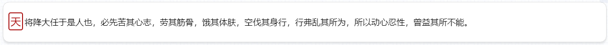
<h3 style="color:#2a90d1;">:first-line</h3>
选择“块级元素”文本段落中的首行文本，只能对“块级元素”生效。<br><br>
该选择器可以设置的值有：<br><br>

- font属性
- color属性
- background属性
- word-spacing属性
- letter-spacing属性
- text-decoration属性
- vertical-align属性
- text-transform属性
- line-height属性
- clear属性

HTML代码示例：

```
<article>
   <p class="firstLine">天将降大任于是人也，必先苦其心志，劳其筋骨，饿其体肤，空伐其身行，行弗乱其所为，所以动心忍性，曾益其所不能。</p>
</article>
```
CSS代码如下：

```
<!-- 伪元素选择器--首行选择 -->
.firstLine:first-line{
    font:28px/42px "微软雅黑";
    color:#4e5221;
    letter-spacing:8px;
}
```
运行效果：


<h3 style="color:#2a90d1;">:before</h3>
在指定的选择器之前插入一段内容。插入的内容默认为“行内元素”，可以通过“display”强制装换显示类型。<br><br>
HTML代码示例：

```
<article>
    <p class="addBefore-1">这是正文文本</p>
    <p class="addBefore-2">这是正文文本</p>
    <p class="addBefore-3">这是正文文本</p>
</article>
```
CSS代码如下：

```
<!-- 伪元素选择器--元素之前添加 -->
.addBefore-1:before{
    content:url("./images/onepiece-1.png");
     width: 24px; height: 24px;
}
.addBefore-2:before {
            content: url("./images/onepiece-1.png");
            width: 0px;
            display: inline-block;
        }
.addBefore-3:before {
            content: "好像";
            border: 1px solid #f80;
            font: 24px "微软雅黑";
            color: #f80;
            display: inline-block;
            position: relative;
            top: -4px;
            margin-right: 5px;
        }
```
运行效果：

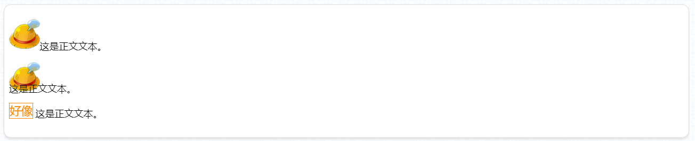
<h3 style="color:#2a90d1;">:after</h3>
在指定的选择器之后插入一段内容，使用方式和“:before”一样。插入的内容默认也是为“行内元素”，同样可以通过“display”强制装换显示类型。<br><br>
HTML代码示例：

```
<article>
    <p class="addAfter-1">这是正文文本</p>
    <p class="addAfter-2">这是正文文本</p>
    <p class="addAfter-3">这是正文文本</p>
</article>
```
CSS代码如下：

```
 /* 伪元素选择器--元素之后添加 */
        .addAfter-1:after {
            content: url("./images/onepiece-2.png");
            display: inline-block;
            position: relative;
            top: 15px;
        }
        .addAfter-2:after {
            content: "";
            display: inline-block;
            border-width: 5px 5px 5px 18px;
            border-style: solid;
            border-color: transparent transparent transparent #f80;
            -webkit-animation: afterSelector 0.6s infinite linear alternate;
        }
        .addAfter-3:after {
            content: "我就问炫不炫？";
            border: 2px solid #0058ff;
            font: 20px "微软雅黑"; color: #0058ff;
            box-shadow: inset 0 0 10px rgba(13, 68, 172, 0.81),0 0 10px rgba(13, 68, 172, 0.81);
        }
        @-webkit-keyframes afterSelector {
            0% { margin-left: 0px }
            100% { margin-left: 15px; border-width: 8px 6px 8px 18px;}
        }
```
运行效果：

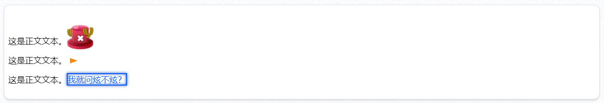
使用“:before”和“:after”伪元素选择器不仅能为指定的元素添加文字、图片和各种利用“width”、“height”、“border”制作出来的形状，甚至还能添加音频、视频这些多媒体文件，而且具有高度自定义性。<br><br>

<!-- 章节练习（一） 
制作任意四个文本，具体要求如下：
1、第一个文本段落需大于两行，为首字添加一个效果：字体设为22像素的“微软雅黑”字体，具有一个2像素的边框，字体颜色和边框均为红色，背景色为“#f3d5df”,字体与表框之间的内间距为2像素；

2、第二个文本段落需大于两行，将首行文字的字间距设为“0.8em”24像素的“微软雅黑”字体，字体颜色为“#e910d4”，并且具有下划线；

3、第三个段落文本，字数控制在4~10字内，文本水平居中。为该段落前添加一个宽高均为“32像素”背景色为“#6d2a03”圆角（border-radius）为“16像素”的形状，形状内含有一个水平垂直均居中的“炫”字。设法使该形状和段落文本水平对齐。

4、第四个段落文本，字数控制在4~10字内，文本水平居中。为该段落后添加一张接近圆形的“PNG图片”，图片大小为“32*32”。设法使该图片和和段落文本水平对齐。

<扩展功能>
1、使段落三前面的“炫”字形状显示出动态的“外发光效果”（最小发光距离“5像素”，最大发光距离“20像素”，发光颜色“rgba(48, 77, 235, 0.88)”）；

2、使段落四后方的图片以中心为原点进行无限的顺逆时针旋转（旋转速度自定）。
-->
<h1>结构性伪类选择器</h1>
<a href="http://www.w3school.com.cn/cssref/css_selectors.asp">W3C选择器</a><br><br>

该类选择器主要用于当前选择器精确地通过元素“<span style="color:#0b933b;font-size:24px;">索引值”</span>或<span style="color:#0b933b;font-size:24px;">"匹配类型"</span>的索引值定位到该选择器的<span style="color:#0b933b;font-size:24px;">同级</span>指定元素。该类型选择器的格式是<span style="color:#0b933b;font-size:24px;">“基本选择器”</span>（包括“后代选择器”、“自主选择器”、“同级选择器”等）或<span style="color:#0b933b;font-size:24px;">"属性选择器"</span>（包括各种带条件的属性选择器）”+“结构性伪类选择器”的形式。“结构性伪类选择器”会增加“1”的权重，该类选择器主要有以下形式：
<h3 style="color:#2a90d1;">:first-child</h3>
对该类所有父元素中的首个子元素进行选择。<br><br>
HTML代码如下：

```
<section>
        <p>夫君子之行,静以修身,俭以养德,非淡泊无以明志,非宁静无以致远。</p>
        <p>夫君子之行,静以修身,俭以养德,非淡泊无以明志,非宁静无以致远。</p>
        <p>夫君子之行,静以修身,俭以养德,非淡泊无以明志,非宁静无以致远。</p>
    </section>
    <article>
        <p>夫君子之行,静以修身,俭以养德,非淡泊无以明志,非宁静无以致远。</p>
        <p>夫君子之行,静以修身,俭以养德,非淡泊无以明志,非宁静无以致远。</p>
        <p>夫君子之行,静以修身,俭以养德,非淡泊无以明志,非宁静无以致远。</p>
    </article>
    <div>
        <p>夫君子之行,静以修身,俭以养德,非淡泊无以明志,非宁静无以致远。</p>
        <p>夫君子之行,静以修身,俭以养德,非淡泊无以明志,非宁静无以致远。</p>
        <p>夫君子之行,静以修身,俭以养德,非淡泊无以明志,非宁静无以致远。</p>
    </div>
```
CSS代码如下：
```
 section,article {
            border-bottom: 1px dashed #bbb;
        }
        div {
            border: none;
        }
        p:first-child {
            color: #800;
            font: x-large "华文行楷";
        }
```
运行效果：

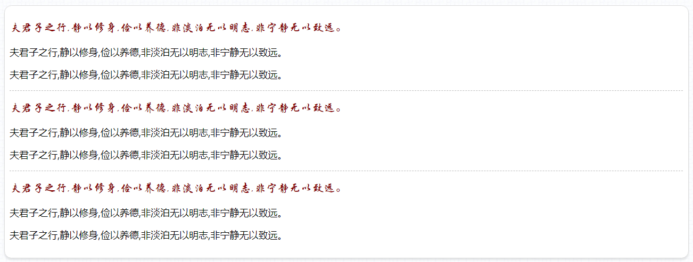
<h3 style="color:#2a90d1;">:last-child</h3>
对该类所有父元素中的最后一个子元素进行选择。<br><br>
HTML代码如下：

```
<section>
        <p>夫君子之行,静以修身,俭以养德,非淡泊无以明志,非宁静无以致远。</p>
        <p>夫君子之行,静以修身,俭以养德,非淡泊无以明志,非宁静无以致远。</p>
        <p>夫君子之行,静以修身,俭以养德,非淡泊无以明志,非宁静无以致远。</p>
    </section>
    <article>
        <p>夫君子之行,静以修身,俭以养德,非淡泊无以明志,非宁静无以致远。</p>
        <p>夫君子之行,静以修身,俭以养德,非淡泊无以明志,非宁静无以致远。</p>
        <p>夫君子之行,静以修身,俭以养德,非淡泊无以明志,非宁静无以致远。</p>
    </article>
    <div>
        <p>夫君子之行,静以修身,俭以养德,非淡泊无以明志,非宁静无以致远。</p>
        <p>夫君子之行,静以修身,俭以养德,非淡泊无以明志,非宁静无以致远。</p>
        <p>夫君子之行,静以修身,俭以养德,非淡泊无以明志,非宁静无以致远。</p>
    </div>
```
CSS代码如下：
```
section,article {
            border-bottom: 1px dashed #bbb;
        }
        div {
            border: none;
        }
        p:last-child {
            color: #060;
            font: x-large "华文彩云";
        }
```
运行效果：

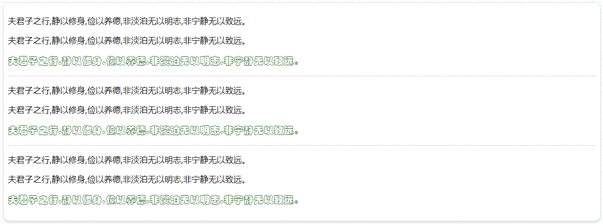
<h3 style="color:#2a90d1;">:first-of-type</h3>
对该类所有父元素中的首个匹配到类型的子元素进行选择。<br><br>
HTML代码如下：

```
    <section>
        <h3>夫君子之行,静以修身,俭以养德,非淡泊无以明志,非宁静无以致远。</h3>
        <p>夫君子之行,静以修身,俭以养德,非淡泊无以明志,非宁静无以致远。</p>
        <p>夫君子之行,静以修身,俭以养德,非淡泊无以明志,非宁静无以致远。</p>
    </section>
    <article>
        <p>夫君子之行,静以修身,俭以养德,非淡泊无以明志,非宁静无以致远。</p>
        <h3>夫君子之行,静以修身,俭以养德,非淡泊无以明志,非宁静无以致远。</h3>
        <p>夫君子之行,静以修身,俭以养德,非淡泊无以明志,非宁静无以致远。</p>
    </article>
    <div>
        <h3>夫君子之行,静以修身,俭以养德,非淡泊无以明志,非宁静无以致远。</h3>
        <p>夫君子之行,静以修身,俭以养德,非淡泊无以明志,非宁静无以致远。</p>
        <h3>夫君子之行,静以修身,俭以养德,非淡泊无以明志,非宁静无以致远。</h3>
    </div>
```
CSS代码如下：

```
section,article {
            border-bottom: 1px dashed #bbb;
        }
        div {
            border: none;
        }
        h3:first-of-type {
            color: #046;
            font: x-large "华文琥珀";
        }
        p:first-child {
            color: #f46;
            font: x-large "微软雅黑";
        }
```
运行效果：

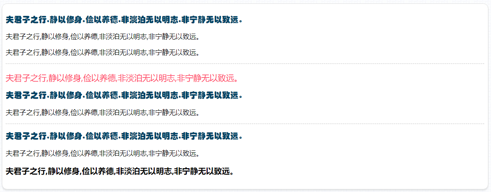
<h3 style="color:#2a90d1;">:last-of-type</h3>
对该类所有父元素中的最后一个匹配到类型的子元素进行选择。<br><br>
HTML代码如下：

```
<section>
        <h3>夫君子之行,静以修身,俭以养德,非淡泊无以明志,非宁静无以致远。</h3>
        <p>夫君子之行,静以修身,俭以养德,非淡泊无以明志,非宁静无以致远。</p>
        <div>夫君子之行,静以修身,俭以养德,非淡泊无以明志,非宁静无以致远。</div>
    </section>
    <article>
        <p>夫君子之行,静以修身,俭以养德,非淡泊无以明志,非宁静无以致远。</p>
        <h3>夫君子之行,静以修身,俭以养德,非淡泊无以明志,非宁静无以致远。</h3>
        <p>夫君子之行,静以修身,俭以养德,非淡泊无以明志,非宁静无以致远。</p>
    </article>
    <div>
        <h3>夫君子之行,静以修身,俭以养德,非淡泊无以明志,非宁静无以致远。</h3>
        <p>夫君子之行,静以修身,俭以养德,非淡泊无以明志,非宁静无以致远。</p>
        <h3>夫君子之行,静以修身,俭以养德,非淡泊无以明志,非宁静无以致远。</h3>
    </div>
```
CSS代码如下：

```
section,article {
            border-bottom: 1px dashed #bbb;
        }
        div {
            margin: 1em 0;
            border: none;
        }
        h3:last-of-type {
            color: #d45ed4;
            font: x-large "楷体";
        }
        p:last-child {
            color: #138d29;
            font: x-large "幼圆";
        }
```
运行效果：

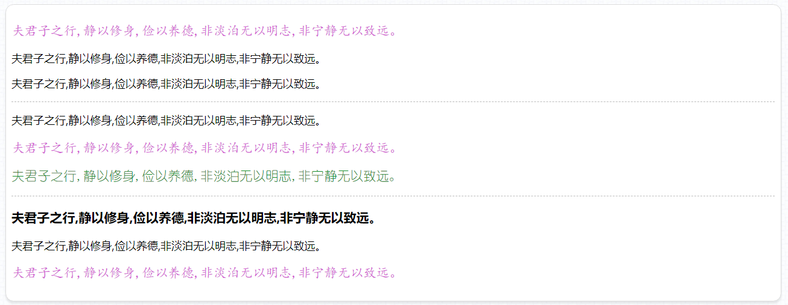
<h3 style="color:#2a90d1;">:only-child</h3>
对该类所有父元素中只含有唯一所匹配（不包含同级元素）的子元素进行选择。<br><br>
HTML代码如下：

```
<section>
        <h3>夫君子之行,静以修身,俭以养德,非淡泊无以明志,非宁静无以致远。</h3>
        <p>夫君子之行,静以修身,俭以养德,非淡泊无以明志,非宁静无以致远。</p>
        <div>夫君子之行,静以修身,俭以养德,非淡泊无以明志,非宁静无以致远。</div>
    </section>
    <article>
        <p>夫君子之行,静以修身,俭以养德,非淡泊无以明志,非宁静无以致远。</p>
    </article>
    <div>
        <h3>夫君子之行,静以修身,俭以养德,非淡泊无以明志,非宁静无以致远。</h3>
        <p>夫君子之行,静以修身,俭以养德,非淡泊无以明志,非宁静无以致远。</p>
        <p>夫君子之行,静以修身,俭以养德,非淡泊无以明志,非宁静无以致远。</p>
    </div>
    <section>
        <p>夫君子之行,静以修身,俭以养德,非淡泊无以明志,非宁静无以致远。</p>
    </section>
```
CSS代码如下：
```
 section,article,div {
            border-bottom: 1px dashed #bbb;
        }
        section div {
            border: none;
            margin: 1em 0;
        }
        section:last-child {
            border: none;
        }
        p:only-child {
            color: #638d13;
            font: xx-large "黑体";
        }
```
运行效果：

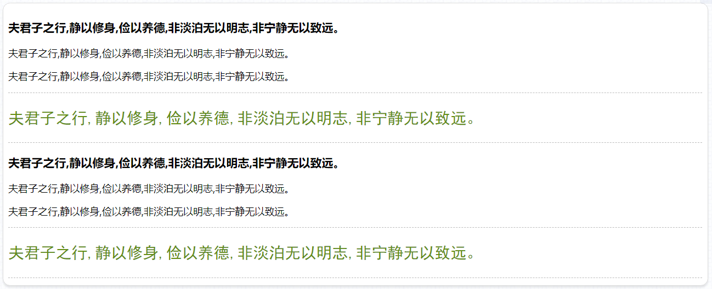
<h3 style="color:#2a90d1;">:only-of-type</h3>
对该类所有父元素中只含有唯一所匹配类型的子元素进行选择。<br><br>
HTML代码如下：

```
<section>
        <h3>夫君子之行,静以修身,俭以养德,非淡泊无以明志,非宁静无以致远。</h3>
        <p>夫君子之行,静以修身,俭以养德,非淡泊无以明志,非宁静无以致远。</p>
        <p>夫君子之行,静以修身,俭以养德,非淡泊无以明志,非宁静无以致远。</p>
    </section>
    <article>
        <div>夫君子之行,静以修身,俭以养德,非淡泊无以明志,非宁静无以致远。</div>
        <p>夫君子之行,静以修身,俭以养德,非淡泊无以明志,非宁静无以致远。</p>
        <div>夫君子之行,静以修身,俭以养德,非淡泊无以明志,非宁静无以致远。</div>
    </article>
    <div>
        <h3>夫君子之行,静以修身,俭以养德,非淡泊无以明志,非宁静无以致远。</h3>
        <p>夫君子之行,静以修身,俭以养德,非淡泊无以明志,非宁静无以致远。</p>
        <div>夫君子之行,静以修身,俭以养德,非淡泊无以明志,非宁静无以致远。</div>
    </div>
```
CSS代码如下：
```
section,article {
            border-bottom: 1px dashed #bbb;
        }
        section div, article div {
            margin: 1em 0;
            border: none;
        }
        div:last-child {
            border: none;
        }
        p:only-of-type {
            color: #550fa7;
            font: x-large "微软雅黑";
        }
```
运行效果：

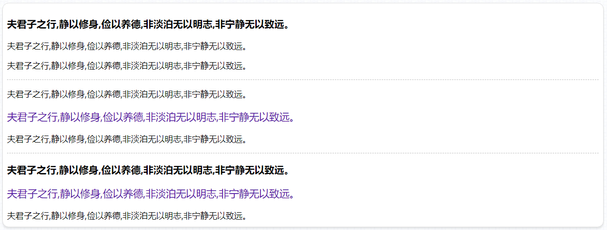
<h3 style="color:#2a90d1;">:nth-child(n)</h3>
对其父元素的第“n”个子元素进行选择，通过设置<span style="color:#0b933b;font-size:24px;">参数</span>“n”指定为第几个元素<br><br>
HTML代码如下：

```
    <section>
        <div>夫君子之行,静以修身,俭以养德,非淡泊无以明志,非宁静无以致远。</div>
        <div>夫君子之行,静以修身,俭以养德,非淡泊无以明志,非宁静无以致远。</div>
        <div>夫君子之行,静以修身,俭以养德,非淡泊无以明志,非宁静无以致远。</div>
        <div>夫君子之行,静以修身,俭以养德,非淡泊无以明志,非宁静无以致远。</div>
        <div>夫君子之行,静以修身,俭以养德,非淡泊无以明志,非宁静无以致远。</div>
    </section>
```
CSS代码如下：
```
div { line-height: 1.4;}
        div:nth-child(2), div:nth-child(4) {
            font: 24px "微软雅黑";
        }
        div:nth-child(2) {
            color: #6d9b4b;
        }
        div:nth-child(4) {
            color: #9b4b86;
        }
```
运行效果：

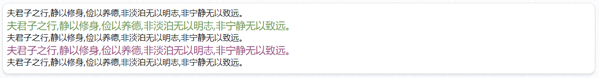
该选择器不仅能准确的匹配到第“几”个指定类型的元素，还能对匹配类型元素的“<span style="color:#0b933b;font-size:24px;">奇偶索</span>引”值进行选择，用“奇偶索引”选择器来制作隔行变色的表格及相关场景的元素时非常高效便捷：<br><br>
HTML代码如下：

```
<table>
        <tr>
            <th>编号</th><th>姓名</th><th>职位</th><th>外貌</th>
        </tr>
        <tr>
            <td>rimi-001</td><td>张三</td><td>学霸</td><td>长得还比较帅</td>
        </tr>
        <tr>
            <td>rimi-002</td><td>李四</td><td>学霸</td><td>长得还比较帅</td>
        </tr>
        <tr>
            <td>rimi-003</td><td>王五</td><td>学霸</td><td>长得还比较帅</td>
        </tr>
        <tr>
            <td>rimi-004</td><td>王麻子</td><td>学霸</td><td>长得还比较...</td>
        </tr>
    </table>
```
CSS代码如下：
```
table, th, td {
            border: 1px solid #aaa;
            line-height: 160%;
            border-collapse: collapse;
            text-align: center;
            color: #fff;
        }
        th { width: 140px }
        th:last-child { width: 240px }
        table tr:nth-child(odd),table tr:nth-child(even) {
            font: 22px "幼圆";
        }
        table tr:nth-child(odd) {
            background-color: #0a2841;
        }
        table tr:nth-child(even) {
            background-color: #4d1608;
        }
```
运行效果：

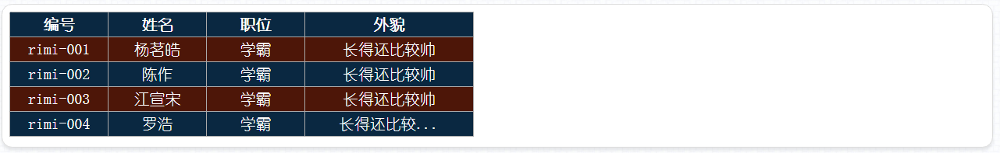
除此之外，“:nth-child(n)”这个结构性伪类选择器的参数还具备运算特性，如：

```
    <section>
        <div></div><div></div><div></div><div></div><div></div>
        <div></div><div></div><div></div><div></div><div></div>
        <div></div><div></div><div></div><div></div><div></div>
        <div></div><div></div><div></div><div></div><div></div>
        <div></div><div></div><div></div><div></div><div></div>
        <div></div><div></div><div></div><div></div><div></div>
        <div></div><div></div><div></div><div></div><div></div>
        <div></div><div></div><div></div><div></div><div></div>
        <div></div><div></div><div></div><div></div><div></div>
    </section>
```
CSS代码如下:
```
 section {
            width: 900px;
        }
        section div {
            width: 100px; height: 40px;
            border: 1px solid #fff;
            background-color: #1c9877;
            float: left;
            box-sizing: border-box;
        }
        section div:nth-child(3n-1) {
            background-color: #dec926;
        }
```
运行效果：

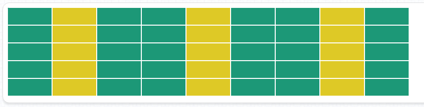
这样的参数我们叫做“带增量计算”的参数，参数内的“n”是一个增量，它从“0”开始计数，每次“+1”。如上代码，第一生效时机是“3*0-1”（计算结果小于1），无效；第二次生效时机是“3*1-1”,为第2个；第三次生效时机是“3*2-1”，为第5个，以此类推。
<h3 style="color:#2a90d1;">:nth-last-child(n)</h3>
该选择器和“:nth-child(n)”的特性基本一致，唯一的不同点就是该选择器的索引值是从该选择器匹配到的元素的同级元素中的<span style="color:#0b933b;font-size:24px;">最后一个</span>开始进行计算的。主要运用范畴是，当这些标签是动态生成的，也就是说生成数量不固定的时候，用“:nth-last-child(n)”能精确的定位到同级元素中的最后一个（这里使用“:last-child”会更简便）、最后几个，或从最后开始有选择地进行计数选择。
<h3 style="color:#2a90d1;">:nth-if-type(n)</h3>
该选择器是对匹配标签类型的同级元素进行选择<br><br>
HTML代码如下：

```
    <section>
        <div></div>
        <p></p>
        <div></div>
        <p></p>
        <div></div>
        <p></p>
        <div></div>
    </section>
```
CSS代码如下：
```
    section {
            width: 900px;
        }
        section div,section p {
            width: 100px; height: 40px;
            border: 1px solid #fff;
            background-color: #98721c;
            float: left;
            margin: 0;
            box-sizing: border-box;
        }
        section p:nth-of-type(2) {
            background-color: #26de42;
        }
```
运行效果：

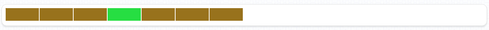
该选择器的参数设置和“:nth-child(n)”中的“n”是一样的，即既可以传进“odd”和“even”这样的奇偶数，也可以传进带有“增量计算”的参数。
<h3 style="color:#2a90d1;">:nth-last-of-type</h3>
该选择器和“:nth-of-type(n)”的特性基本一致，不过计算方式也和“nth-last-child(n)”一样，是从最后一个开始计数。
<h3 style="color:#2a90d1;">:root</h3>
该选择器选择HTML页面的根节点元素，也就是< html>标签。<br><br>
该选择符不能选择任何其它HTML文档内的标签，只能单独使用，对应的CSS代码如下：

```
:root {
            background: url("./images/3.png") repeat;
        }
```
运行效果：

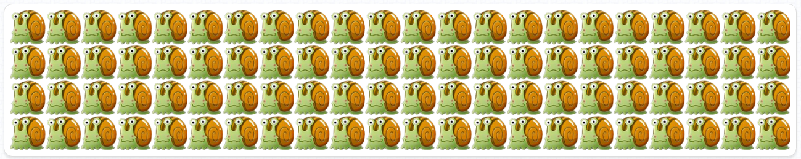
<h3 style="color:#2a90d1;">:empty</h3>
该选择器会匹配所有，或指定基本选择器内没有元素（没有子节点）的标签元素。<br><br>
HTML代码如下：

```
<section>
        <div>夫君子之行...非宁静无以致远。</div>
        <span></span>
        <p></p>
        <p>夫君子之行...非宁静无以致远。</p>
    </section>
    <section class="special">
        <div>夫君子之行...非宁静无以致远。</div>
        <span></span>
        <p></p>
        <p>夫君子之行...非宁静无以致远。</p>
    </section>
```
CSS代码如下：
```
 :empty {
            width: 300px; height: 32px;
            background-color: #e3e3e3;
            border: 2px solid #999;
            border-radius: 12px;
            margin: 10px 0;
            display: block;
        }
        .special p:empty, .special span:empty {
            background-color: #e33f3f;
            border: 2px solid #710909;
        }
```
运行效果：

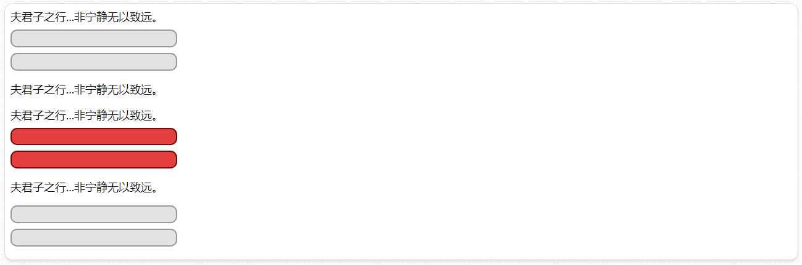
<h3 style="color:#2a90d1;">:target</h3>
该选择器用于“<span style="color:#0b933b;font-size:24px;">活动锚点</span>”所指向的对象的选择。

HTML代码如下:

```
<section>
        <section>
            <a href="#panel-1">前往panel-1</a>
            <a href="#panel-2">前往panel-2</a>
            <a href="#panel-3">前往panel-3</a>
            <a href="#panel-4">前往panel-4</a>
        </section>
        <div id="panel-1">
            <h2>第一首诗</h2>
            <p>自我远行游，故庐今始归。如何廿载间，旧事都已非。曳杖过比邻，相呼寻故知。不见垂白翁，但见初长儿。我园既稍葺，我田亦就治。种秫酿美酒，拾薪煮豆糜。一笑集亲朋，相从说暌离。以之感畴昔，俯仰多所悲。人生一世中，所忧渴与饥。力耕给其用，此外更何思。便当息吾驾，皓首以为期。</p>
        </div>
        <div id="panel-2">
            <h2>第二首诗</h2>
            <p>太阳渐渐西沉，已衔着西山了，天边的晚霞也逐渐开始消散，只残留有几分黯淡的色彩，映照着远处安静的村庄是多么的孤寂，拖出那长长的影子。雾淡淡飘起，几只乌黑的乌鸦栖息在佝偻的老树上，远处的一只大雁飞掠而下，划过天际。山清水秀；霜白的小草、火红的枫叶、金黄的花朵，在风中一齐摇曳着，颜色几尽妖艳。</p>
        </div>
        <div id="panel-3">
            <h2>第三首诗</h2>
            <p>老衰哭无泪，行叹复坐嗟。荒凉鹤呜村，尚友初萌芽。当时各年少，涉世迷骊騧。中天悬明月，争欲伸手拿。朝语日再昃，夜谈更五檛。君文蚤贵重，蜀锦载胡车。离离三千首，雅正排淫哇。石碑富规制，玉策垂芬葩。简牍尤妙美，一字不可加。笑我自山野，悲君混泥沙。古称骚人穷，留与后代夸。临谁寄音信，已受南台衙。俄然被弹射，翻燎北坞畲。季也守大玉，千里畦稻麻。请登小芙蓉，万仞凌烟霞。兹游隐者事，亦用期屡差。书来病良慰，誓言指春华。秉我乌臼烛，瀹以蒋富茶。那知是绝笔，杨柳空白花。颇疑魂气升，彷佛天之涯。多生註周易，遥认草玄家。</p>
        </div>
        <div id="panel-4">
            <h2>第四首诗</h2>
            <p>林尽水源，便得一山，山有小口，仿佛若有光。便舍船，从口入。初极狭，才通人。复行数十步，豁然开朗。土地平旷，屋舍俨然，有良田美池桑竹之属。阡陌交通，鸡犬相闻。其中往来种作，男女衣着，悉如外人。黄发垂髫，并怡然自乐。</p>
        </div>
    </section>
```
CSS代码如下：

```
body {
            background-color: #e3e3e3;
        }
        section {
            width: 960px;
            margin: 10px auto;
        }
        section a {
            width: 180px; line-height: 42px;
            background-color: #0c70cb;
            border-radius: 5px;
            text-decoration: none;
            text-align: center;
            color: #fff;
            display: inline-block
        }
        section a:hover {
            background-color: #399af2;
        }
        section a:active {
            background-color: #065298;
        }
        div {
            width: 960px; height: auto;
            border: 2px solid transparent;
            border-radius: 15px;
            padding: 20px;
            margin: 20px auto;
            text-indent: 2em;
            font: 32px "华文行楷";
            color: #666;
            box-sizing: border-box;
        }
        div h2 {
            text-indent: 0;
        }
        div:target {
            background-color: #fff;
            border-color: #0c70cb;
            color: #0c70cb;
            box-shadow: 0 8px 8px rgba(144,146,148,0.9);
        }
```
<h3 style="color:#2a90d1;">:not(selector)</h3>
该选择器是用于排除指定元素的选择器。<br><br>
HTML代码如下：

```
   <article>
        <p>诸子曰：</p>
        <p>夫君子之行,静以修身,俭以养德,非淡泊无以明志,非宁静无以致远。</p>
        <p class="special">夫君子之行,静以修身,俭以养德,非淡泊无以明志,非宁静无以致远。</p>
        <p>夫君子之行,静以修身,俭以养德,非淡泊无以明志,非宁静无以致远。</p>
    </article>
```
CSS代码如下:
```
  p:not(.special) {
            font: 32px "华文行楷";
            color: #976;
        }
```
运行效果：

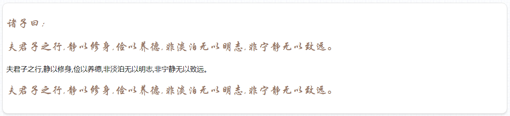

<!-- <章节练习（二）>
制作三个表格，具体要求如下：

1、三个表格均不含“<thead>”、“<tbody>”、“<tfoot>”和“<th>”标签；

2、第一个表格为6行8列，表格实现隔行背景变色效果，首行和末行背景色一致，但与其它行颜色不一样。为第一、第四，第七列添加同一个背景色；

3、第二个表格为5行8列，表头横跨8列，表头字体为24像素的“微软雅黑”字体。表格实现隔行背景变色效果。第二行第三列、第二行第七列、第三行第五列、第四行第五列、第四行第一列、第四行第六列、第五行第四列单元格内容为空，其它单元格均需填充任意文本内容，并且将内容为空的单元格背景色设置为“#888”；

4、第三个表格为5行8列，执行跨行背景变色和跨列背景变色效果。首行和末行、首列和末列的字体大小为其它单元格的1.4倍；

5、顶部添加三个漂亮的超链接按钮（鼠标悬浮、鼠标点击均要有效果变化）。点击第一个、第二个和第三个超链接按钮时，分别让第一个、第二个和第三个表格产生“水平0偏移”，“垂直向下偏移8像素”，“模糊距离8像素”，颜色为“rgba(166,167,168,0.9)”的阴影。同一时间，有且只有一个表格产生此阴影效果；

6、除了<table>标签外，其它标签内不能出现任何“Class”和“id”属性。所有表格的字体颜色为“#fff”，并且要求和背景色有区分（即能清楚辨认文本）；

7、所有表格的宽度为960像素，页面水平居中，表格间上下的距离为50像素，所有单元格行高为32像素。顶部的第一个按钮需要和表格的左边缘垂直对齐，并且与页面顶部保持20像素的距离。 -->

<h1>UI元素状态伪类选择器</h1>
该类选择器的选择依据主要是页面内标签元素的状态发生改变时所触发的选择状态改变。如：表单元素的“读写状态”、“值状态”，各类元素的“选中状态”等。“UI元素状态伪类选择器”主要有以下内容：
<h3 style="color:#2a90d1;">:read-only</h3>
当标签元素为只读状态时，触发该选择器。通常用于“input”和“textarea”。在FireFox（火狐）浏览器中的写法为“-moz-read-only”。<br><br>
HTML代码如下：

```
<form name="testSelector">
        <p>
            <label>用户名：</label>
            <input type="text" placeholder="请输入用户名"
            value="aulence" readonly>
        </p>
        <p>
            <label>密码：</label>
            <input type="password" placeholder="请输入密码"
            value="rimi1234" readonly>
        </p>
        <p>
            <label>验证码：</label>
            <input type="text" placeholder="请输入验证码">
            
        </p>
    </form>
```
CSS代码如下：
```
label, img[src$=".jpg"] {
            vertical-align: middle;
            display: inline-block;
        }
        label {
            width: 102px;
            text-align: right;
        }
        input {
            width: 120px;
            padding: 6px;
            font-size: 15px;
        }
        input:read-only {
            width: 220px;
            box-shadow: inset 2px 2px 4px rgba(234, 34, 34, 0.6);
        }
        img[src$=".jpg"] {
            width: 90px; height: 36px;
        }
```
运行效果：

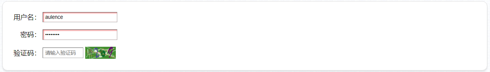