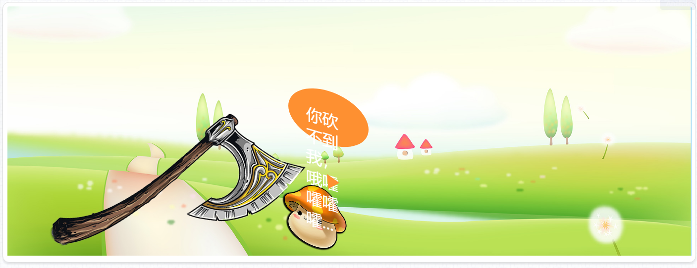
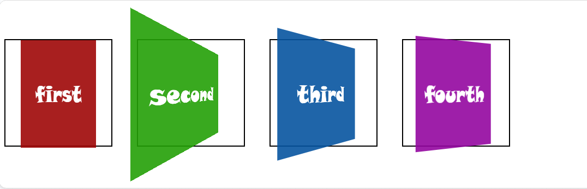
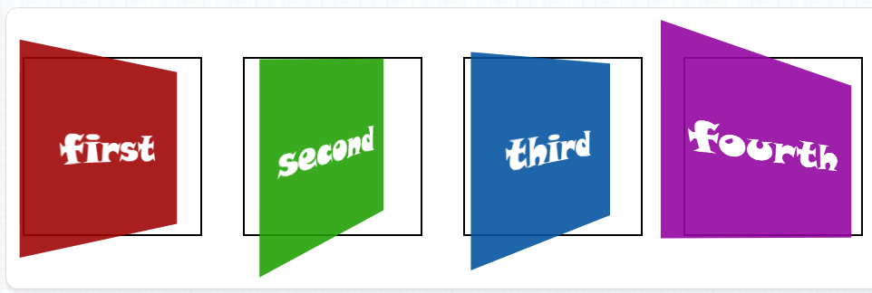

<h1>CSS变形转换概述</h1>
在CSS中执行变形转换的属性是CSS3属性中的“transform"，能够执行“位移”、“旋转”、“缩放”、“倾斜”、“翻转”和“透视”等变形转换的设置，可以让Web页面的表现更加的“活跃”，增加页面的交互感，给用户留下更深的“印象”。但在用该属性进行设置时，特别是用于生产环境中时，一定要控制一个“度”，也就是说要避免“<span style="font-size: 24px;color: #0b933b;">过渡设计</span>"，否则反而会让“印象”这一词有了贬义的意思。
<h1>transform之位移“translate”</h1>
该属性值可以让元素从当前位置根据“left（X轴）”参数和“top（Y轴）”参数的设置在水平和垂直方向进行移动。它和用于布局的“position”属性，特别是当它的“position”的值为“relative”时十分相似，在进行移动后，自身的位置仍然保留，也不会影响到其它元素的位置，但有存在着区别：<br><br>

- translate”可以作用于已经执行了“绝对定位（position：absolute）”的元素，而要用“position”已经设置为了“绝对定位”的元素使用“相对定位（position：relative）”需要对布局进行重新计算，或修改DOM的标签嵌套方式。
- 使用“translate”可以让 GPU 参与运算，动画的 FPS 更高。
- 使用“translate”可以让动画的像素精确到浮点数，而使用“position”属性的值最小执行动画的单位是1像素。<br><br>
所以说，“position”属性是为布局而生，而“Transform”的“translate”是为动画而生。<br><br>
该属性值有三种类型：“translateX”、“translateY”和“translate”：“translateX”设置元素在X轴方向的偏移，“translateY”设置元素在Y轴方向的偏移，“translate”同时设置元素在X轴和Y轴方向的偏移，参数间用逗号“,”进行分隔。<br><br>
HTML部分为4个< section>标签，CSS代码如下：

```
body {
            height: 290px;
        }
        section {
            text-align: center;
            color: #fff;
            font: 46px/240px "snap itc";
            box-sizing: border-box;
        }
        section {
            width: 240px; height: 240px;
            transition: 0.3s linear;
            float: left;
        }
        section:nth-child(1) {
            background-color: #9f0606;
        }
        section:nth-child(2) {
            background-color: #239f06;
        }
        section:nth-child(3) {
            background-color: #06539f;
        }
        section:nth-child(4) {
            background-color: #93069f;
        }
        section:nth-child(1):hover {
            transform: translateX(100px);
        }
        section:nth-child(2):hover {
            transform: translateY(30px);
        }
        section:nth-child(3):hover {
            transform: translate(80px, 80px);
        }
        section:nth-child(4):hover {
            transform: translate(-80px, -30px);
        }
```
<h1>transform之旋转“rotate”</h1>
该属性值会让元素以当前元素的中心(X=width/2，Y=height/2)进行旋转（若不对“transform-origin”进行设置），旋转的角度为参数所设定的值，“正数”是顺时针，“负数”是逆时针，单位为“<span style="font-size: 24px;color: #0b933b;">deg</span>”。
该属性值有三种类型：“rotateX”、“rotateY”和“rotate（也作rotateZ）”：“rotateX”设置元素在X轴方向的旋转，“rotateY”设置元素在Y轴方向的旋转，“rotate”设置元素在Z轴（垂直于元素平面的线）方向的旋转。<br><br>

HTML部分为4个< section>标签，CSS代码如下：

```
 body {
            height: 240px;
            padding-top: 40px;
            padding-bottom: 40px;
        }
        section {
            text-align: center;
            color: #fff;
            font: 46px/240px "snap itc";
            box-sizing: border-box;
        }
        section {
            width: 240px; height: 240px;
            transition: 0.6s linear;
            float: left;
        }
        section:nth-child(1) {
            background-color: #9f0606;
        }
        section:nth-child(2) {
            background-color: #239f06;
        }
        section:nth-child(3) {
            background-color: #06539f;
        }
        section:nth-child(4) {
            background-color: #9f0687;
        }
        section:nth-child(1):hover {
            transform: rotateZ(180deg);
        }
        section:nth-child(2):hover {
            transform: rotateX(-120deg)
        }
        section:nth-child(3):hover {
            transform: rotateY(180deg);
        }
        section:nth-child(4):hover {
            transform: rotate(-1080deg);
        }
```
<h1>transform之缩放“scale”</h1>
该属性值会让元素以当前元素的中心进行缩放，参数的值为一个整数或浮点数，如：“1（默认）”不进行缩放，“0.8”缩小为原来的80%，“1.5”扩大到原来的150%，参数不需要单位。<br><br>
该属性值有三种类型：“scaleX”、“scaleY”和“scale”：“scaleX”设置元素在X轴方向的缩放，“scaleY”设置元素在Y轴方向的缩放，“scale”可以同时设置元素在X轴和Y轴方向的缩放，参数间用逗号“,”进行分隔。<br><br>

HTML部分为4个< section>标签，CSS代码如下：

```
 body {
            height: 300px;
            padding-top: 60px;
        }
        section {
            text-align: center;
            color: #fff;
            font: 46px/240px "snap itc";
            box-sizing: border-box;
        }
        section {
            width: 240px; height: 240px;
            transition: 0.3s linear;
            float: left;
        }
        section:nth-child(1) {
            background-color: #9f0606;
        }
        section:nth-child(2) {
            background-color: #239f06;
        }
        section:nth-child(3) {
            background-color: #06539f;
        }
        section:nth-child(4) {
            background-color: #93069f;
        }
        section:nth-child(1):hover {
            transform: scaleX(.6);
        }
        section:nth-child(2):hover {
            transform: scaleY(1.8);
        }
        section:nth-child(3):hover {
            transform: scale(1.5);
        }
        section:nth-child(4):hover {
            transform: scale(.5);
        }
```
<h1>transform之倾斜“skew”</h1>
该属性值会让元素根据水平（X轴）和垂直（Y轴）线参数设定倾斜角度。该属性值有三种类型：“skewX”、“skewY”和“skew”。“skewX”只有一个参数，用于控制元素在水平轴方向的倾斜，“skewY”只有一个参数，用于控制元素在垂直轴方向的倾斜，“skew”有两个参数（一个参数相当于“skewX”），分别控制元素在水平和垂直轴方向的倾斜，参数间用逗号“,”进行分隔。<br><br>

HTML部分为4个< section>标签，CSS代码如下：

```
body {
            height: 300px;
            padding-top: 60px;
        }
        section {
            text-align: center;
            color: #fff;
            font: 46px/240px "snap itc";
            box-sizing: border-box;
        }
        section {
            width: 240px; height: 240px;
            transition: 0.3s linear;
            float: left;
        }
        section:nth-child(1) {
            background-color: #9f0606;
        }
        section:nth-child(2) {
            background-color: #239f06;
        }
        section:nth-child(3) {
            background-color: #06539f;
        }
        section:nth-child(4) {
            background-color: #93069f;
        }
        section:nth-child(1):hover {
            transform: skewX(30deg);
        }
        section:nth-child(2):hover {
            transform: skewY(30deg);
        }
        section:nth-child(3):hover {
            transform: skew(15deg, 30deg);
        }
        section:nth-child(4):hover {
            transform: skew(30deg, -30deg);
        }
```
<h1>transform的组合值</h1>
和其它具有分支属性的CSS属性一样，“transform”属性也能采用多值组合的方式来实现一个CSS的复杂效果（<注意>以上讲到的变形转换效果均不是该属性的分支属性，而是通过设置不同的值，并且配置该值允许的参数实现的），有一点需要特别注意的是，若该属性配合过渡CSS特效“transition”属性来使用的话，值的先后顺序不一样，很多时候效果也是不一样的，需要根据需要去调整值设置的顺序。<br><br>

我们首先以“translate”和“rotate”为例来看两个例子，首先是一个“translate”的属性值在前，“rotate”的属性值在后的例子，HTML部分代码如下：

```
<div class="ctrlCrabstick"></div>
<div class="crabstick"></div>
```
CSS的代码如下：
```
 body {
            height: 340px;
        }
        /* 金箍棒控制器 */
        .ctrlCrabstick {
            width: 32px; height: 32px;
            background-color: #1747c9;
            border-radius: 50%;
        }
        /* 金箍棒 */
        .crabstick {
            width: 14px; height: 220px;
            background: url("./img/crabstick.png") no-repeat;
            margin-left: 60px;
            transition: 1.2s ease-out;
        }
        .ctrlCrabstick:hover + .crabstick {
	        transform: translate(600px, 100px) rotate(720deg) scale(0.3);
        }
```
HTML代码不变，CSS代码部分改动“tranform”属性内“translate”和“rotate”值的位置后（为了让演示效果更明显，稍微调整了一下“金箍棒”的“margin-left”属性），示例CSS代码如下：

```
 body {
            height: 340px;
        }
        /* 金箍棒控制器 */
        .ctrlCrabstick {
            width: 32px; height: 32px;
            background-color: #1747c9;
            border-radius: 50%;
        }
        /* 金箍棒 */
        .crabstick {
            width: 14px; height: 220px;
            background: url("../../../img/content/crabstick.png") no-repeat;
            margin-left: 260px;
            transition: 1.2s ease-out;
        }
        .ctrlCrabstick:hover + .crabstick {
	        transform: rotate(720deg) scale(0.3) translate(600px, 100px);
        }
```
从上面两个例子可以发现，“transform”属性的值顺序的不同，所产生的效果有时会有非常大的差别，不过正是这种差别可以让效果表现得更加丰富，让我们拥有了更多的选择，在对该属性有一定熟悉程度后，可以先在脑袋里构思需要的效果，然后再以此将所需的值写出来，并设置相应的参数。<br><br>

到目前为止，我们已经学习了“transform”的4种(“translate”、“rotate”、“scale”和“skew”)2D转换变形方式，这4种方式都可以在该属性内进行自由组合。
<h1>transform之矩阵“matrix”</h1>
该属性值可以通过参数设置同样将所有的变形转换（2D）属性值组合在一起，和“transform”的多值组合的写法不一样，它只有一个值，不过是需要配置6个参数，通过配置这6个值来实现一个“<span style="font-size: 24px;color: #0b933b;">矩阵</span>"的变化，而且这种变化是同时产生的，无法调整每种变形转换的顺序。“matrix”这个值的实现原理具体讨论起来会比较复杂，它并非CSS独有，而是数学运算里的一个知识点）。
<h3 style="color: #2a90d1;font-size: 24px;">matrix——translate</h3>
“matrix”的第5个和第6个参数影响“translate”的效果：“matrix(1,0,0,1,120,80)”相当于“translate(120px,80px)”。<br><br>
HTML部分为2个< section>标签，CSS代码如下：

```
body {
            height: 320px;
        }
        section {
            text-align: center;
            color: #fff;
            font: 46px/240px "snap itc";
            box-sizing: border-box;
        }
        section {
            width: 240px; height: 240px;
            transition: 0.3s linear;
            float: left;
        }
        section:nth-child(1) {
            background-color: #9f0606;
        }
        section:nth-child(2) {
            background-color: #239f06;
        }
        section:nth-child(1):hover {
            transform: translate(120px, 80px);
        }
        section:nth-child(2):hover {
            transform: matrix(1,0,0,1,120,80);
        }
```
<h3 style="color: #2a90d1;font-size: 24px;">matrix——rotate</h3>
用“matrix”去实现“rotate”相对就要复杂一些，会涉及到“matrix”的前四个参数，并且会涉及到“三角函数”的运算，会增加实际操作的难度，如要用到旋转，还是直接使用“rotate”的形式会更高效。用“matrix”去实现旋转相当于“matrix(cosθ,sinθ,-sinθ,cosθ,0,0)”这种形式，其中“θ”为假设的角度。若要实现“rotate(30deg)”，写成“matrix”就应该是“matrix(0.866025,0.5,-0.5,0.866025,0,0)”。<br><br>

HTML部分为2个< section>标签，CSS代码如下：

```
body {
            height: 240px;
            padding: 50px;
        }
        section {
            text-align: center;
            color: #fff;
            font: 46px/240px "snap itc";
            box-sizing: border-box;
        }
        section {
            width: 240px; height: 240px;
            transition: 0.3s linear;
            float: left;
        }
        section:nth-child(1) {
            background-color: #9f0606;
        }
        section:nth-child(2) {
            background-color: #239f06;
        }
        section:nth-child(1):hover {
            transform: rotate(45deg);
        }
        section:nth-child(2):hover {
            transform: matrix(0.707107,0.707107,-0.707107,0.707107,0,0);
        }
```
<h3 style="color: #2a90d1;font-size: 24px;">matrix——scale</h3>
“matrix”影响缩放“scale”的参数为第1和第4个参数，如：“matrix(1.5,0,0,1.3,0,0)”就相当于“scale(1.5,1.3)”。<br><br>

HTML部分为2个< section>标签，CSS代码如下：

```
body {
            height: 240px;
            padding: 26px;
            padding-left: 56px;
           /* border: 1px solid #aaa;*/
        }
        section {
            text-align: center;
            color: #fff;
            font: 46px/240px "snap itc";
            box-sizing: border-box;
        }
        section {
            width: 240px; height: 240px;
            transition: 0.3s linear;
            float: left;
        }
        section:nth-child(1) {
            background-color: #9f0606;
        }
        section:nth-child(2) {
            background-color: #239f06;
        }
        section:nth-child(1):hover {
            transform: scale(1.5, 1.2);
        }
        section:nth-child(2):hover {
            transform: matrix(1.4,0,0,1.2,0,0);
        }
```
<h3 style="color: #2a90d1;font-size: 24px;">matrix——skew</h3>
用“matrix”去实现“skew”也比较复杂，也是通过“三角函数”的运算的出来的，不过只涉及到“matrix”的第2个和第3个参数。公式为：“matrix(1,tan(θy),tan(θx),1,0,0)”，如：“matrix(1,1,0.577350,1,0,0)”就相当于“skew(30deg,45deg)”<br><br>
HTML部分为2个< section>标签，CSS代码如下：

```
body {
            height: 240px;
            padding: 60px;
            padding-left: 90px;
           /* border: 1px solid #aaa;*/
        }
        section {
            text-align: center;
            color: #fff;
            font: 46px/240px "snap itc";
            box-sizing: border-box;
        }
        section {
            width: 240px; height: 240px;
            transition: 0.3s linear;
            float: left;
        }
        section:nth-child(1) {
            background-color: #9f0606;
        }
        section:nth-child(2) {
            background-color: #239f06;
        }
        section:nth-child(1):hover {
            transform: skew(37deg,28deg);
        }
        section:nth-child(2):hover {
            transform: matrix(1,0.531709,0.753554,1,0,0);
        }
```
<h1>变换原点“transform-origin”</h1>
该属性用于设置旋转元素的原点（基点）位置，默认为元素的中点。可以为3种类型的值：“方位英文单词”，“Web常用长度单位”，“百分数”。
<h3 style="color: #2a90d1;font-size: 24px;">方位英文单词</h3>
有“top”、“right”、“bottom”、“left”和“center”5个值可以使用，如“top left”表示左上角，“right bottom”表示右下角，“center center”表示默认的中点。
<h3 style="color: #2a90d1;font-size: 24px;">Web常用长度单位</h3>
如最常用的像素“px”，字符“em”，点“pt”等，如：“16px 20px”表示旋转的轴在“X轴”的16像素，“Y轴（向下为正，向上为负）”的20像素的位置。
<h3 style="color: #2a90d1;font-size: 24px;">百分数</h3>
第一个百分数表示相对于元素宽度的百分比位置，第二个百分数表示相对于元素高度的百分比位置，如：“0% 0%”相当于左上角，“50% 50%”相当于默认的中点，“100% 100%”相当于元素的右下角。<br><br>

HTML部分为4个< section>标签，CSS代码如下：

```
body {
            height: 180px;
            padding: 120px;
        }
        section {
            text-align: center;
            color: #fff;
            font: 36px/180px "snap itc";
            box-sizing: border-box;
        }
        section {
            width: 180px; height: 180px;
            transition: 0.6s linear;
            float: left;
        }
        section:hover {
            transform: rotate(360deg);
        }
        section:nth-child(1) {
            background-color: #9f0606;
        }
        section:nth-child(2) {
            background-color: #239f06;
        }
        section:nth-child(3) {
            background-color: #06539f;
        }
        section:nth-child(4) {
            background-color: #93069f;
        }
        section:nth-child(2):hover {
            transform-origin: left bottom;
        }
        section:nth-child(3):hover {
            transform-origin: 30px 30px;
        }
        section:nth-child(4):hover {
            transform-origin: 100% 100%;
        }
```
通过上面学习的知识，我们来看一个“transition+transform”的综合应用：<br>

HTML部分的代码为：

```
    <section></section>
    <section></section>
    <section>你砍不到我，哦嚯嚯嚯嚯...</section>
```
CSS代码为：
```
body {
            height: 560px;
            background: url(".img/content/example/exam-005.jpg") no-repeat;
            background-size: cover;
            background-position: left bottom;
        }
        section {
            position: absolute;
            cursor: pointer;
        }
        section:nth-child(1) {
            width: 341px; height: 500px;
            background: url("./img/content/example/exam-004.png") no-repeat;
            left: 100px; top: 40px;
            transform: rotate(-15deg);
            transform-origin: 34px 463px;
            transition: 0.6s ease-in;
        }
        section:nth-child(2) {
            width: 260px; height: 260px;
            background: url("./img/content/example/exam-003.png") no-repeat;
            left: 480px; top: 280px;
            transition: 0.2s ease-out 0.4s;
        }
        section:nth-child(3) {
            width: 180px; height: 120px;
            background-color: #fe9031;
            border-radius: 50%;
            line-height: 160%;
            font: 36px "droid sans";
            color: #fff;
            padding: 40px;
            left: 680px; top: 100px;
            transition: 0.3s ease-out 0.6s;
            opacity: 0;
        }
        section:nth-child(3):after {
            content: "";
            display: block;
            border-width: 30px 15px 0 15px;
            border-style: solid;
            border-color: #fe9031 transparent transparent transparent;
            position: absolute;
            left: 80px; top: 192px;
            transform: rotate(22deg);
        }
        section:nth-child(1):active {
            transform: rotate(42deg);
        }
        section:nth-child(1):active + section {
            transform: matrix(0.6,0.2,0,0.6,80,60);
        }
        section:nth-child(1):active ~ section:nth-child(3){
            opacity: 1;
            /*transform: translate(-60px, 40px);*/
            transform: matrix(1,0.3,0,1,-50,90);
        }
```
运行效果：



<h1>3D嵌套样式“transform-style”</h1>
该属性规定如何在3D空间中呈现被嵌套的元素（是子元素，而不是元素本身），它主要有两个值：
<h3 style="color: #2a90d1;font-size: 24px;">flat</h3>
表示所有子元素在2D平面呈现。
<h3 style="color: #2a90d1;font-size: 24px;">preserve-3d</h3>
表示所有子元素在3D空间中呈现。<br><br>
当“transform-style”的值为“preserve-3D”时更贴近我们现实中的思维，因为平时我们眼睛所看到的东西都是“3D（立体）”的，而当值为“flat”的时候，就相当于在纸上画画，无论画功再好，画出的东西都是平面的，只是由于透视和明暗关系，有的时候看起来“<span style="color: #2a90d1;font-size: 24px;">很立体</span>”罢了。
HTML代码为：

```
<section>
        <article>first</article>
    </section>
    <section>
        <article>second</article>
</section>
```
CSS代码为:
```
section {
            width: 240px; height: 240px;
            margin-right: 50px;
            float: left;
            position: relative;
        }
        section article {
            width: 100%; height: 100%;
            background-repeat: no-repeat;
            background-size: cover;
            text-align: center;
            font: 56px/240px "snap itc";
            color: #fff;
            box-sizing: border-box;
            text-shadow: 0 1px 2px rgba(0, 0, 0, 0.8);
            transition: 0.6s linear;
            border: 2px solid #0ff;
            position: absolute;
        }
        section:nth-child(1) {
            background-color: #d30000;
            transform-style: flat;
        }
        section:nth-child(1) article {
            background-image: url("../../../img/bgi/example-bgi-01.jpg");
        }
        section:nth-child(1) article:hover {
            transform: rotateX(45deg) rotateY(30deg);
        }
        section:nth-child(2) {
            background-color: #0041d3;
            transform-style: preserve-3d;
        }
        section:nth-child(2) article {
            background-image: url("../../../img/bgi/example-bgi-03.jpg");
        }
        section:nth-child(2) article:hover {
            transform: rotateX(45deg) rotateY(30deg);
        }
```

<h1>3D透视“perspective”和“perspective-origin”</h1>
“perspective”属性定义3D元素距视图的距离，它只对转换为了3D模式的元素生效，单位为像素。而定义了“perspective-origin”属性会让子元素（元素本身不会生效）获得透视效果，它是用于定义3D元素底部的位置，默认值是“50% 50%”或“center center”，表示3D元素透视的位置是以子元素的“中心”开始的。<br><br>

perspective”属性有两种使用方式，一种是直接作为一个属性去使用，即“perspective:400”的形式；还有一种形式是作为“Transform”属性的值去使用，这个时候就需要加上单位了，即：“transform: perspective(400px)”。<br><br>

为了避免理解的混淆，我们首先来对“perspective”属性进行讲解。不同的浏览器器需要加上该浏览器的“<span style="color: #0b933b;;font-size: 24px;">前缀</span>”，这里使用“Chrome v51”作为测试，考虑到篇幅限制这里就只测试了“-webkit-”前缀的“perspective”属性。

HTML部分代码如下:

```
<section>
        <article>first</article>
    </section>
    <section>
        <article>second</article>
    </section>
    <section>
        <article>third</article>
    </section>
    <section>
        <article>fourth</article>
    </section>
```

CSS代码如下:
```
 body {
            padding-top: 70px;
            padding-bottom: 70px;
        }
        section {
            width: 220px; height: 220px;
            margin-right: 50px;
            float: left;
            border: 2px solid #000;
            text-align: center;
            font: 46px/220px "snap itc";
            color: #fff;
            box-sizing: border-box;
        }
        section:nth-child(1) {
            -webkit-perspective: 0;
        }
        section:nth-child(2) {
            -webkit-perspective: 200;
        }
        section:nth-child(3) {
            -webkit-perspective: 400;
        }
        section:nth-child(4) {
            -webkit-perspective: 1000;
        }
        section article {
            transform: rotateY(45deg);
            opacity: 0.9;
        }
        section:nth-child(1) article {
            background-color: #9f0606;
        }
        section:nth-child(2) article {
            background-color: #239f06;
        }
        section:nth-child(3) article {
            background-color: #06539f;
        }
        section:nth-child(4) article {
            background-color: #93069f;
        }
```
运行效果：



接来下我们再来看看“perspective-origin”属性的影响，为了避免差异带来的混淆，我们HTML部分采用同样的代码，将在“Y轴”上的旋转统一为“30度”，透视距离统一为“300像素”，对应的CSS代码为：

```
 body {
            padding: 50px 10px;
        }
        section {
            width: 220px; height: 220px;
            margin-right: 50px;
            float: left;
            border: 2px solid #000;
            text-align: center;
            font: 46px/220px "snap itc";
            color: #fff;
            box-sizing: border-box;
        }
        section:nth-child(1) {
            -webkit-perspective: 300;
            /*-webkit-perspective-origin: 50% 50%;*/
        }
        section:nth-child(2) {
            -webkit-perspective: 300;
            -webkit-perspective-origin: left top;
        }
        section:nth-child(3) {
            -webkit-perspective: 300;
            -webkit-perspective-origin: 50px 40px;
        }
        section:nth-child(4) {
            -webkit-perspective: 300;
            -webkit-perspective-origin: 100% 100%;
        }
        section article {
            transform: rotateY(30deg);
            opacity: 0.9;
        }
        section:nth-child(1) article {
            background-color: #9f0606;
        }
        section:nth-child(2) article {
            background-color: #239f06;
        }
        section:nth-child(3) article {
            background-color: #06539f;
        }
        section:nth-child(4) article {
            background-color: #93069f;
        }
```
运行效果：


<h1>3D翻转背面可见性“backface-visibility”</h1>
该属性定义当3D元素不面向屏幕时是否可见，该属性有两个值：

<h3 style="color: #2a90d1;font-size: 24px;">visible（默认）</h3>
表示当3D元素通过“rotate”属性旋转到元素“背部”时，元素仍然可见。
<h3 style="color: #2a90d1;font-size: 24px;">hidden</h3>
表示当3D元素通过“rotate”属性旋转到元素“背部”时，元素不可见。<br><br>

HTML代码如下:

```
<section>
        <article>first</article>
    </section>
    <section>
        <article>second</article>
        <article>second<br>backface</article>
    </section>
```

CSS部分代码为:

```
body {
            padding: 50px 10px;
        }
        section {
            width: 220px; height: 220px;
            margin-right: 50px;
            float: left;
            border: 2px solid #000;
            text-align: center;
            font: 46px/220px "snap itc";
            color: #fff;
            box-sizing: border-box;
            position: relative;
        }
        section:nth-child(2) article:last-child {
            font: 42px/60px "snap itc";
            padding-top: 46px;
            color: #000;
            box-sizing: border-box;
        }
        section:nth-child(1) {
            -webkit-perspective: 300;
        }
        section:nth-child(2) {
            -webkit-perspective: 300;
        }
        section article {
            width: 100%; height: 100%;
            position: absolute;
            transition: 4s;
        }
        section:nth-child(1) article {
            background-color: #9f0606;
            backface-visibility: visible;
        }
        section:nth-child(1) article:hover {
           transform: rotateY(180deg);
        }
        section:nth-child(2) article:first-child {
            transform: rotateY(0deg);
            background-color: #239f06;
            backface-visibility: hidden;
        }
        section:nth-child(2):hover article:first-child {
            transform: rotateY(180deg);
        }
        section:nth-child(2) article:last-child {
            transform: rotateY(-180deg);
            background: url("../../../img/bgi/backface_bg.jpg") repeat;
            backface-visibility: hidden;
        }
        section:nth-child(2):hover article:last-child {
            transform: rotateY(0deg);
        }
```

<!-- <综合练习>
制作一个3D盒子，具体要求如下：

1、盒子每个面的宽和高均相等，具体像素自定即可；

2、盒子需要不同颜色（或者图片）的六个面,每个面的透明度为0.8（使用opacity属性控制通明度）；

3、整个盒子在X轴的旋转为30度，在Y轴的旋转也为30度；

4、页面需要一张背景图片，背景图片需要在不失比例的情况下，填充满分辨率范围从“1024*768”到“1920*1080”的屏幕。

简化版的示例图如下：

<扩展功能>
1、当鼠标移动到“盒子”后，盒子的6个面会向外各自的方向“张开”一定的像素值（自定数值）；

2、“张开”的每一面都变成一个原型，且带有一个漂亮的“外发光”效果。

<功能提示>
1、6个面需要用绝对（或固定）定位“叠”在一起；

2、每一面都主要用transform的translateZ属性值来控制在立体空间的位置。
 -->

