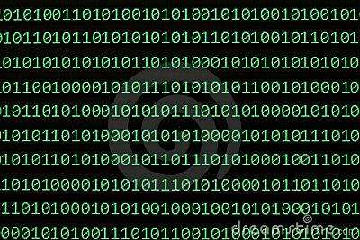
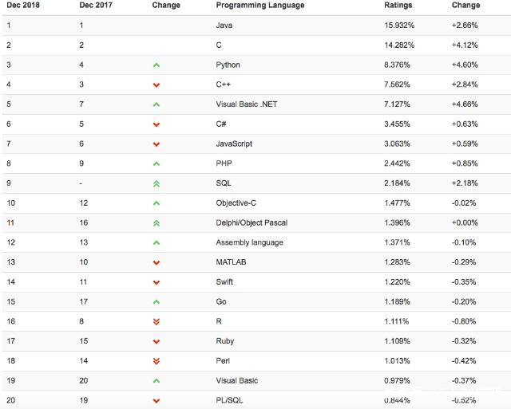
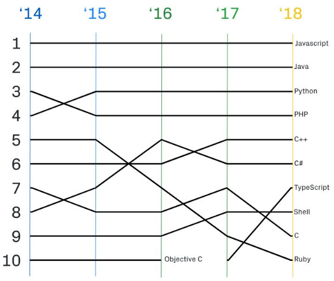

<h1>JS简介</h1>

http://www.w3school.com.cn/js/js_intro.asp
<h2>什么是语言？如何能和计算机对话？</h2>
计算机有自己的语言，就好像全世界不同国家有自己的语言一样。<br><br>

- 只有我们学会计算机语言，才能与它交流给它布置任务。
- 其实，计算机能够理解的语言叫做二进制，我们敲到电脑里的代码都被转换成了二进制，然后计算机就能够理解了。
- 什么是二进制呢，二进制就是指只有2个符号，计算机只认识这两个符号，其他的通通都不认识。
- 这两种符号指的是？在计算机里，信息都是以电流的形式储存着的。计算机在进行运算时会让电流停止或前进，就像我们用开关把它们打开关闭一样。这一开一关，就是1和0，它们就是计算机认识的符号。


如：前端

转换为计算机听得懂的语言后：101001001001101111101011101111

<h2>语言的发展：</h2>

- 纸带机：机器语言
- 汇编语言：符号语言
- 现代语言：高级语言
<h2>起源</h2>
JavaScript诞生于1995年，主要用于处理网页中的前端验证，检查用户输入的内容是否符合一定的规则。如：用户名长度，密码长度，邮箱格式等。
<h2>JavaScript历史</h2>

- JavaScript是有网景公司发明，起初命名为LiveScript，后来由SUN公司介入改名为JavaScript。
- 1996年微软公司在最新IE3浏览器中引入自己对JavaScript的实现JScript。
- 于是在市面上存在两个版本的JavaScript，一个网景公司的JavaScript和微软的JScript。
- 为了JavaScript再不同浏览器上运行一致，几家公司共同制定了JS的标准，命名为：ECMAScript。

<h2>JavaScript发展历程</h2>

```
1995年    网景公司开发了JavaScript
1996年    微软发布了和JavaScript兼容的JScript
1997年    ECMAScript第1版(ECMA-262)
1998年    ECMAScript第2版
1998年    DOM Leve1 的制定
1998年    新型语言 DHTML登场
1999年    ECMAScript 第3版
2000年    DOM Leve2制定
2002年    ISO/IEC 16262:2002 的确立
2004年    DOM Leve3的制定
2005年    新型语言AJAX登场
2009年    ECMAScript 第5版
2009年    新型语言HTML5 登场
```
<h2>实现</h2>
ECMA是一个标准，这个标准需要由各个厂商去实现。不同浏览器厂商对该标准会有不同的实现。
```
浏览器             JavaScript实现方式
FireFox              SpiderMonkey
Internet Explorer     JScript/Chakra
Safari                JavaScriptCore
Chrome                   v8
Carakan                Carakan
```

<h2>JavaScript额外API三大类</h2>

JavaScript核心语法包括两个部分：基本的语法构造（比如操作符、控制结构、语句）和标准库（就是一系列具有各种功能的对象比如Array、Date、Math等）。除此之外，各种宿主环境提供额外的API，以便JavaScript调用。以浏览器为例，它提供的额外API可以分成三大类。
- 浏览器控制类：操作浏览器 ECMAScript
- DOM类：操作网页的各种元素
- Web类：实现互联网的各种功能

<h2>JavaScript特点</h2>

- 解释型语言(不用编译写完直接运行)
- 类似于C和Java 的语法结构
- 动态语言
- 基于原型的面向对象


计算机语言2018排行版



github代码提交图：


