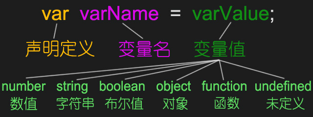

<h1>字面量，变量和数据类型</h1>

<h2>字面量</h2>
什么是字面量：字面量都是一些不可改变的值。<br><br>
字面量都是可以直接使用的,但是我们一般都不会直接使用字面量，如果数据多了操作麻烦不方便。

<h5>Number类型 数值字面量 </h5>

`
var age=18;//数值字面量，18为字面值
`
<h5>Number类型 数值字面量 </h5>

`
var age=18;//数值字面量，18为字面值
`

<h2>变量</h2>
什么是变量？

- 会变化的量。
- 变量可以用来保存字面量，且变量的值是可以随意改变的，更加方便我们使用。
- 可以通过变量对字面量进行描述。
- 在开发中通常都是通过变量去保存一个字面量，而多数不会直接使用字面量。


```
 var a; //声明变量
 a=123; //给变量赋值
 console.log(a);

 var age=30; //定义变量并赋值
 console.log(age);
```
<h2>变量的集体声明</h2>

```
var n1=1,n2=2,n3=3;n1+=n2;//变量的集体声明。
alert(n2);
```

<h2>标识符</h2>
什么是标识符：

   - 在JS中所有可以由我们自主命名的都可以称为标识符。<br>
   例如：变量名、函数名、属性名都属于标识符。

命名时，需要遵守以下规则：

- (1)标识符中可以包含字母、数字、下划线_、$。
- (2)标识符不能以我们的数字开头。
- (3)标识符不能是我们JS中的关键词或保留字。
- (4)标识符一般都采用驼峰命名法。<br>
    首字母小写，每个单词的开头字母大写，其余字母小写。如：helloWorld。
- (5)JS底层保存标识符时实际上是采用的Unicode编码，所有理论上讲所有的utf-8中含有的内容都可以作为标识符。像中文也行，但建议还是不要使用。
ECMAScript关键字完整列表：

```
break
case
catch
continue
default
delete
do
else
finally
for
function
if
in
instanceof
new
return
switch
this
throw
try
typeof
var
void
while
with
```
注意：如果把关键字用作变量名或函数名，可能得到诸如 "Identifier Expected"（应该有标识符、期望标识符）这样的错误消息。

ECMA-262 第三版中保留字的完整列表：   

 ```
abstract
boolean
byte
char
class
const
debugger
double
enum
export
extends
final
float
goto
implements
import
int
interface
long
native
package
private
protected
public
short
static
super
synchronized
throws
transient
volatile
 ```   
 注意：如果将保留字用作变量名或函数名，那么除非将来的浏览器实现了该保留字，否则很可能收不到任何错误消息。当浏览器将其实现后，该单词将被看做关键字，如此将出现关键字错误。

 <h2>转义字符</h2>

 ```
alert("你\"好\"");      转双引号
alert("你\'好\'")       转单引号
alert("你\n好"); 
alert("你\r好"); 
alert("你\n\r好");
 ```

```
\ "      转双引号
\'       转单引号
\n       是换行，newline使光标下移一格
\r       是回车，return 使光标到行首
\t       制表符，相当于空格
\b       空格
\f       进纸
\\       斜杆
\'       单引号(')在用单引号的字符串中使用。例：'He said,\'hey.\''
\"       双引号(")在用双引号表示的字符串中使用例："He said,\"hey.\""
\xnn     以十六进制代码nn表示的一个字符(其中n为0-F)例：\x41表示“A”
\unnnn   以十六进制代码nnnn表示的一个Unicode字符（其中n为0-F）例：\u03a3表示希腊字符∑（Sigma）
```
<h2>JS中的数据类型</h2>

<h5>简单（基本、值）数据类型:</h5>

      Number、String、Boolean、Undefined、Null
<h5>复杂（引用）数据类型：</h5>

      Object、Array、Date等
<h5>函数类型</h5>
 
      function

<h5>Symbol类型，es6新类型</h5>

      Symbol

简单的数据类型 

<h5>（1）数字类型 number</h5>

正数、负数、小数

```
var n2=2;
```
<h5>（2）字符串 string</h5>
凡是双引号或者单引号引起的都是字符串。获取一个字符串中字符的个数可以使用length

```
例如：var name="zs";alert(name.length);//12
     var n5="hello word";
```
<h5>字符串的不可变</h5>
ECMAScript中的字符串是不可变的，也就是说，字符串一旦创建，它们的值就不能改变。<br>
要改变变量保存的字符串，首先要销毁原来的字符串，然后再用另一个包含新值的字符串填充该变量<br>
例如：
var str="123";str=str+"abc";

<h5>字符串拼接</h5>
如果有两个字符串变量a,b，如何把这两个变量的值链接起来？<br>

```
例如：
var a="hello";
var b="word";
var c=a+b;
思考：
var a="100";
var b=100;
var c=a-b;//结果是什么?
```
<h5>（3）布尔数据类型   Boolean</h5>
只有2个值一个是true,一个是false,实际运算中true=1，false=0

```
var n1 = 2;
var n2 = 3;
alert( n1==n2);//false 错误的
alert (n1<n2); //true 正确的
```
<h5>Boolean类型</h5>
- Boolean类型有两个字面量：true和false,并且区分大小写！
- 虽然Boolean类型的字面值只有两个，但ECMAScript中所有类型的值都有与这两个Boolean等价的值。

```
例如：
var result=Boolean("a");
console.log(result);//结果为true

var result=Boolean(100);
console.log(result);//结果为true
```

<h5>转换成Boolean类型</h5>
任何类型可以转换成Boolean类型，一般使用在流程控制语句后面。

```
例如：
var message="hello";
if(message){alert(message+"word")};
```

```
数据类型    转换为true的值                转换为false的值
Boolean          true                        false
String        任何非空字符串               ""（空字符串）
Number        任何非零数字值(包括无穷大)     0和NaN
Object        任何对象                      null
Undefined         n/a                      undefined
```
<h5>（4）变量未初始化 undefined</h5>

- 定义了变量，但未给变量赋值
- Undefined这是一种比较特殊的类型，表示变量为赋值，这种类型只有一种值就是undefined。

```
var n1;//定义了变量，没有给变量赋值 变量在内存中是存在的
alert(n1); //undefined

注：var n3=""; //空字符串 变量在内存里是存在的

例如：
var message;
console.log(message);//结果是undefined
undefined是Undefined类型的字面量。
例如：
var message=undefined;
console.log(message);
typeof message;获取到的是"undefined"
```
<h5>（5）变量未引用 /值为空   null（object）</h5>

```
var n2=null;//在内存里是找不到这个变量的，被销毁
alert(n2);
```
 <h2>判断数据类型typeof</h2>
 typeof()

```
    alert(typeof(n1));//判断数据类型
```
<h2>数据类型转换</h2>
<h5>1：数字类型转字符串</h5>
调用string() 函数

方式一：

- 调用String()函数，并将被转换的数据作为参数传递给函数
- 使用String()方法做强制类型转换时
- 对于Number和Boolean实际上是调用的toStirng()方法
- 但对于null和undefined，就不会调用toString()方法
- 它会将null直接转换为"null"
- 将undefined直接转换为"undefined"

```
var n1=1;
var n2=13.45;
var n3=-22.3;
var n4=String(n1);//调用函数直接n4=String(n1);
alert(n4);
alert(typeof(n4));
```
调用.toString() 方法

方式二：

- 调用被转换数据类型的.toString()方法
- 该方法不会影响原变量，它会将换行结果返回
- 注意：null和undefined这两个没有.toString()方法，如果调用他们的方法，会报错<br>

```
如：a=null;
a=a.toString();//报错

a=undefined;
a=a.toString();//报错
```

```
var n1=1;
var n2=13.45;
var n3=-22.3;
var n5=n2.toString();//调用方法.toString()
alert(n5);
alert(typeof(n5));
```
<h5>2：字符串转数字类型</h5>

 ❀Number

- ◇数字类型的字符串，转换之后得到的是数字。

- ◇非数字字符串，转换之后得到的是NaN。

- ◇小数类型的字符串，转换之后得到的是原数字。
- ◇如果字符串是一个空串或者是一个全是空格的字符串，则转换为"0"
- ◇布尔--->数字<br>
    true转成1&nbsp;&nbsp;   false转成0
- ◇Null--->数字&nbsp;&nbsp;0
- ◇undefined--->数字&nbsp;&nbsp;NaN
```
var n1="123";
var n2="123abc";
var n3="helloword";
var n4="JS数据类型转换";
var n5="1.23";
var n6=Number(n5);//字符串转数字
var n7="  ";//结果为0
var n8="";//结果为0
    n7=Number(a);
alert(n6);
alert(typeof(n6));
```
❀parseInt   整数

- ◇整数数字类型的字符串，转换之后得到的整数数字。

- ◇数字开头的字符串，转换之后得到的是前边的数字。

- ◇非数字开头的字符串，转换之后得到是NaN。

- ◇小数类型的字符串，转换之后取整。

```
var n1="123";
var n2="12abc";
//var n2="abc12"//NaN
var n3="helloword";
var n4="JS数据类型转换";
var n6="-5.93";
var n5=parseInt(n6);//
alert(n5);
alert(typeof(n5));
```
❀parseFloat

- ◇整数数字类型的字符串，转换之后得到的整数数字。

- ◇数字开头的字符串，转换之后得到的是前边的数字。

- ◇非数字开头的字符串，转换之后得到是NaN。

- ◇小数类型的字符串，转换之后得到的是原数字。

```
var n1="123";
var n2="12abc";
//var n2="abc12"//NaN
var n3="helloword";
var n4="JS数据类型转换";
var n6="-5.93";
var n5=parseFloat(n6);
alert(n5);
alert(typeof(n5));
```
<h5>3.转布尔类型</h5>
Boolean()

- ◇数字和字符串、Infinity、" "字符串空格、对象转换后为true。

- ◇undefind、null、0、NaN、""空字符串转换之后为false。

```
var n1=123;
var n2="345";
var n3; //false
var n4=null; //false
var n6=0; //false
var n7=Infinity;
var n5=Boolean(n7); //转布尔类型
alert(n5);
alert(typeof(n5));
```
<h5>4.隐式数据类型转换</h5>
在运算过程中，电脑/程序自己进行的转换。（程序员没有操作）<br>
任何值在— * /运算时都会自动转换为Number<br>
我们可以利用这一特点做隐式的类型转换:可以通用一个-0 *1 /1来将其转换为Number<br>
为任意的数据类型做两次非运算，即可将其转换为布尔值<br>

```
例:
var a="hello";
a=!!a;//true
```

```
var d="123";
d=d-0;
console.log(typeof(d));
console.log(d);
```

```
var n1=12;
var n2="3";
var n3=n1-n2;
alert(n2);
alert(typeof(n2));
```
<h5>一元运算符</h5>

- 一元运算符，值需要一个操作数
- 正号+ 不会对数字产生任何影响
- 负号- 可以对数字就那些负号的取反
-         对于非Number类型的值，它会将先转换为Number，然后运算
           可以对一个其他的数据类型使用+。来将其转换为number
           它的原理和Number()函数一样
```
var a=123;
a=-a;//结果-123

a=true;
a=-a;//结果a=-1 类型为number

a="18";
a=+a;//结果a=18 类型为number

var result=1+ +"2"+3'
console.log("result"=result);//结果result=6

console.log("a=" +a);
console.log(typeof(a));
```
<h2>数字类型的表达方式</h2>
进制包括：2进制、8进制(011)、10进制、16进制(0xA)、32进制等

```
常用：10进制、2进制、【8进制、16进制】
n进制包含的数：0，1，2、、、n-1
比如说：10进制：0-9，9进制：0-8，
n进制应该满n进1
```

```
123（1o进制）
百位  十位   各位(小于10)
i*10的二次方+j*10的以此份+k*10的次方
1*(10**2)+2*(10**1)+(3*10**0)
```

```
任意n进制ijk
n2位 n位  各位(小于n)
i*n的二次方+j*n的一次方+k*n的0次方
```
Number类型  
<h5>十进制表示法</h5>

```
var n1=23;//十进制表示法
进行算术计算时，八进制和十六进制表示的数值最终都背转换成十进制数值。
```
<h5>十六进制表示法</h5>
数字系列范围：从0-9 ,a(A)-f(F)表示数字。以0x开头

```
var n4=0x4323;//十六进制表示法
var num=0xA;
console.log(n4);
```
<h5>八进制表示法</h5>
数字系列范围：0开头，0-7组成<br>
如果字面值中的数值超出了范围，那么前导零将被忽略，后面的数值将被当作十进制数值解析

```
var n5=0472;//八进制表示法
var num1=07;//对应十进制的7
var num2=019;//对应十进制的19
var num3=08;//对应十进制的8
```
<h4>二进制</h4>
二进制以0b开头，但不是所有浏览器都支持

```
var a= 0b10;
console.log(a);//结果2(支持FF和chrome)
```
<h5>"070字符串"</h5>
像"070"这种字符串，IE8浏览器会当成8进制解析，谷歌会当成10进制解析。<br>
可以在parseInt()中传递第二个参数，来指定数字的

```
var a="070";
a=parseInt(a，10);//转换成10进制
console.log(typeof(a));
console.log(a);
```
<h5>Number类型    浮点数</h5>

```
var n=5e-324;
浮点数值的最高精度是17位小数，但在进行算术时精确度远远不如整数
var result=0.1+0.2;//结果不是0.3，而是：0.30000000000000004
console.log（0.07*100）；
永远不要测试某个特定的浮点数值（不要判断两个浮点数是否相等）
```

<h2>能表示的最大最小的值/数值范围</h2>
由于内存的限制，ECMAScript并不能 保存世界上所有的数值。

```
能表示的最大值是：
Number.MAX_VALUE，这个值为
+
-1.7976931348623157乘以10的308次方/1.7976931348623157e+308


能表示最小值是：
Number.MIN_VALUE,这个值为
+
-5乘以10的-324次方/5e-324
```

```
无穷大：Infinity  //使用typeof检查Infinity 也会返回number

无穷小：-Infinity
```

<h2>数值检测</h2>
NaN非数值（Not a Number）

使用typeof检查一个NaN也会返回number

- console.log("abc"/18);//结果是NaN
- NaN与任何值都不相等，包括NaN本身,如：console.log(NaN==NaN);//结果false

isNaN（）：任何不能被转换为数值的值都会导致这个函数返回true

- isNaN(NaN);//true
- isNaN("blue");//true
- isNaN(123);//true

```
var b=123;
console.log(isNaN(b));//结果false
```
