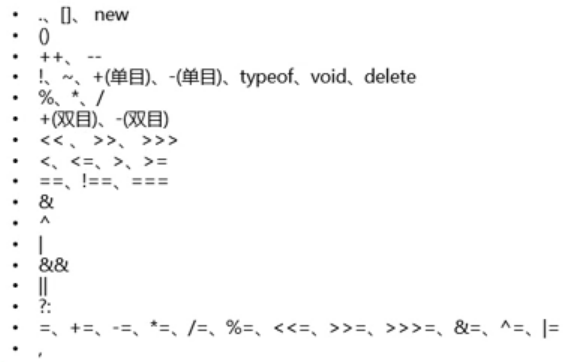

<h2>比较运算符</h2>

```
运算符     描述              例子
==        等于              x==8为false
===       全等（值和类型）   x===5为true;x==="5"为false
!=        不等于            x!=8为true
>         大于              x>8为false
<         小于              x<8为false
>=        大于或等于        x>=8为false
<=        小于或等于        x<=8为true
```

<      <=      >=  >  ==   !=

- 在比较字符串时，实际比较的是两个字符串中对应位置的每个字符的字符编码值。
- 在比较数值和字符串时，字符串都会被转换成数值，然后再以数值方式与另一个数值比较。
- 如果一边是数字，另一半是Boolean,先把Boolean类型的值转换成数字，再比较。

==        != 相等和不相等<br>

===     !==全等和不全等<br>

相等只比较值，全等比较的是值和类型

```
例如：
var result="55"==55;//true
var result="55"===55;//false值相等，类型不相等
var result=55 ===55;//true

特殊情况:console.log(null ==0);//false

undefined衍生自null，所以两个值做相等判断时，会返回true
console.log(undefined==null);//结果true


```
比较运算符计算出的结果只有两种：

- true
- false

<h5>!非</h5>

- ！非可以用来对一个布尔值进行取反操作。
- 如果一个值进行两次取反，它不会变化
- 如果对非布尔值进行取反，则会将其转换为布尔值，然后再取反
- 我们可以利用这特点，将一个其他的数据类型转换为布尔值
- 可以为一个任意数据类型取两次反，来将其转换为布尔值，原理和Boolean()函数一样。

```
var a=false;
a=!a;
console.log("a="+a);//结果a=true

var b=10;
b=!b;
console.log("b="+b);//结果b=false
console.log(typeof(b));//结果boolean
```
<h5>&&与</h5>
&&可以对符号两侧的值进行与运算并返回结果<br>
运算规则：

     两个值中只要有一个值为false就返回false<br>
     只有两个值为true,才会返回true
     如果第一个值为false，则不会看第二个值

```
<!-- 如果两个值都是true则返回true -->
var result=true && true;//结果true

<!-- 只要有一个false，就返回false -->
var result=true && false;//结果false
var result=false && false;//结果false
console.log("resule="+result);

<!-- 第一个值为false不会检查第二个值 -->
false && alert("你出来呀！！");

<!-- 第一个值为true会检查第二个值 -->
true && alert("你出来呀！！");
```
<h5>||或</h5>
||可以对符号两侧的值进行或运算并返回结果

运算规则：

- 两个值只要有一个true就返回true
- 两个值都是false才返回false
- 如果第一个值为true，则不会坚持第二个值
```
<!-- 两个都是false返回false -->
result=false || false;//结果false

<!-- 只要有一个true就返回true -->
result=true || false;//结果true
result=false ||true ;//结果true
result=true ||true ;//结果true
console.log("result="+result);

<!-- 第一个值为false,则会检查第二个值 -->
false || alert("123");
<!-- 第一个值为true,则不会检查第二个值 -->
true || alert("123");
```
<h5>&& || ！ 非布尔值的情况</h5>
<h6>&&与</h6>

- 会先将其转换为布尔值，然后再运算,并且返回原值
- 如果第一个值true，则返回第二个值
- 如果第一个值为false，则直接返回第一个值

<h6>||或</h6>

- 如果第一个值为true，则直接返回第一个值
- 如果第一个值为false，则返回第二个值

```
//true || true
//如果第一个值为true，直接返回第一个值
result =1|| NaN;//结果1

//如果第一个值为false，则直接返回第二个值
result=NaN || 1;//结果1
console.log("result="+result);
```

```
//true && true
//如果两个值都为true，则返回后边的值
var result=1 && 2;//结果为2

//如果两个值中有false，则返回靠前的false
//false && true
    result=0 && 2;//结果0
    result=2 && 0;//结果0
//false && false
    result=NaN && 0;//结果NaN
    result=0 && NaN;//结果0

    result="" || "hello";//结果hello
    result=-1 || "你好"；//结果-1

console.log("result="+result);
```

 
<h2>算术运算符</h2>

- 运算符也叫操作符
- 通过运算符可以对一个或多个值进行运算，并获取运算结果
- 比如：typeof就是运算符，可以来获得一个值的类型，它会将改值的类型以字符串的形式返回：number、string、boolean、undefined、object

```
var a=123;
var result=typeof;
console.log(typeof(result));//结果为："string"
```
当对非Number类型的值进行运算时，会将这些值转换为Number，然后再运算<br>
任何值和NaN做运算都得NaN

加（+），减（-），乘（*），除（/），取余（%），幂运算（**），递增（++），递减（--），一元正号（+），一元负号（-）
<h5>+  加</h5>

- （1）两个数字类型的变量相加，得到的是一个数字类型。
- （2）一个数字类型和一个字符串相加，得到的是一个字符串,并叫做拼接操作。
- （2.1）我们可以利用这一特点，将一个任意的数据类型转换为String，我们只需要为任意的数据类型+一个""即可将其转换为String。
- （2.2）这是一种隐式的类型转换，由浏览器自动完成，实际上也是调用String()函数。

```
var c=123;
c=c+"";//和c=string(c);本质上是一样的，前者常用
console.log(c);//结果为："123"
console.log(typeof(c));//结果为"string"
console.log("c="+c);//结果"c=123"这种方法常用
```

```
var n1="helloword";
var n2=2;
var n3=n1+n2;
alert(n3);
alert(typeof(n3));        //string

result=1+2+"3"; //结果33
result="1"+2+3;//结果123
console.log("result="+trsult);
```

<h5>—  减</h5>

- （1）两个数字类型的变量相减，得到的是一个数字类型。
- （2）一个数字类型和一个数字字符串相减，得到的是一个数字类型。
- （3）一个数字类型和一个数字开头的字符串相减，得到的是一个NaN（not a number），是一个数字类型。
- （4）一个数字类型和一个非数字开头的字符串相减，得到的是一个NaN（not a number），是一个数字类型。

```
   var n1=12;
// var n2=23;
// var n2="23";
// var n2="23abc";   //NaN
   var n2="abc";    //NaN
   var n3=n1-n2;
   alert(n3);
   alert(typeof(n3)); //number

   result=2*undefined;//结果：NaN
   result=2*null;//结果:0
   console.log("result=" +result);
```
<h5>*乘</h5>

- （1）两个数字类型的变量相乘，得到的是一个数字类型。
- （2）一个数字类型和一个数字字符串相乘，得到的是一个数字类型。
- （3）一个数字类型和一个数字开头的字符串相乘，得到的是一个NaN（not a number），是一个数字类型。
- （4）一个数字类型和一个非数字开头的字符串相乘，得到的是一个NaN（not a number），是一个数字类型。

```
   var n1=12; 
  //var n2=23;
  //var n2="23"; 
  //var n2="23abc"; //NaN 
    var n2="abc";  //NaN 
    var n3=n1*n2; 
    alert(n3); 
    alert(typeof(n3)); //number
```
<h5>/  除</h5>

- （1）两个数字类型的变量相除，得到的是一个数字类型。
- （2）一个数字类型和一个数字字符串相除，得到的是一个数字类型。
- （3）一个数字类型和一个数字开头的字符串相除，得到的是一个NaN（not a number），是一个数字类型。
- （4）0作为除数的时候，得到的结果是Infinity（无限大），是一个数字类型。

```
   var n1=6;
// var n2=2;
// var n2="2";
// var n2="2ac";
   var n2=0; //Infinity 无穷大
   var n3=n1/n2;
   alert(n3);
   alert(typeof(n3));
```

<h5>%  取余</h5>

```
var n1=7;
var n2=2;
var n1=n1%n2;
alert(n1);

result=9 % 5;
console.log("result="+result);//结果result=4
```

<h2>运算符的优先级</h2>
非数值的情况：

```
对于非数值进行比时，会将其转换为数字然后再比较，如：console.log(1>"0"); //结果为true

    console.log(10>"null"); //结果为true

    //任何值和NaN做任何比较都是false
    console.log(10>"hello"); //结果为false

    console.log(true>false); //结果为true

    //特殊情况:如果符号两侧的值都是字符串时，不会将其转换为数字进行比较，而会分别比较字符串字符的Unicode编码
    console.log("1">"5"); //结果为true
    console.log("11">"5"); //结果为true

//比较两个字符串时，比较的是字符串编码
    console.log("a">"b");//false
    console.log("a"<"b");//true

    //比较字符编码是一位一位进行比较,如果两位一样，则比较下一位，可以借用它来对我们英文来排序
    console.log("bbc"<"b");//true
    
    比较中文时没有意义
    console.log("戒">"我");//true

    //如果比较的两个字符串类型的数字，可能会得到不可预期的结果
    console.log("11" < "5");//true
    //注意：在比较两个字符串的数字时，一定要转型
    console.log("11" < +"5");//false
```
优先级从高到底


- ()优先级最高（ 有括号先计算（）里边的）
- 一元运算符 ++  -- !
- 算术运算符：先   *     /      %   后+  -
- 关系运算符：先>   >=    <    <=
- 相等运算符：==   !=  ===   !==
- 逻辑运算符：先&&  后||
<h6>自增++</h6>

- 通过自增可以使变量在自身的基础上增加1
- 对于一个变量自增以后，原变量的值会立即自增1
- 自增分两种：后++(a++)和前++(++a)
- -无论是a++，还是++a,都会立即使原变量的值自增1<br>
   不同的是a++和++a的值不同
    a++的值等于原变量的值(自增前的值)
    ++a的值等于原变量自增后的值/原变量的新增

```
var a=1;
a++;
++a;
console.log("a="+a);//a=2

var a=1;
console.log(a++);//这个a是表达式的值，结果为1
console.log("a="+a);//这个a是变量值，结果a=2

var a=1;
console.log(++a);//表达式的值，结果为2
console.log("a="+a);//变量值，结果为a=2

var d=20;
var result=d++ + ++d +d;//结果64(20+22+22)
console.log("resule="+result);

var d=20;
d=d++;//原值是20
console.log("d=" +d);//结果d=20
```
<h5>自减--</h5>
通过自减可以使变量在自身的基础上减1

- 分为两种，--前和后--
- 无论是--前还是后--都会立即使原变量的值自减1
- 不同的是a--和--a的值不同
- a--是变量的原值（自减前的值）
- --a是变量的新增（自减以后的值）

```
var num=10;
<!-- num--; -->
--num;
console.log("num="+num);//结果num=9

var num=10;
console.log(num--);
console.log("num="+num);//结果num=10

var num=10;
console.log(--num);//9
console.log("num="+num);//结果num=9
```

<h2>带操作的赋值运算</h2>
=：可以将符号右侧的值赋值给符号左侧的变量

```
运算符         示例         等价于
+=             a+=b         a=a+b
-=             a-=b         a=a-b
*=             a*=b         a=a*b
/=             a/=b         a=a/b
%=             a%=b         a=a%b
```

```
var n1=2;
var n2=3;
n1+=n2;//等价于 n1=n1+n2
alert(n1);

var num=0;
num+=5;//相当于num=num=5;
```
<h2>Unicode编码</h2>

Unicode Chart：https://www.ssec.wisc.edu/~tomw/java/unicode.html#x3000

Unicode编码转换：http://tool.chinaz.com/tools/unicode.aspx

在字符串中使用转义字符输入Unicode编码<br>
\u四位编码16进制编码

`
console.log("\u0031");//结果1
`


```
<body>
    <!-- 在网页中使用Unicode编码
         &#编码；这里的编码需要的是10进制 -->
         <h1 styie="font-size:100px;">&#9760</h1>//结果：在谷歌控制台会出现一个骷髅头
</body>
```
